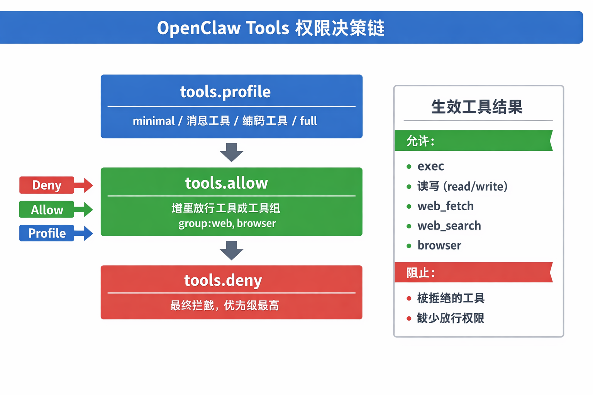
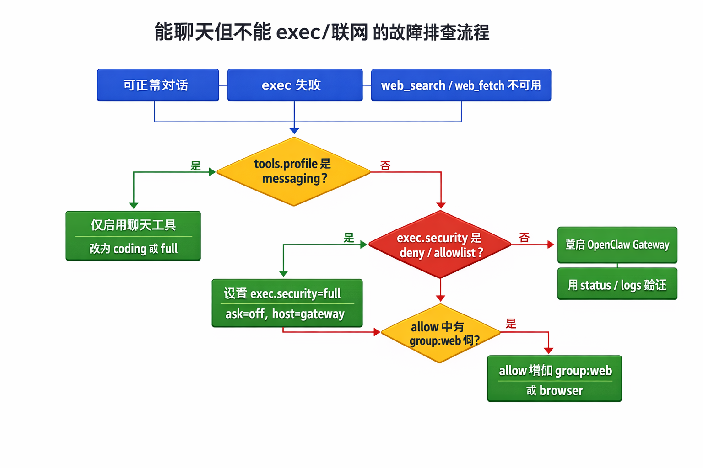
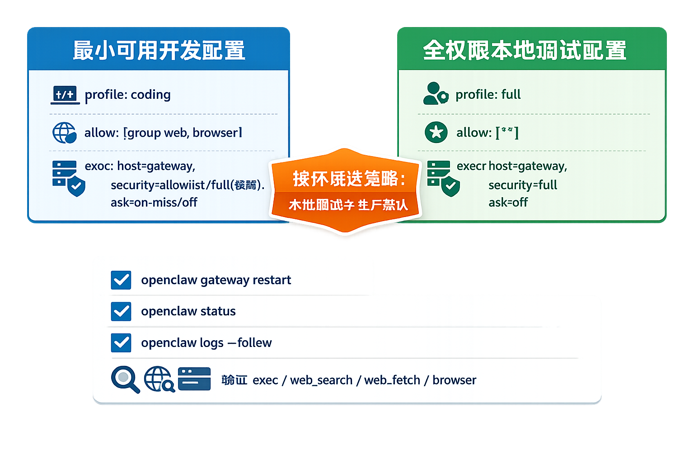

After upgrading OpenClaw yesterday, I ran into a strange problem: channel conversations worked normally, but `exec` would not run, and `web_search` and `web_fetch` were unavailable. After digging into it, I found that this usually does not mean the installation is broken. It is often the expected result of the Tools permission model and security policy taking effect.

## The short answer

Changing `tools.profile` to `full` can quickly restore capabilities in many cases, but it is only a coarse-grained switch. Actual behavior is determined by three stacked rule layers: `tools.profile`, `tools.allow`, and `tools.deny`, plus the more detailed policy under `tools.exec`.



If you only change the profile while ignoring `deny` or `exec.security`, tools may still be blocked.

## How the Tools permission model works

OpenClaw agents call capabilities through Tools. They do not directly run a raw shell. Common mappings look like this:

- Run commands: `exec`
- Read and write files: `read` / `write`
- Apply patch changes: `apply_patch`
- Fetch from the web: `web_fetch`
- Search the web: `web_search`
- Control the browser: `browser`

Permission decisions follow this order:

`deny > allow > profile`

That means:

1. `profile` provides the baseline capability set.
2. `allow` grants additional capabilities on top of that baseline.
3. `deny` is the final blocklist and has the highest priority.

## Why you can chat but cannot do anything else

After a new install or upgrade, the default may be `tools.profile = "messaging"`. This configuration keeps only conversation-related tools, so chat works, but execution, file access, web access, and similar capabilities are unavailable.

The second common cause is an overly strict `exec` policy:

- `security=deny`: execution is disabled outright.
- `security=allowlist`, but the command is not on the allowlist: the call is rejected.
- `ask=on-miss` or `ask=always`: the system waits for approval. If the UI does not show the approval prompt correctly, it can look like the call is stuck.

The third cause is a runtime environment difference. With `host=gateway`, `PATH` may be more minimal. If a command cannot be found, it can look like "execution failed" on the surface, while the real issue is that the process environment lacks the command.



## Two usable configurations

### Option A: minimal usable development config, recommended first

Use this when you need to write code, run commands, and search the web, but do not want to open permissions completely.

```json
{
  "tools": {
    "profile": "coding",
    "allow": ["group:web", "browser"],
    "exec": {
      "host": "gateway",
      "security": "allowlist",
      "ask": "on-miss"
    }
  }
}
```

For temporary troubleshooting, you can also switch `exec.security` to `full` first, then tighten it again after locating the issue.

### Option B: local full-permission debugging config

Use this for single-machine debugging and quick validation. I do not recommend using it as the production default.

```json
{
  "tools": {
    "profile": "full",
    "allow": ["*"],
    "exec": {
      "host": "gateway",
      "security": "full",
      "ask": "off"
    }
  }
}
```

After changing the config, restart OpenClaw:

```bash
openclaw gateway restart
```



## Four-step self-check

1. Check whether the config is still using the `messaging` profile.
2. Confirm that `group:web` is allowed; otherwise web search will not work.
3. Check `exec.security` and `ask` to avoid hidden approval blocking.
4. After restarting, use status and logs to verify that the config loaded correctly:

```bash
openclaw status
openclaw logs --follow
```

At minimum, confirm that `exec`, `web_search`, `web_fetch`, and `browser` are available as expected.

## Practical advice

Split Tools configuration into two versions: a development template and a production template. This avoids one-off manual edits during urgent troubleshooting. Teams can codify allowed tool groups, approval policy, restart steps, and verification commands in scripts. After each upgrade, you can quickly return to a known-good state instead of relying on memory for permission details.
