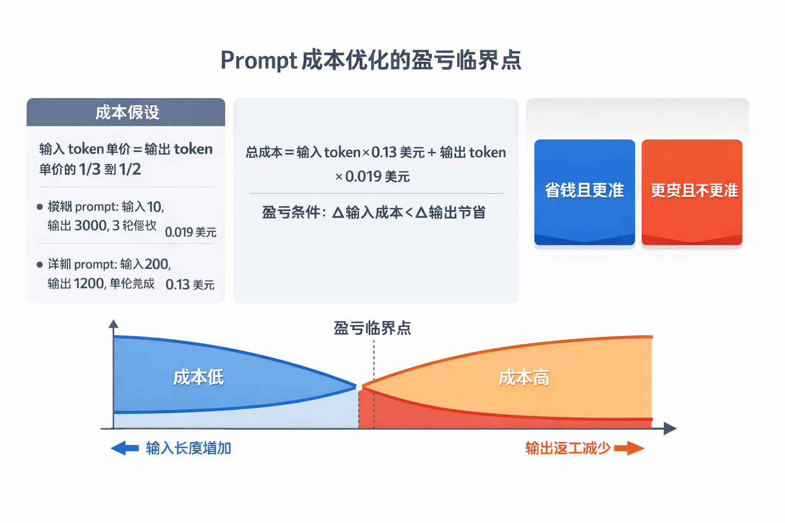
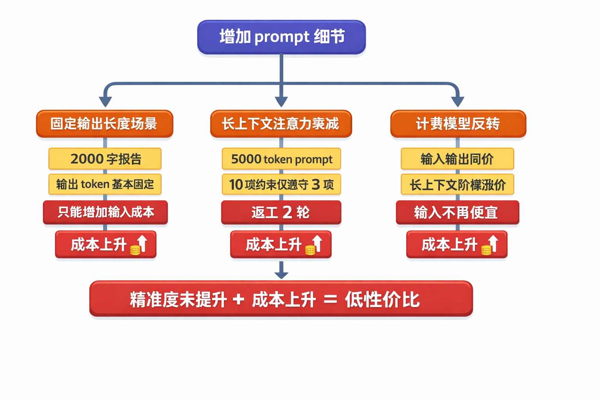
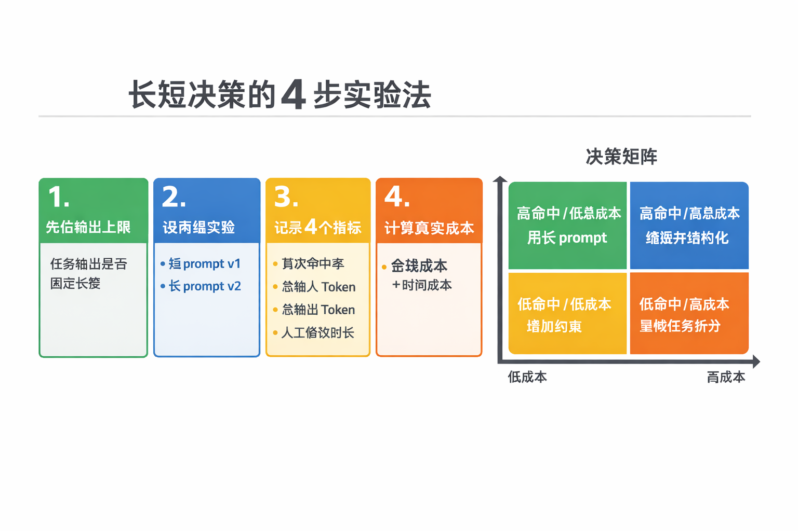

When building LLM applications, many teams treat "write a more detailed prompt" as the default strategy. It does work in many scenarios, but it is not unconditionally true. The real driver of cost is not how complete the prompt looks. It is the difference between the added input cost and the reduced output rework.

## Problem definition: what are we actually optimizing?

If we break down a single call, total cost can be written as a simple expression:

`Total cost = input tokens x input price + output tokens x output price`

In mainstream commercial models, input tokens are usually cheaper than output tokens. That is the basis for the idea that "more input can buy less output." In the original Doubao discussion, a typical comparison was given: an ambiguous prompt accumulated to $0.13 after multiple rounds of revisions, while a structured prompt hit the target in one call at about $0.019, reducing the cost to roughly one seventh.

This example shows that the value of a long prompt is not that it is longer. Its value is reducing expensive output and rework rounds.

## Three scenarios where long prompts really pay off

### Open-ended tasks with high tolerance cost

Tasks such as campaign plans, technical proposals, and compliance copy have a large output space, so the model can easily drift. Adding boundaries, formats, and forbidden items on the input side can significantly reduce bad output. As long as the saved rework output tokens exceed the added input tokens, cost goes down.

### Multi-turn conversations that are already heavy

If a task naturally carries historical context, each revision repeatedly sends that context back into the model. Writing the key constraints up front can often compress three rounds into one. The savings here are not only output tokens, but also repeated context input.

### Batch generation with a stable framework

Batch scripts, batch summaries, and batch report templates are ideal for "fixed input framework, variable output content." Put the fixed framework into the prompt and let the model produce only the variable parts. Output tokens decrease noticeably, and standardization improves as well.

## Four boundary conditions where long prompts fail

### Boundary 1: output length is fixed

When the task naturally requires a fixed length, such as a 2,000-word report, output tokens are basically locked. Adding more input will likely only raise total cost.

### Boundary 2: attention decays in long context

An excessively long prompt can cause the model to ignore constraints in the middle. The original discussion mentioned a case with 5,000 tokens and 10 constraints where only 3 constraints were followed. The underlying issue is reduced effective information density, which then triggers rework.

### Boundary 3: pricing is no longer "cheap input"

Not every model prices input cheaply and output expensively. In some cases, input and output cost the same, or long context triggers tiered price increases. Once that premise changes, the cost advantage of long prompts disappears quickly.

### Boundary 4: human time cost is ignored

Writing a high-quality prompt requires breaking down requirements, listing constraints, and preparing examples. If the task value is low, the cost of human time may exceed the token savings.

## Engineering rollout: decide with experiments, not instinct

I recommend treating prompt length as a small experiment instead of deciding by experience alone.

1. Define the output limit first: confirm whether the task has a fixed length.
2. Create two A/B prompt groups: a short `v1` and a long `v2`.
3. Record four metrics: first-pass success rate, total input tokens, total output tokens, and manual editing time.
4. Calculate real cost with one consistent formula: `API cost + converted cost of human time`.

If `v2`'s improvement in success rate cannot cover the growth in input and human effort, do not keep lengthening the prompt. A better approach is to shorten the text and rewrite the information into stronger structured constraints.

## Conclusion

"Detailed prompts are cheaper" is not a conclusion. It is a conditional statement. It holds only when three premises are true at the same time: input is relatively cheap, rework drops noticeably, and human effort remains controlled. For teams, the most reliable strategy is to measure first, then standardize. Turn effective prompt shapes into templates, and keep deleting verbose parts that do not work.
