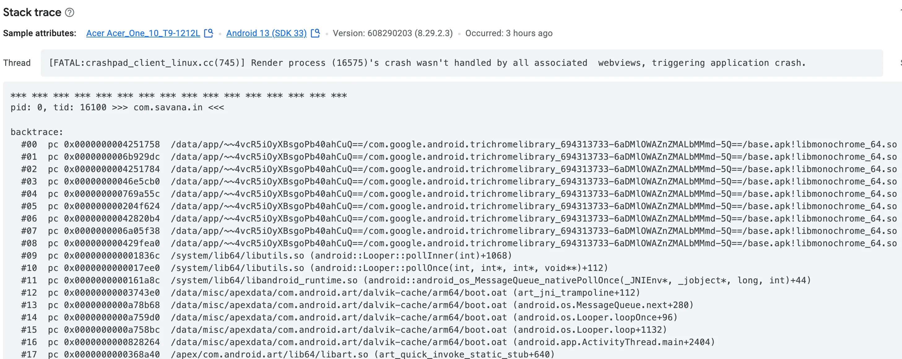

In mobile app development, WebView has become an important component for embedding web content. On Android in particular, WebView is usually implemented on top of Chromium, so its stability and security directly affect the overall user experience of an app. In real-world development, however, you may encounter cases where the WebView renderer process exits unexpectedly or crashes. The error log may look like this:

```plain
[FATAL:crashpad_client_linux.cc(745)] Render process (16575)'s crash wasn't handled by all associated webviews, triggering application crash.
```

This article analyzes the issue from several angles. It explains the causes, the underlying mechanism, and how to respond and self-check from both the native side and the frontend side, so the app can degrade gracefully when a WebView crash happens instead of bringing down the entire process.

---

## 1. Background and Error Log Interpretation

When using a Chromium-based WebView, Crashpad is a common tool for capturing and reporting crash information. The error log indicates two things:

- **Renderer process crash**: `Render process (16575)` refers to a process used to render web pages. It hit a fatal error and crashed while running.
- **Not handled by all WebViews**: the system tried to let all associated WebViews handle the crash, but some WebViews failed to catch it. As a result, the whole app crashed.

This means the low-level exception was not fully isolated or recovered, which then caused a more serious app-level failure.

### 1.1 Example Error Log



_Figure 1: An example error log showing Crashpad reporting a renderer process crash_

---

## 2. Why the WebView Renderer Process Exits or Crashes

For Android WebView's implementation architecture, see: [https://www.youtube.com/watch?v=qMvbtcbEkDU](https://www.youtube.com/watch?v=qMvbtcbEkDU)

There are many reasons why the WebView renderer process may exit abnormally or crash. The main categories are:

### 2.1 Low Memory and Resource Exhaustion

- **Memory leaks and excessive consumption**: complex pages, heavy JavaScript execution, or large image and video resources can make WebView consume too much memory. When device memory is low, the operating system may actively terminate processes that use too many resources.
- **Poor memory management**: low-level allocation problems, memory leaks, or out-of-bounds access can also crash the renderer process.

### 2.2 Code Errors and Engine Defects

- **JavaScript logic errors**: in some cases, defects or errors in page JavaScript or CSS may trigger unhandled exceptions inside Chromium.
- **Engine bugs**: Chromium itself may contain unresolved defects that cause the renderer process to exit abnormally in specific scenarios.

### 2.3 Hardware Acceleration and GPU Issues

- **Hardware acceleration problems**: when hardware acceleration is enabled, graphics driver or GPU problems, such as compatibility issues or driver errors, may also crash the renderer process.

### 2.4 Security Vulnerabilities and Malicious Content

- **Malicious pages**: malicious code or exploited vulnerabilities may abnormally terminate the low-level renderer process.
- **Content loading issues**: loading unsafe or malformed content can also trigger engine-level exceptions.

### 2.5 System Resource Management Policies

- **Background resource reclaiming**: to optimize overall performance, the operating system may reclaim long-idle processes or processes with high resource usage. This can also cause the WebView renderer process to exit unexpectedly.

---

## 3. Native-Side Protection: `onRenderProcessGone`

To reduce the impact of WebView renderer process crashes on overall app stability, Android provides the `onRenderProcessGone` callback. This method lets developers catch the event when the WebView renderer process exits abnormally and handle it appropriately, avoiding a direct app crash.

### 3.1 How the Method Works

`onRenderProcessGone` is mainly used to catch renderer process exits caused by a crash or system reclaiming. Its callback provides a `RenderProcessGoneDetail` object. Developers can inspect this object to determine whether the abnormal exit was caused by a crash and then choose a recovery strategy.

- **Determine the crash cause**: call `detail.didCrash()` to determine whether the process exited because of a crash.
- **Handling strategy**: the return value decides whether the developer handled the exception. Returning `true` means the developer caught and handled it. Returning `false` lets the system use the default behavior, which terminates the app process and causes an app crash.

### 3.2 Kotlin Example

```kotlin
webView.webViewClient = object : WebViewClient() {
    override fun onRenderProcessGone(view: WebView, detail: RenderProcessGoneDetail): Boolean {
        if (detail.didCrash()) {
            Log.e("WebView", "Renderer process crashed.")
        } else {
            Log.w("WebView", "Renderer process was reclaimed by the system.")
        }
        // The renderer process has terminated. The current WebView must be destroyed and cannot be reused.
        view.destroy()
        // Returning true means the exception has been handled, preventing the app from crashing.
        return true
    }
}
```

With this approach, developers can catch the exception promptly when the renderer process crashes or is reclaimed by the system, preventing the entire app from crashing. Note that after the renderer process terminates, the original WebView instance **must not** be used again, including calls such as `loadUrl`. Destroy it and create a new instance instead. You can combine this with recovery measures, such as prompting the user, recreating the WebView and loading the page again, or recording logs, to improve app robustness.

---

## 4. Self-Checks and Monitoring in Frontend Code

Although WebView renderer process crashes mainly happen on the native side, frontend code can still use indirect techniques to detect page abnormalities. This helps developers discover problems earlier and report them. The following are several common frontend self-check methods.

### 4.1 Global Error Monitoring

JavaScript's global error capture mechanism can record errors and report them to a backend server when exceptions occur, which makes later analysis easier.

#### Example Code

```javascript
window.onerror = function(message, source, lineno, colno, error) {
    console.error("Caught error:", message, source, lineno, colno, error);
    // Send the error information to a server or report it through a third-party monitoring tool.
};
```

This method captures runtime JavaScript errors. It cannot directly catch native crashes, but when the WebView renderer process starts having problems, many JavaScript errors may appear and serve as an early warning signal.

### 4.2 Heartbeat Detection

By periodically sending heartbeat requests or running simple tasks, you can check whether the page is still responding normally. If no response is detected within a certain time window, the underlying process may be abnormal.

#### Example Code

```javascript
function sendHeartbeat() {
    fetch('/heartbeat')
        .then(response => {
            if (!response.ok) {
                throw new Error('Heartbeat request failed');
            }
            console.log('Heartbeat is healthy');
        })
        .catch(error => {
            console.error('Heartbeat error:', error);
            // Report the error or trigger the corresponding handling flow here.
        });
}

// Send a heartbeat request every 30 seconds.
setInterval(sendHeartbeat, 30000);
```

This heartbeat mechanism helps developers discover unresponsive pages in time and provides clues for later renderer crash investigation.

### 4.3 Page Visibility and Performance Monitoring

The Page Visibility API and Performance API can be used to monitor page visibility changes and resource loading. Abnormal resource loading delays or a page suddenly becoming invisible may be indirect signs of an abnormal state.

#### Example Code: Page Visibility Monitoring

```javascript
document.addEventListener('visibilitychange', function() {
    if (document.visibilityState === 'hidden') {
        console.warn('Page entered the background or may have been unloaded abnormally');
        // Record logs or report the state change here.
    }
});
```

#### Example Code: Performance Monitoring

```javascript
window.addEventListener('load', function() {
    const performanceEntries = performance.getEntriesByType('resource');
    console.log('Page resource loading status:', performanceEntries);
    // Analyze loading data to determine whether abnormalities exist.
});
```

These methods cannot directly detect native WebView renderer process crashes. As supplementary techniques, however, they help developers capture likely abnormal states in time, report them, and take appropriate action.

---

## 5. Comprehensive Response Strategy and Best Practices

When dealing with WebView renderer process crashes, a single layer of defense is often not enough. The following are comprehensive response strategies and best practices:

### 5.1 Native-Side Protection

- **Update dependencies**: keep the WebView component and related Chromium engine up to date so you benefit from the latest bug fixes and performance improvements.
- **Use the `onRenderProcessGone` callback**: override `onRenderProcessGone` in WebView, and choose different recovery strategies based on why the renderer process exited, whether from a crash or system reclaiming. This ensures one WebView crash does not affect the entire app.
- **Logging and monitoring**: use tools such as Crashpad to record detailed crash logs, and combine them with a reporting system to monitor app state in real time.

### 5.2 Supplementary Frontend Detection

- **Global error capture**: use `window.onerror` and other error listeners to catch exceptions and report them to the backend.
- **Heartbeat detection**: design a reasonable heartbeat mechanism so the page can report its own state promptly and trigger handling as soon as an abnormal state is detected.
- **Performance and visibility monitoring**: use the Performance API and Page Visibility API to monitor page loading and state, which helps investigate abnormal behavior.

### 5.3 Coordinated Handling and User Experience

- **Error prompts and fallback strategies**: when a crash or abnormal state is caught, show a friendly error page promptly and provide recovery or retry actions where possible, so users are not left confused or frustrated.
- **Process restart and resource release**: after a crash, release WebView resources promptly and restart a new renderer process so the app can recover quickly.
- **Detailed log recording**: both native and frontend layers should record detailed error logs and use a reporting system to analyze exceptions for later improvements.

---

## 6. Summary

WebView renderer process crashes are complex and multi-factor failures. They may be caused by low memory, resource exhaustion, code errors, hardware acceleration issues, system resource management policies, or malicious content. Developers should use the native-side `onRenderProcessGone` callback to catch exceptions and implement graceful degradation through blank pages, error prompts, or similar recovery measures. At the same time, frontend-side global error monitoring, heartbeat detection, page visibility monitoring, and performance monitoring can indirectly capture abnormal states, forming a layered self-check and recovery system.

By combining these strategies, you can reduce the impact of WebView renderer process crashes on the whole app and provide development teams with more diagnostic details for more effective troubleshooting and performance optimization. This article covered the causes, mechanisms, and response methods for WebView renderer process crashes, with the goal of helping developers build more robust apps with a better user experience.
