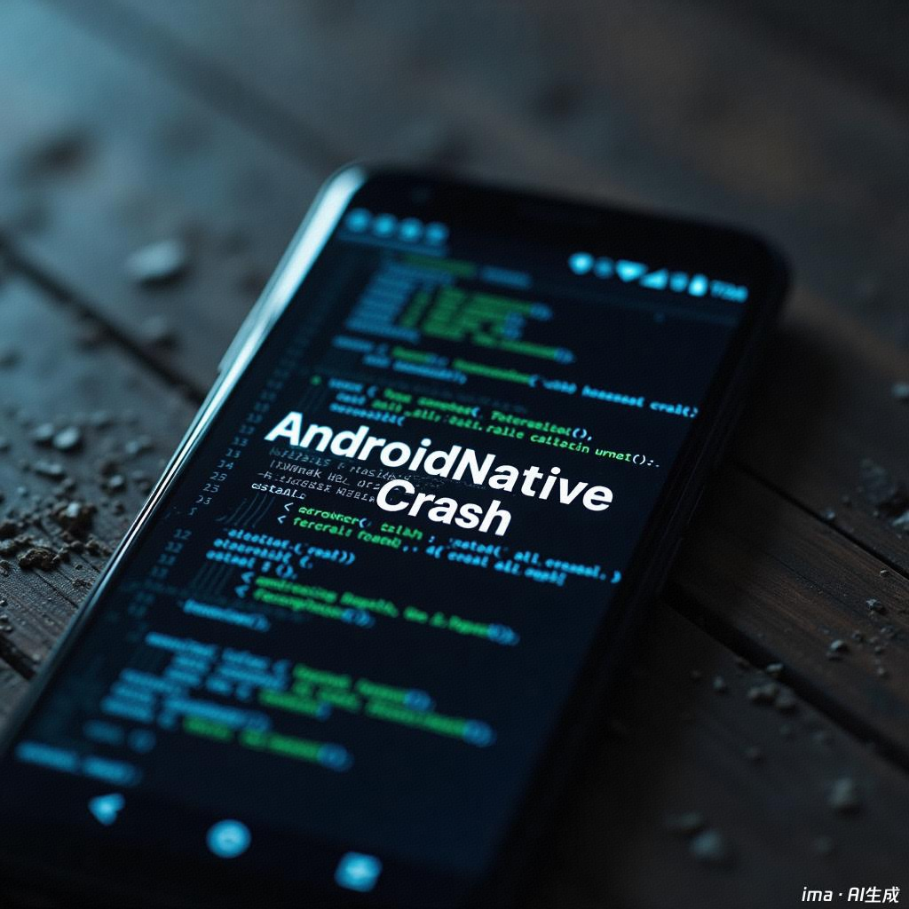

在 Android 开发中，应用崩溃可分为 **Java 层崩溃（RuntimeException）** 和 **Native 层崩溃（NDK 相关，如 SIGSEGV）**。Java 崩溃通常能被 Firebase Crashlytics 轻松捕获，但 **Native 崩溃默认不会被 Firebase 记录**，需要额外配置。

本文将从以下几个方面展开说明：

1. **如何触发 Android 上的 Native 崩溃**
2. **为什么 Firebase 默认不捕获 Native 崩溃**
3. **如何配置 Firebase 以支持 Native 崩溃捕获**
4. **如何解决 uploadCrashlyticsSymbolFileDebug 任务找不到的问题**
5. **总结与最佳实践**

---

## 1. 如何触发 Android 上的 Native 崩溃

### 1.1 创建 NDK 工程并启用 NDK 支持

首先，确保项目支持 NDK。在 `app/build.gradle` 中启用 NDK 并指定 `ndkVersion`：

```plain
android {
    defaultConfig {
        ndk {
            abiFilters "armeabi-v7a", "arm64-v8a"  // 仅编译常见架构
        }
    }
    buildFeatures {
        prefab true
    }
    externalNativeBuild {
        cmake {
            path "src/main/cpp/CMakeLists.txt"
            version "3.22.1"
        }
    }
}
```

### 1.2 编写 C++ 代码触发崩溃

在 `app/src/main/cpp/` 目录下创建 `native_crash.cpp`，写入以下 C++ 代码：

```plain
#include <jni.h>
#include <stdlib.h>

extern "C"
JNIEXPORT void JNICALL
Java_com_example_crash_MainActivity_nativeCrash(JNIEnv *env, jobject instance) {
    int *p = nullptr;
    *p = 42;  // 访问空指针，制造崩溃
}
```

### 1.3 在 Java 代码中调用 Native 方法

在 `MainActivity.java` 中：

```plain
public class MainActivity extends AppCompatActivity {
    static {
        System.loadLibrary("native-lib");
    }
    public native void nativeCrash();

    @Override
    protected void onCreate(Bundle savedInstanceState) {
        super.onCreate(savedInstanceState);
        setContentView(R.layout.activity_main);
        findViewById(R.id.btn_crash).setOnClickListener(v -> nativeCrash());
    }
}
```

运行应用并点击按钮，即可触发 Native 崩溃。

---

## 2. 为什么 Firebase 默认不捕获 Native 崩溃？

Firebase Crashlytics 主要针对 **Java 层崩溃**，而 Native 层崩溃（如 SIGSEGV）不会被默认捕获，原因包括：

1. **Firebase 需要额外的 NDK 组件** 来解析 Native 崩溃信息；
2. **缺少符号表（symbols）**，导致 Firebase 无法解析崩溃日志；
3. **Native 崩溃日志存储在应用私有目录**，需要特殊处理才能上传到 Firebase。

为解决上述问题，需要手动配置 Firebase Crashlytics 以支持 NDK 崩溃捕获。

---

## 3. 配置 Firebase 以支持 Native 崩溃捕获

### 3.1 安装 firebase-crashlytics-ndk

在 `app/build.gradle` 中添加 Firebase NDK 依赖：

```plain
dependencies {
    implementation 'com.google.firebase:firebase-crashlytics-ndk:18.6.1'
}
```

添加后执行 **Gradle 同步**。

### 3.2 确保符号表（Debug 符号）已上传

在 `app/build.gradle` 中启用符号表上传：

```plain
android {
    buildTypes {
        release {
            minifyEnabled false
            ndk {
                debugSymbolLevel 'FULL'  // 让 Firebase 解析完整的 Native 崩溃日志
            }
        }
    }
}
```

然后执行：

```plain
./gradlew app:uploadCrashlyticsSymbolFileRelease
```

---

## 4. 如何解决 uploadCrashlyticsSymbolFileDebug 任务找不到的问题？

### 4.1 Firebase 默认不生成 uploadCrashlyticsSymbolFileDebug 任务

Firebase 只会为 release 版本上传符号表，不会自动生成 debug 版本的 `uploadCrashlyticsSymbolFileDebug` 任务。

### 4.2 启用 Debug 版本的 Crashlytics 符号表上传

在 `app/build.gradle` 中显式启用 debug 版本：

```plain
android {
    buildTypes {
        debug {
            firebaseCrashlytics {
                mappingFileUploadEnabled true
            }
            ndk {
                debugSymbolLevel 'FULL'
            }
        }
    }
}
```

然后执行：

```plain
./gradlew app:uploadCrashlyticsSymbolFileDebug
```

若仍无法找到该任务，可手动上传符号表：

```plain
firebase crashlytics:symbols:upload --app=your-firebase-app-id --symbols=path/to/symbols
```

---

## 5. 总结

1. **默认情况下，Firebase 只能捕获 Java 崩溃，无法捕获 Native 崩溃；**
2. **要捕获 Native 崩溃，需要安装 `firebase-crashlytics-ndk` 依赖；**
3. **必须启用 `debugSymbolLevel 'FULL'` 并上传符号表，否则 Firebase 无法解析 Native 崩溃日志；**
4. **Firebase 默认只生成 `uploadCrashlyticsSymbolFileRelease` 任务，如需 Debug 版本，需在 debug 构建类型中手动配置。**

### 最佳实践

- **在 Release 版本中使用 Firebase Crashlytics 记录 Native 崩溃，确保符号表完整；**
- **Debug 版本也可上传符号表，便于调试 Native 崩溃；**
- **结合 ndk-stack 等工具与 Firebase，可获取更详细的崩溃信息。**

通过正确配置，可以让 Firebase 有效捕获 Native 崩溃，提升应用稳定性和调试效率。
