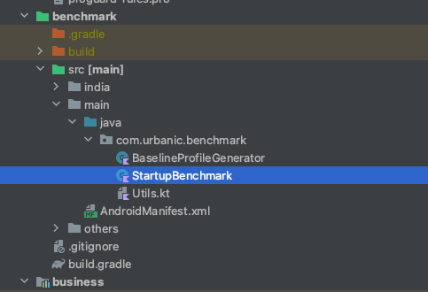
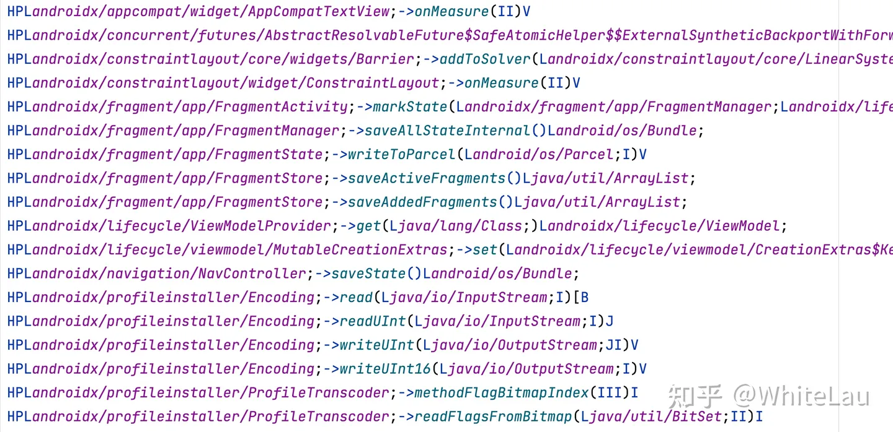
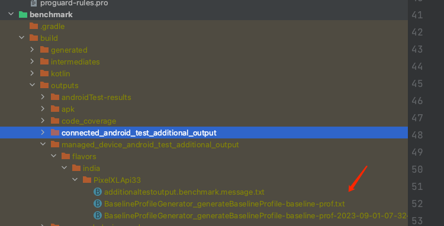
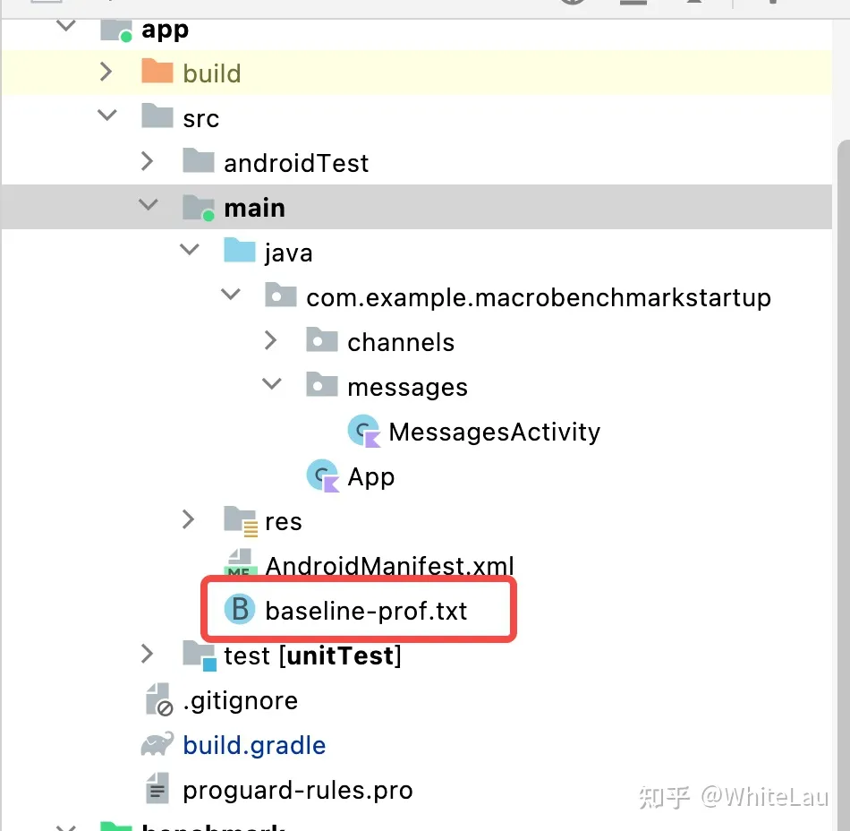
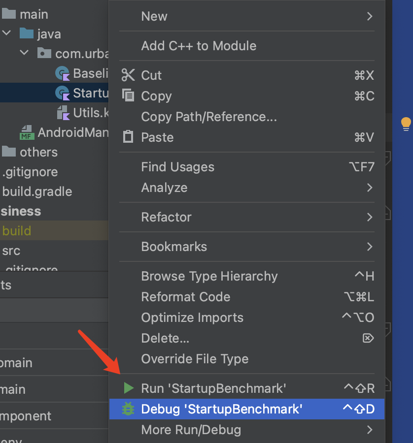

# Android 冷启动优化：Baseline 优化方案

## 背景

Android 应用的首次启动时间对用户留存率至关重要。谷歌在 Google I/O 2022 上向开发者推荐了 Baseline Profiles 方案进行优化，该方案通用性极高，几乎所有 Android 应用都可以采用。

因此，我们的 App 也可以尝试接入此方案，以进一步提升启动速度。

## 原理

### 核心概念

#### AOT

**AOT（Ahead-of-Time）编译**是一种编译技术，在程序运行之前将源代码或中间代码（如字节码）转换为机器代码。与传统的 JIT（Just-In-Time）编译相反，AOT 编译在程序执行之前完成编译过程，将代码转换为本地机器代码，以便直接在目标平台上运行。

AOT 编译的主要优势是在程序运行时提供更高的性能和更低的启动时间。由于代码已被提前编译为机器代码，运行时无需再进行解释或编译，从而减少了执行时间。这对于需要快速启动和响应的应用程序非常重要，例如移动应用或嵌入式系统。

另一个优势是 AOT 编译可以进行更多优化，因为编译器可以在编译时对整个程序进行分析和优化。这种静态优化可以提高代码的执行效率，并可根据目标平台的特性进行特定优化，从而进一步提高性能。

然而，AOT 编译也有一些限制。由于代码在编译时已被固定，无法根据运行时上下文进行动态优化。这意味着一些动态特性，如反射或动态代码生成，可能无法得到完全优化。此外，AOT 编译还需要额外的编译时间和存储空间。

#### JIT

**JIT（Just-In-Time）编译**是一种在程序运行时将源代码或中间代码（如字节码）动态转换为机器代码的编译技术。与 AOT 编译相反，JIT 编译在程序执行过程中实时进行编译，根据需要将代码片段编译为机器代码。

#### ART

**ART（Android Runtime）**是 Android 操作系统中的运行时环境，在 Android 5.0（Lollipop）中引入，取代了之前的 Dalvik 虚拟机。ART 的目标是提供更高的性能、更低的内存占用和更好的应用响应性。

与 Dalvik 虚拟机不同，ART 使用 AOT 编译技术。在应用安装时，ART 会将应用的字节码转换为本地机器码并存储在设备上，以便在运行时直接执行。这种预先编译的方式消除了 Dalvik 中即时编译（JIT）的开销，提高了应用的启动时间和执行性能。

ART 还引入了多种优化技术，例如更高效的垃圾回收算法、方法内联、循环优化和逃逸分析等。另一个重要特性是 ART 支持多种架构，可根据设备架构（如 ARM、x86、MIPS 等）生成相应的本地机器码。

#### 基准配置文件

基准配置文件是一个列表，包含在应用安装期间 [Android 运行时 (ART)](https://source.android.google.cn/devices/tech/dalvik?hl=zh-cn) 将关键路径预编译为机器代码时使用的 APK 中的类和方法。这是一种由配置文件引导的优化（PGO），可让应用优化启动、减少卡顿、提升性能，从而改善用户体验。

#### JVM

JVM 屏蔽了与具体操作系统平台相关的信息，使 Java 程序只需生成在 Java 虚拟机上运行的目标代码（字节码），就可以在多种平台上不加修改地运行。JVM 在执行字节码时，最终会把字节码解释成具体平台上的机器指令执行，属于用户态。


- Java 源文件 → 编译器 → 字节码文件
- 字节码文件 → JVM → 机器码

#### .oat 文件

**.oat 文件**是 Android 系统中的一种文件格式，包含预编译的应用程序或库的机器码，用于提高应用程序的启动速度和执行效率。

.oat 文件由 ART 虚拟机在应用程序安装或首次运行时生成。ART 会将应用程序的字节码进行优化和编译，生成对应的 .oat 文件。在后续运行过程中，ART 可以直接加载和执行 .oat 文件中的机器码，无需再次解析和编译字节码。

.oat 文件通常与 APK 文件关联。当应用程序被安装或首次运行时，ART 会根据 APK 中的字节码生成对应的 .oat 文件，并存储在设备的系统目录中。需要注意的是，每个设备和每个 Android 版本的 .oat 文件格式和存储位置可能不同，.oat 文件由 ART 自动管理，开发者无需直接操作。

### App 编译运行流程


编译流程


运行流程

1. **Java/Kotlin 代码编写**：使用 Java 或 Kotlin 编写应用程序的逻辑和功能。
2. **编译和构建**：使用 Android Studio 或其他 IDE 将代码编译成字节码，生成包含资源和字节码的 APK 文件。
3. **安装应用程序**：将 APK 安装到 Android 设备上，安装过程会解压 APK 并将文件复制到设备文件系统。
4. **Android 运行时环境（ART）**：应用程序在 ART 中运行，ART 负责加载和执行字节码。
5. **类加载和验证**：ART 在运行前进行类加载和验证，确保字节码符合 JVM 规范和 Android 系统要求。
6. **字节码解释和编译**：ART 使用解释器将字节码转换为机器码并执行。在运行过程中，ART 还会使用 JIT 技术将热点代码编译为本地机器码，以提高执行效率。

### 各 Android 版本的行为

Android 不同版本采用了不同的应用编译方法，每种方法都有相应的性能权衡。基准配置文件提供了一个适用于所有安装的配置文件，对之前的编译方法进行了改进。

| Android 版本 | 编译方法 | 优化方法 |
| :--- | :--- | :--- |
| Android 5（API 21）到 Android 6（API 23） | 完全 AOT | 整个应用在安装期间进行优化，导致用户等待时间较长、RAM 和磁盘占用增加、从磁盘加载代码时间更长，进而可能增加冷启动时间。 |
| Android 7（API 24）到 Android 8.1（API 27） | 部分 AOT（基准配置文件） | 基准配置文件由 androidx.profileinstaller 在应用首次运行时安装。ART 可在应用使用期间添加额外的配置文件规则，并在设备空闲时编译这些规则，从而更好地利用磁盘空间并缩短加载时间。 |
| Android 9（API 28）及更高版本 | 部分 AOT（基准配置文件 + 云配置文件） | 在应用安装期间，Play 会使用基准配置文件和云配置文件（如有）优化 APK。应用安装后，ART 配置文件会上传到 Play 并汇总，然后在其他用户安装/更新应用时以云配置文件形式提供。 |

对于 Android 5.0、6.0 系统，代码会在安装期间进行全量 AOT 编译。虽然 AOT 性能更高，但会带来应用安装时间增加、磁盘占用增大等问题。

对于 Android 7.0+ 系统，Android 支持 JIT 与 AOT 并存的混合编译模式。ART 虚拟机会在运行时统计应用的热点代码，存放在 `/data/misc/profiles/cur/0/包名/primary.prof` 路径下，并针对这些热点代码进行 AOT 编译，这种方式比全量 AOT 编译更灵活。

### Baseline Profiles 原理

#### 混合编译

Android 系统需要在执行过程中统计应用的热点代码，并生成 .prof 文件，然后在系统闲置时根据 .prof 文件执行 AOT 编译。该方案兼顾了安装速度与运行速度（对设备厂商而言还包括首次开机和 OTA 后开机的速度；使用过 Android 5.x、6.x 的用户会记得 OTA 升级后缓慢的「应用优化中」流程）。

但**混合编译有一个明显缺点：应用首次运行时一定是 JIT 编译，启动速度相对较慢。**

**Google 的 Baseline Profiles 方案思路很简单：让开发者在开发阶段就完成热点代码的统计，这样无需用户打开应用即可执行 AOT 编译。**

#### 基准配置文件的运作方式

配置文件规则会在 APK 的 `assets/dexopt/baseline.prof` 中编译为二进制形式。

在应用安装期间，ART 会对配置文件中的方法执行预先（AOT）编译，以提升这些方法的执行速度。如果配置文件包含应用启动或帧渲染期间使用的方法，用户将获得更快的启动速度和更少的卡顿。

在开发应用或库时，建议定义基准配置文件，涵盖关键用户历程中渲染时间或延迟非常重要的热路径，例如启动、转换或滚动。这样一来，基准配置文件会与 APK 一起直接发送给用户。

**总结**：Google 的思路是**让开发者提前统计好热点代码，将规则随代码一起打入 APK，并存放到 `/data/misc/profiles/cur/0/` 目录下**。整体分为两步：1. 统计热点代码的规则；2. 将规则存到特定目录下。


通过 Google Play


无 Google Play

工程编译后生成的 APK 将在 assets 下多出 dexopt 文件夹，其中存放 baseline.prof 和 baseline.profm 文件，如下图所示：


#### 预先编译时机


- **ab-ota**：Android Bootloader Over-The-Air 的缩写，指通过无线网络（通常为 OTA 更新）对 Android 设备的引导加载程序（bootloader）进行更新的过程。
- **bg-dexopt**：Android 系统中用于在后台执行 DEX 优化操作的进程。
- **Install app**：安装时
- **first-use**：第一次使用时

## 生成基准文件

### 原理

采用插桩过程，记录从启动到首页展示的完整路径。

### 编译环境


### 代码架构



```plain
package com.urbanic.benchmark

import androidx.benchmark.macro.junit4.BaselineProfileRule
import androidx.test.ext.junit.runners.AndroidJUnit4
import org.junit.Rule
import org.junit.Test
import org.junit.runner.RunWith

@RunWith(AndroidJUnit4::class)
class BaselineProfileGenerator {

    @get:Rule
    val rule = BaselineProfileRule()

    @Test
    fun generateBaselineProfile() {
        rule.collectBaselineProfile(PACKAGE_NAME) {
            pressHome()
            startActivityAndWait()

            // val intent = Intent(HOME_ACTIVITY_ACTION)
            // intent.`package` = packageName
            // intent.component = ComponentName(packageName, HOME_ACTIVITY_PATH)
            // startActivityAndWait(intent)
            // device.wait(Until.hasObject(By.clazz(HOME_ACTIVITY_PATH)), 5_000)
            // device.wait(Until.hasObject(By.res(packageName + ":id/content_img")), 5_000)
            // device.wait(Until.hasObject(By.res(packageName + ":id/include_navigation_bottom")), 5_000)

        }
    }

    internal companion object {
        const val HOME_ACTIVITY_PATH = "com.urbanic.home.view.NewBrandHomeActivity"
        const val HOME_ACTIVITY_ACTION = "urbanic.intent.action.benchmark"
    }
}
```

### 编译命令

生成基准文件的命令如下：

```plain
:benchmark:PixelXLApi33IndiaBenchmarkAndroidTest --rerun-tasks -P android.testInstrumentationRunnerArguments.class=com.urbanic.benchmark.BaselineProfileGenerator
```

参数说明：

- **benchmark**：模块名
- **PixelXLApi33IndiaBenchmarkAndroidTest**：设备配置，用于运行 mock 代码的设备信息
- **com.urbanic.benchmark.BaselineProfileGenerator**：生成基准文件的测试类

### baseline-prof.txt 文件解读



`H`、`S` 和 `P` 中的一个或多个字符用于指示相应方法在启动类型方面的标记：

- **H（Hot）**：表示方法在应用的整个生命周期内会被多次调用
- **S（Startup）**：表示方法会在启动过程中被调用
- **P（Post Startup）**：表示方法会在启动之后被调用

### 注意事项

创建基准配置文件时需注意以下事项：

- Android 5 到 Android 6（API 21 和 23）已在安装时对 APK 进行 AOT 编译，故基准配置文件对其无影响。
- [可调试应用](https://developer.android.google.cn/guide/topics/manifest/application-element#debug)绝不会经过 AOT 编译，以帮助进行问题排查。
- 规则文件必须命名为 `baseline-prof.txt`，并放在主源代码集的根目录中（与 `AndroidManifest.xml` 同级）。
- 仅在使用 Android Gradle 插件 `7.1.0-alpha05` 或更高版本（Android Studio Bumblebee Canary 5）时才会用到这些文件。
- [Bazel](https://source.android.com/docs/setup/build/bazel/introduction?hl=zh-cn) 目前不支持读取基准配置文件，也不支持将其合并到 APK 中。
- 基准配置文件的压缩后大小不得超过 1.5 MB，因此库和应用应尽量定义一小部分能够最大限度提升影响的规则。
- 如果规则过于宽泛导致编译过多，会增加磁盘访问，进而降低启动速度，应测试基准配置文件的性能。

## 接入基准文件

### 添加 Profileinstaller 依赖

```plain
dependencies {
    //...
    implementation "androidx.profileinstaller:profileinstaller:1.2.0"
}
```

### 添加 baseline-prof 文件





## 自动化验证测试

```plain
package com.urbanic.benchmark

import androidx.benchmark.macro.CompilationMode
import androidx.benchmark.macro.StartupMode
import androidx.benchmark.macro.StartupTimingLegacyMetric
import androidx.benchmark.macro.junit4.MacrobenchmarkRule
import androidx.test.ext.junit.runners.AndroidJUnit4
import org.junit.Rule
import org.junit.Test
import org.junit.runner.RunWith

@RunWith(AndroidJUnit4::class)
class StartupBenchmark {
    @get:Rule
    val benchmarkRule = MacrobenchmarkRule()

    @Test
    fun startupNoCompilation() {
        startup(CompilationMode.None())
    }

    @Test
    fun startupBaselineProfile() {
        startup(CompilationMode.Partial())
    }

    // @Test
    // fun startupFullCompilation() {
    //     startup(CompilationMode.Full())
    // }

    private fun startup(compilationMode: CompilationMode) {
        benchmarkRule.measureRepeated(packageName = PACKAGE_NAME,
            metrics = listOf(StartupTimingLegacyMetric()),
            iterations = 15,
            startupMode = StartupMode.COLD,
            compilationMode = compilationMode,
            setupBlock = { pressHome() }) {
            startActivityAndWait()
            // device.wait(Until.hasObject(By.res(packageName + ":id/content_img")), 5_000)
            // device.wait(Until.hasObject(By.res(packageName + ":id/include_navigation_bottom")), 5_000)
        }
    }
}
```



## 测试结果

### 启动时间

#### 测试环境及说明

- **min**：一组数据的最小值
- **max**：一组数据的最大值
- **median**：数据中位数
- **timeToInitialDisplayMs**：从系统收到启动 intent 到渲染目标 Activity 第一帧的时间

测试设备：小米 10，Android 13

### 用户可用时间

SM-A5070，Android 11，API 30

测量范围：从 Application attachBaseContext 到 HomeActivity onResume

#### 结果


### 结论

1. 手机性能越好，优化效果越不明显。
2. 优化效果未达到 Google 官方文档介绍的 20%+，测试中较好的情况约为 10%。
3. 基准文件用于告知系统需要提前编译为二进制码的代码。多国和印度环境在绝大多数情况下逻辑类似，两个环境使用同一份文件打包影响不大。

### 上线后预测

总体优化会有一定效果，但不会特别明显，预计在 10% 以下，基于以下三点：

#### 1. 实验数据


参考其他开发者的实测数据，优化效果无法达到 Google 宣传的 20%，基本在 10% 以内，与当前测试结果相近。

#### 2. 三方库已有优化


dexopt 为编译后的基准文件


未添加基准文件时的 dexopt 文件


添加基准文件时的 dexopt 文件

未添加 baseline-prof.txt 时的 baseline.prof 文件


其中多为 Android 系统库内的方法。

#### 3. 已有热代码

当用户使用时间较长时，系统自身产生的热代码文件与基准文件中的热代码重合度较高，因此优化效果会不明显。

## 开发过程中的问题

### 1. 生成的基准文件如何自动添加到 app 目录？


对应的 androidx.baselineprofile 插件未找到，在公共库中搜索也无结果。

参考文档：<https://developer.android.com/topic/performance/baselineprofiles/create-baselineprofile?hl=zh-cn#baseline-profile-library>

### 2. 如何针对多 productFlavor 生成不同的基准文件并应用？

配置完成后会生成两个 Gradle 任务：


该任务执行完毕后会生成两个不同的 baselineProfile 文件，分别对应两个不同 flavor 的包，需要分别手动添加，并考虑如何接入现有的打包机制。

**第一阶段：手动打出印度和多国环境下的 productFlavor 产物**

分别将印度和多国环境的产物放置于 India 和 Others 目录下：


在执行打包命令时，通过自定义脚本将 india 或 others 的文件拷贝到主工程中，以实现多 flavor 环境下分别使用对应的基准文件打包，从而接入现有的 Starlink 打包流程：

```plain
if (isPackOtherApk()) {
    task copyTxtFile(type: Copy) {
        from '../app/src/others/baseline-prof.txt'
        into '../app/src/main/'
    }
    preBuild.dependsOn(copyTxtFile)
} else if (isPackIndiaApk()) {
    task copyTxtFile(type: Copy) {
        from '../app/src/india/baseline-prof.txt'
        into '../app/src/main/'
    }
    preBuild.dependsOn(copyTxtFile)
}
```

曾考虑将文件放到 assets 目录下，但该目录下的文件打包完成后不会被删除，会增大包体积，且该目录通常被加入 .gitignore，无法被 Git 追踪。也考虑过 raw 目录，但该目录有命名规则限制，且打包后原产物不会被删除，同样存在包体积增大的问题。

**第二阶段**：完整流程自动化（待实现）

### 3. systemImageSource = "aosp" 与 systemImageSource = "google" 的区别？

- **Google API**：由 Google 提供的一组应用程序接口，用于开发人员与 Google 的各种服务和平台进行交互和集成，涵盖 Google Maps、Drive、Calendar、Analytics、Cloud Vision 等领域。
- **AOSP**：Android Open Source Project，开源 Android 源码。使用 AOSP 的另一个原因是便于 root。

参考文档：<https://developer.android.com/reference/tools/gradle-api/7.4/com/android/build/api/dsl/ManagedVirtualDevice#systemImageSource()>


### 4. 如何在不使用自动化测试的情况下验证优化前后效果？

#### 手动衡量应用改进

首先，衡量未优化的应用启动时间作为参考：

```plain
PACKAGE_NAME=com.example.app

# Force Stop App
adb shell am force-stop $PACKAGE_NAME
# Reset compiled state
adb shell cmd package compile --reset $PACKAGE_NAME

# Measure App startup
# This corresponds to `Time to initial display` metric
# For additional info https://developer.android.com/topic/performance/vitals/launch-time#time-initial
adb shell am start-activity -W -n $PACKAGE_NAME/.ExampleActivity \
 | grep "TotalTime"
```

接下来，旁加载基准配置文件。

**注意**：此工作流程仅适用于 Android 9（API 28）到 Android 11（API 30）。

```plain
# Unzip the Release APK first
unzip release.apk

# Create a ZIP archive
# Note: The name should match the name of the APK
# Note: Copy baseline.prof{m} and rename it to primary.prof{m}
cp assets/dexopt/baseline.prof primary.prof
cp assets/dexopt/baseline.profm primary.profm

# Create an archive
zip -r release.dm primary.prof primary.profm

# Confirm that release.dm only contains the two profile files:
unzip -l release.dm
# Archive:  release.dm
#   Length      Date    Time    Name
# ---------  ---------- -----   ----
#      3885  1980-12-31 17:01   primary.prof
#      1024  1980-12-31 17:01   primary.profm
# ---------                     -------
#                               2 files

# Install APK + Profile together
adb install-multiple release.apk release.dm
```

验证软件包在安装时是否已优化：

```plain
# Check dexopt state
adb shell dumpsys package dexopt | grep -A 1 $PACKAGE_NAME
```

输出应指明已编译软件包：

```plain
[com.example.app]
  path: /data/app/~~YvNxUxuP2e5xA6EGtM5i9A==/com.example.app-zQ0tkJN8tDrEZXTlrDUSBg==/base.apk
  arm64: [status=speed-profile] [reason=install-dm]
```

现在可以像前面那样衡量应用启动性能，但**切勿重置软件包的编译状态**：

```plain
# Force Stop App
adb shell am force-stop $PACKAGE_NAME

# Measure App startup
adb shell am start-activity -W -n $PACKAGE_NAME/.ExampleActivity \
 | grep "TotalTime"
```

### 5. 生成基准文件的大小限制及处理


上述为已编译文件的大小要求。实践中发现，约 3MB 的源文件编译后仅约 30KB，一般不会超过限制。


### 6. 混淆相关问题

首先，生成 baseline-prof.txt 时不要启用 `minifyEnabled`，或单独配置不进行混淆的规则，否则记录下的热点代码将是混淆后的代码。

那么，Baseline Profiles 记录的是热点类的路径，混淆会改变类的路径，在生成最终 release 包时，Baseline Profiles 还能正常生效吗？

大部分官方文档未提及这一点。在相关 Issue 中，Google 开发人员回复：

> _Baseline profiles also participate in the obfuscation process, like classes; so this already works._

参考：<https://issuetracker.google.com/issues/235571073#comment2>

Google 确认 Baseline Profiles 已可与 R8 优化一起正常工作。测试验证表明，开启 `minifyEnabled` 后，MacroBenchmark 同样得到了启动速度更优的结果。

### 7. 包含 Dynamic Feature Modules 的工程进行基准测试时，相关代码无法打入 APK

我们的 App 首页多个 Tab 通过 Dynamic Feature Modules 实现，因此基准测试打出的包不包含相关代码，首页会出现空白。

相关讨论：<https://stackoverflow.com/questions/71706002/android-jetpack-baseline-profile-with-dynamic-feature-modules>

> Same issue here, it looks like when we run benchmark task, the task didn't include the dynamic feature code into our application, basically it will use app bundle(aab) instead of apk. So if the class is not included in your base.apk, then it will throw a classnotfound exception

**原因**：基准测试的 Gradle 命令为 `:benchmark:connectedIndiaBenchmarkAndroidTest`，其任务链最后打包的命令为 `:app:packageIndiaBenchmark`，该命令打的 APK 不包含 Dynamic Feature Modules 相关产物。而使用 `:app:packageIndiaBenchmarkUniversalApk` 才会将 Dynamic Feature Modules 代码带入包中。

**临时解决方案**：在 `:app:packageIndiaBenchmark` 命令执行完成后，用通过 `:app:packageIndiaBenchmarkUniversalApk` 打出的包替换 benchmark 产物。该方案的准确性和代码合理性仍有待完善，预计 Google 后续会提供官方解决方案。

```plain
//benchmark 测试时使用
//    afterEvaluate {
//        tasks.named('packageIndiaBenchmark').get().doLast {
//            delete("/Users/weifeng/works/urbanic-android/app/build/intermediates/apk/india/benchmark/urbanic-v7.7.0.0-india-benchmark.apk")
//            copy {
//                from("/Users/weifeng/works/urbanic-android/app/build/outputs/apk_from_bundle/indiaRelease/urbanic-v7.7.0.0-india-release-universal.apk")
//                into("/Users/weifeng/works/urbanic-android/app/build/intermediates/apk/india/benchmark")
//                rename("urbanic-v7.7.0.0-india-release-universal.apk", "urbanic-v7.7.0.0-india-benchmark.apk")
//            }
//        }
//    }
```

### 8. 自动化测试问题

我们的 App 有获取通知权限弹窗，该弹窗一旦出现会位于视图的第一层级，导致基于 ID 的自动化测试逻辑出现问题。需要使用 `allowNotifications()` 方法关闭弹窗：

```plain
fun MacrobenchmarkScope.allowNotifications() {
    if (SDK_INT >= TIRAMISU) {
        val command = "pm grant $packageName ${permission.POST_NOTIFICATIONS}"
        device.executeShellCommand(command)
    }
}

private fun startup(compilationMode: CompilationMode) {
    benchmarkRule.measureRepeated(packageName = PACKAGE_NAME,
        // metrics = listOf(TraceSectionMetric("app-start")),
        metrics = listOf(StartupTimingLegacyMetric()),
        iterations = 5,
        startupMode = StartupMode.COLD,
        compilationMode = compilationMode,
        setupBlock = {
            pressHome()
            allowNotifications()
        }) {
        startActivityAndWait()
        allowNotifications()
        device.wait(Until.hasObject(By.res("com.urbanic:id/include_navigation_bottom")), 5_000)
    }
}
```

## 遗留疑问

1. **有时使用基准文件预编译反而不如不使用预编译？**  
   与第 2 点原因相同。

2. **完全 AOT 的数据并没有明显优化？**  
   不同时刻设备的测试环境不同，效果不一定会有改进。建议以 5 次为一组进行测试，时间允许可用 10 次为一组。建议使用最新版本的 AGP（7.3.0-rc01）、macrobenchmark（1.2.0-alpha03）和 profileinstaller（1.2.0）。设备在不同时刻的负载可能不同，可适当增加迭代次数以获得更一致的结果。参考：<https://stackoverflow.com/questions/73639422/baseline-profiles-metrics-are-not-consistent>

3. **如何进行多维度的启动效果统计？**  
   例如新安装版本与已有版本使用该优化后的效果。最新版本的用户多为新安装用户，可以此作为新安装版本的数据基准。

4. **如何剥离其它因素对某个版本 App 启动速度的影响？**  
   待进一步探索。

## 数据观察

[Firebase Console](https://console.firebase.google.com/u/0/project/com-urbanic/performance/app/android:com.urbanic/trends?hl=zh-cn)

## 后续优化

- [DEX 布局优化和启动配置文件](https://developer.android.com/topic/performance/baselineprofiles/dex-layout-optimizations?hl=zh-cn)
- Library 生成配置文件

## 参考文献

- [使用基准配置文件提升应用性能](https://developer.android.com/codelabs/android-baseline-profiles-improve?hl=zh-cn#6)
- [Google Baseline Profiles IssueTrack](https://issuetracker.google.com/issues?q=status:open%20componentid:1071684&s=created_time:desc)
- [基准文件操作流程（中文版）](https://developer.android.com/codelabs/android-baseline-profiles-improve?hl=zh-cn#8)
- [Android 强推的 Baseline Profiles 国内能用吗？我找 Google 工程师求证了！](https://juejin.cn/post/7104230480391864356)
- [Android Baseline Profiles 探究及实践](https://zhuanlan.zhihu.com/p/596716179)
- [Android 使用基准配置文件 (Baseline Profile) 方案提升启动速度记录](https://juejin.cn/post/7195535228230975547?searchId=20230829204659C72AC9DD2ADE3BD81AA7)
- 视频：<https://www.youtube.com/watch?v=hqYnZ5qCw8Y>
