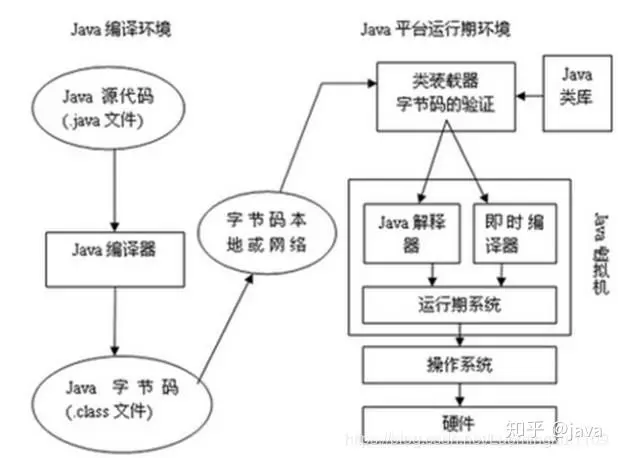
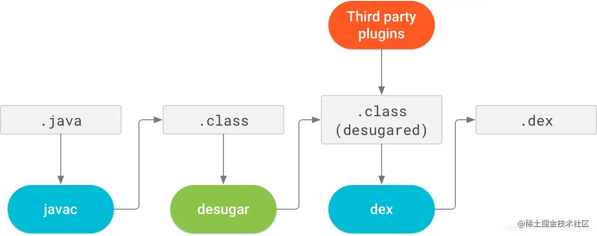
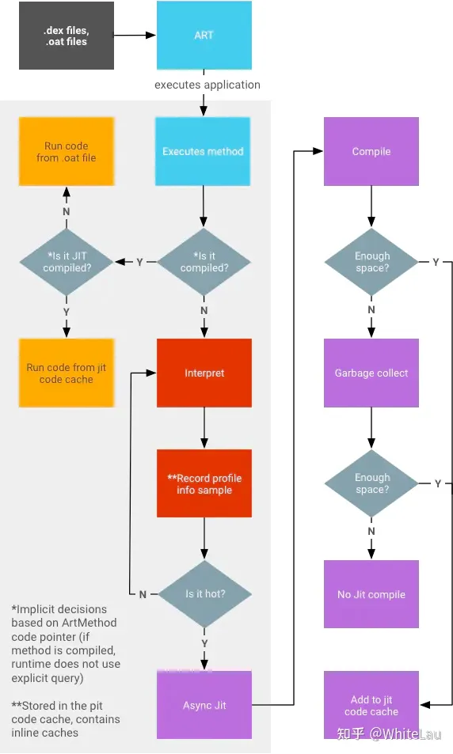
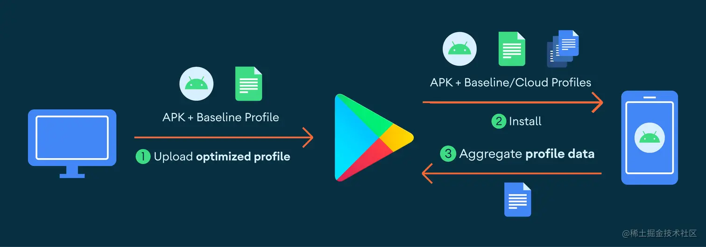
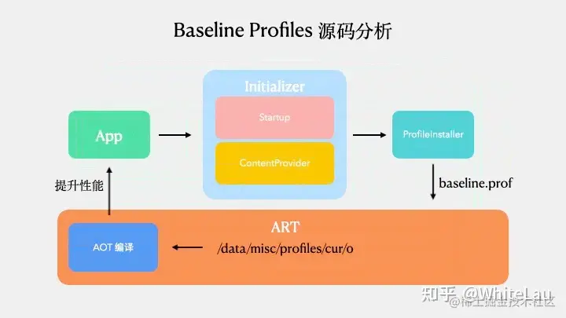
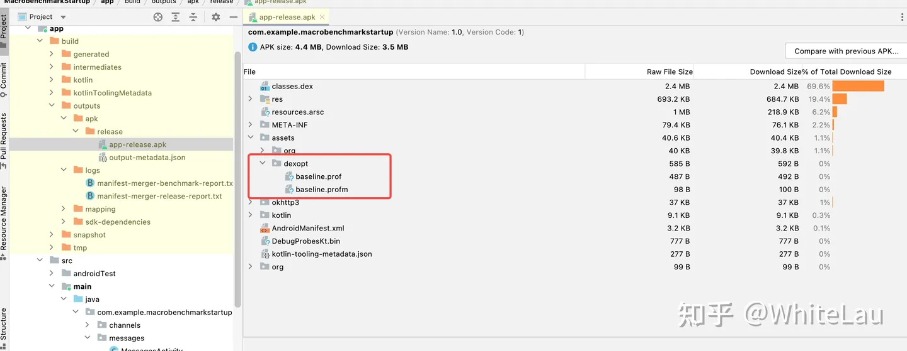
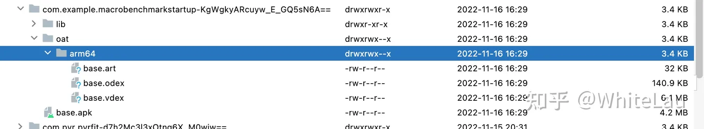
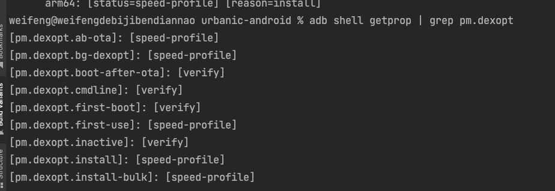

> 本文是「Android 冷启动优化：Baseline 优化方案」系列的第 1 篇，共 3 篇。

## 背景

Android 应用的首次启动时间对用户留存率至关重要。谷歌在 Google I/O 2022 上向开发者推荐了 Baseline Profiles 方案进行优化，该方案通用性极高，几乎所有 Android 应用都可以采用。

因此，我们的 App 也可以尝试接入此方案，以进一步提升启动速度。

## 原理

### 核心概念

#### AOT

**AOT（Ahead-of-Time）编译**是一种编译技术，在程序运行之前将源代码或中间代码（如字节码）转换为机器代码。与传统的 JIT（Just-In-Time）编译相反，AOT 编译在程序执行之前完成编译过程，将代码转换为本地机器代码，以便直接在目标平台上运行。

AOT 编译的主要优势是在程序运行时提供更高的性能和更低的启动时间。由于代码已被提前编译为机器代码，运行时无需再进行解释或编译，从而减少了执行时间。这对于需要快速启动和响应的应用程序非常重要，例如移动应用或嵌入式系统。

另一个优势是 AOT 编译可以进行更多优化，因为编译器可以在编译时对整个程序进行分析和优化。这种静态优化可以提高代码的执行效率，并可根据目标平台的特性进行特定优化，从而进一步提高性能。

然而，AOT 编译也有一些限制。由于代码在编译时已被固定，无法根据运行时上下文进行动态优化。这意味着一些动态特性，如反射或动态代码生成，可能无法得到完全优化。此外，AOT 编译还需要额外的编译时间和存储空间。

#### JIT

**JIT（Just-In-Time）编译**是一种在程序运行时将源代码或中间代码（如字节码）动态转换为机器代码的编译技术。与 AOT 编译相反，JIT 编译在程序执行过程中实时进行编译，根据需要将代码片段编译为机器代码。

#### ART

**ART（Android Runtime）**是 Android 操作系统中的运行时环境，在 Android 5.0（Lollipop）中引入，取代了之前的 Dalvik 虚拟机。ART 的目标是提供更高的性能、更低的内存占用和更好的应用响应性。

与 Dalvik 虚拟机不同，ART 使用 AOT 编译技术。在应用安装时，ART 会将应用的字节码转换为本地机器码并存储在设备上，以便在运行时直接执行。这种预先编译的方式消除了 Dalvik 中即时编译（JIT）的开销，提高了应用的启动时间和执行性能。

ART 还引入了多种优化技术，例如更高效的垃圾回收算法、方法内联、循环优化和逃逸分析等。另一个重要特性是 ART 支持多种架构，可根据设备架构（如 ARM、x86、MIPS 等）生成相应的本地机器码。

#### 基准配置文件

基准配置文件是一个列表，包含在应用安装期间 [Android 运行时 (ART)](https://source.android.google.cn/devices/tech/dalvik?hl=zh-cn) 将关键路径预编译为机器代码时使用的 APK 中的类和方法。这是一种由配置文件引导的优化（PGO），可让应用优化启动、减少卡顿、提升性能，从而改善用户体验。

#### JVM

JVM 屏蔽了与具体操作系统平台相关的信息，使 Java 程序只需生成在 Java 虚拟机上运行的目标代码（字节码），就可以在多种平台上不加修改地运行。JVM 在执行字节码时，最终会把字节码解释成具体平台上的机器指令执行，属于用户态。

- Java 源文件 → 编译器 → 字节码文件
- 字节码文件 → JVM → 机器码

#### .oat 文件

**.oat 文件**是 Android 系统中的一种文件格式，包含预编译的应用程序或库的机器码，用于提高应用程序的启动速度和执行效率。

.oat 文件由 ART 虚拟机在应用程序安装或首次运行时生成。ART 会将应用程序的字节码进行优化和编译，生成对应的 .oat 文件。在后续运行过程中，ART 可以直接加载和执行 .oat 文件中的机器码，无需再次解析和编译字节码。

.oat 文件通常与 APK 文件关联。当应用程序被安装或首次运行时，ART 会根据 APK 中的字节码生成对应的 .oat 文件，并存储在设备的系统目录中。需要注意的是，每个设备和每个 Android 版本的 .oat 文件格式和存储位置可能不同，.oat 文件由 ART 自动管理，开发者无需直接操作。

### App 编译运行流程

编译流程

运行流程

1. **Java/Kotlin 代码编写**：使用 Java 或 Kotlin 编写应用程序的逻辑和功能。
2. **编译和构建**：使用 Android Studio 或其他 IDE 将代码编译成字节码，生成包含资源和字节码的 APK 文件。
3. **安装应用程序**：将 APK 安装到 Android 设备上，安装过程会解压 APK 并将文件复制到设备文件系统。
4. **Android 运行时环境（ART）**：应用程序在 ART 中运行，ART 负责加载和执行字节码。
5. **类加载和验证**：ART 在运行前进行类加载和验证，确保字节码符合 JVM 规范和 Android 系统要求。
6. **字节码解释和编译**：ART 使用解释器将字节码转换为机器码并执行。在运行过程中，ART 还会使用 JIT 技术将热点代码编译为本地机器码，以提高执行效率。

### 各 Android 版本的行为

Android 不同版本采用了不同的应用编译方法，每种方法都有相应的性能权衡。基准配置文件提供了一个适用于所有安装的配置文件，对之前的编译方法进行了改进。

| Android 版本 | 编译方法 | 优化方法 |
| :--- | :--- | :--- |
| Android 5（API 21）到 Android 6（API 23） | 完全 AOT | 整个应用在安装期间进行优化，导致用户等待时间较长、RAM 和磁盘占用增加、从磁盘加载代码时间更长，进而可能增加冷启动时间。 |
| Android 7（API 24）到 Android 8.1（API 27） | 部分 AOT（基准配置文件） | 基准配置文件由 androidx.profileinstaller 在应用首次运行时安装。ART 可在应用使用期间添加额外的配置文件规则，并在设备空闲时编译这些规则，从而更好地利用磁盘空间并缩短加载时间。 |
| Android 9（API 28）及更高版本 | 部分 AOT（基准配置文件 + 云配置文件） | 在应用安装期间，Play 会使用基准配置文件和云配置文件（如有）优化 APK。应用安装后，ART 配置文件会上传到 Play 并汇总，然后在其他用户安装/更新应用时以云配置文件形式提供。 |

对于 Android 5.0、6.0 系统，代码会在安装期间进行全量 AOT 编译。虽然 AOT 性能更高，但会带来应用安装时间增加、磁盘占用增大等问题。

对于 Android 7.0+ 系统，Android 支持 JIT 与 AOT 并存的混合编译模式。ART 虚拟机会在运行时统计应用的热点代码，存放在 `/data/misc/profiles/cur/0/包名/primary.prof` 路径下，并针对这些热点代码进行 AOT 编译，这种方式比全量 AOT 编译更灵活。

### Baseline Profiles 原理

#### 混合编译

Android 系统需要在执行过程中统计应用的热点代码，并生成 .prof 文件，然后在系统闲置时根据 .prof 文件执行 AOT 编译。该方案兼顾了安装速度与运行速度（对设备厂商而言还包括首次开机和 OTA 后开机的速度；使用过 Android 5.x、6.x 的用户会记得 OTA 升级后缓慢的「应用优化中」流程）。

但**混合编译有一个明显缺点：应用首次运行时一定是 JIT 编译，启动速度相对较慢。**

**Google 的 Baseline Profiles 方案思路很简单：让开发者在开发阶段就完成热点代码的统计，这样无需用户打开应用即可执行 AOT 编译。**

#### 基准配置文件的运作方式

配置文件规则会在 APK 的 `assets/dexopt/baseline.prof` 中编译为二进制形式。

在应用安装期间，ART 会对配置文件中的方法执行预先（AOT）编译，以提升这些方法的执行速度。如果配置文件包含应用启动或帧渲染期间使用的方法，用户将获得更快的启动速度和更少的卡顿。

在开发应用或库时，建议定义基准配置文件，涵盖关键用户历程中渲染时间或延迟非常重要的热路径，例如启动、转换或滚动。这样一来，基准配置文件会与 APK 一起直接发送给用户。

**总结**：Google 的思路是**让开发者提前统计好热点代码，将规则随代码一起打入 APK，并存放到 `/data/misc/profiles/cur/0/` 目录下**。整体分为两步：1. 统计热点代码的规则；2. 将规则存到特定目录下。

通过 Google Play

无 Google Play

工程编译后生成的 APK 将在 assets 下多出 dexopt 文件夹，其中存放 baseline.prof 和 baseline.profm 文件，如下图所示：

#### 预先编译时机

- **ab-ota**：Android Bootloader Over-The-Air 的缩写，指通过无线网络（通常为 OTA 更新）对 Android 设备的引导加载程序（bootloader）进行更新的过程。
- **bg-dexopt**：Android 系统中用于在后台执行 DEX 优化操作的进程。
- **Install app**：安装时
- **first-use**：第一次使用时

---

> 下一篇我们将探讨「生成基准文件」，敬请关注本系列。

**「Android 冷启动优化：Baseline 优化方案」系列目录**

1. **背景**（本文）
2. 生成基准文件
3. 测试结果
