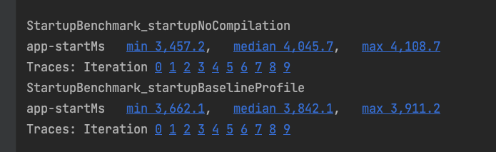
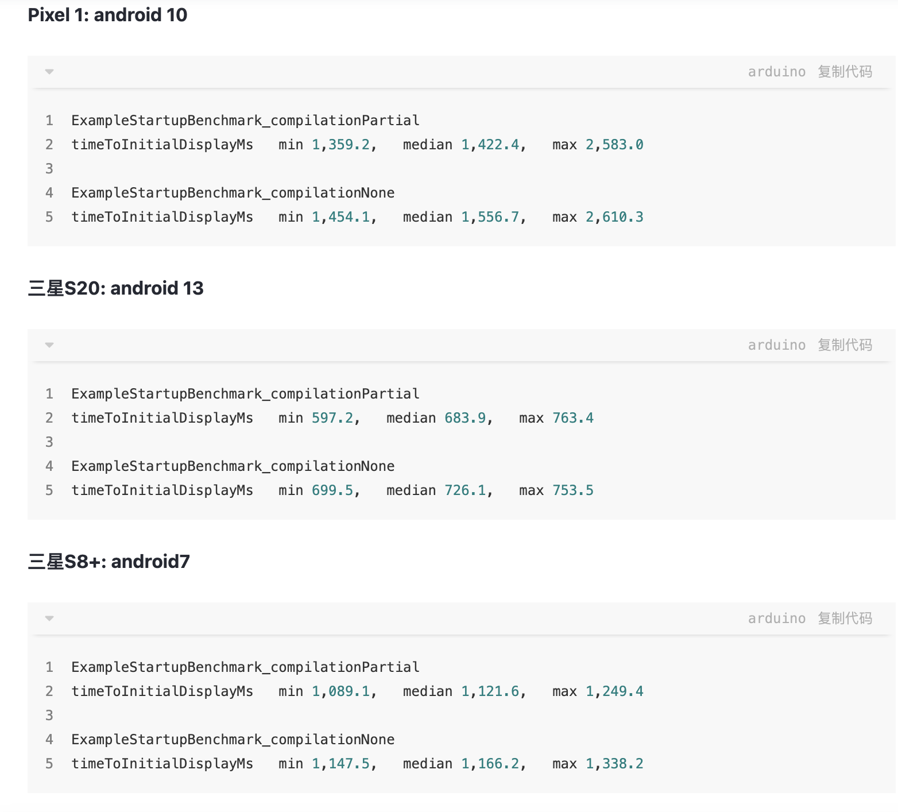
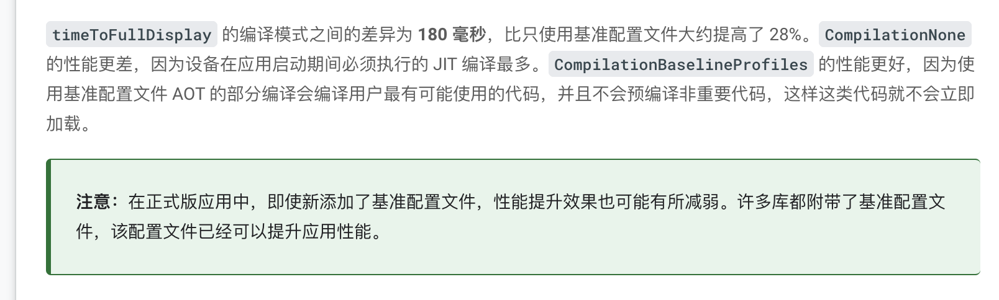
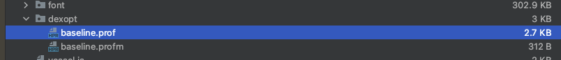
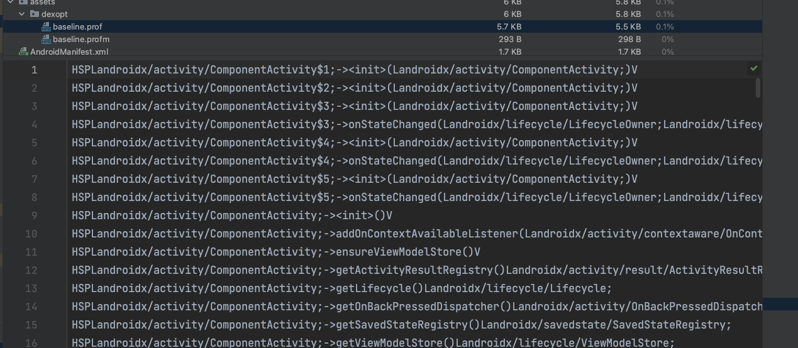
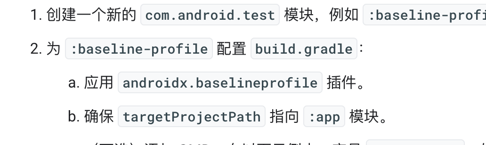
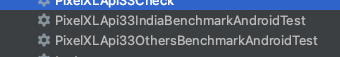
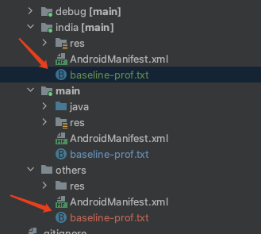
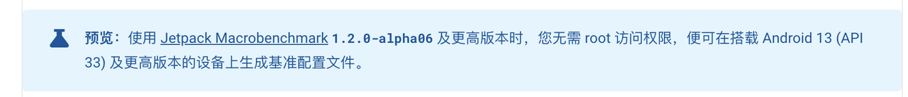

> 本文是「Android 冷启动优化：Baseline 优化方案」系列的第 3 篇，共 3 篇。在上一篇中，我们探讨了「生成基准文件」的相关内容。

## 测试结果

### 启动时间

#### 测试环境及说明

- **min**：一组数据的最小值
- **max**：一组数据的最大值
- **median**：数据中位数
- **timeToInitialDisplayMs**：从系统收到启动 intent 到渲染目标 Activity 第一帧的时间

测试设备：小米 10，Android 13

### 用户可用时间

SM-A5070，Android 11，API 30

测量范围：从 Application attachBaseContext 到 HomeActivity onResume

#### 结果



### 结论

1. 手机性能越好，优化效果越不明显。
2. 优化效果未达到 Google 官方文档介绍的 20%+，测试中较好的情况约为 10%。
3. 基准文件用于告知系统需要提前编译为二进制码的代码。多国和印度环境在绝大多数情况下逻辑类似，两个环境使用同一份文件打包影响不大。

### 上线后预测

总体优化会有一定效果，但不会特别明显，预计在 10% 以下，基于以下三点：

#### 1. 实验数据




参考其他开发者的实测数据，优化效果无法达到 Google 宣传的 20%，基本在 10% 以内，与当前测试结果相近。

#### 2. 三方库已有优化



dexopt 为编译后的基准文件



未添加基准文件时的 dexopt 文件


添加基准文件时的 dexopt 文件

未添加 baseline-prof.txt 时的 baseline.prof 文件



其中多为 Android 系统库内的方法。

#### 3. 已有热代码

当用户使用时间较长时，系统自身产生的热代码文件与基准文件中的热代码重合度较高，因此优化效果会不明显。

## 开发过程中的问题

### 1. 生成的基准文件如何自动添加到 app 目录？



对应的 androidx.baselineprofile 插件未找到，在公共库中搜索也无结果。

参考文档：<https://developer.android.com/topic/performance/baselineprofiles/create-baselineprofile?hl=zh-cn#baseline-profile-library>

### 2. 如何针对多 productFlavor 生成不同的基准文件并应用？

配置完成后会生成两个 Gradle 任务：



该任务执行完毕后会生成两个不同的 baselineProfile 文件，分别对应两个不同 flavor 的包，需要分别手动添加，并考虑如何接入现有的打包机制。

**第一阶段：手动打出印度和多国环境下的 productFlavor 产物**

分别将印度和多国环境的产物放置于 India 和 Others 目录下：



在执行打包命令时，通过自定义脚本将 india 或 others 的文件拷贝到主工程中，以实现多 flavor 环境下分别使用对应的基准文件打包，从而接入现有的 Starlink 打包流程：

```plain
if (isPackOtherApk()) {
    task copyTxtFile(type: Copy) {
        from '../app/src/others/baseline-prof.txt'
        into '../app/src/main/'
    }
    preBuild.dependsOn(copyTxtFile)
} else if (isPackIndiaApk()) {
    task copyTxtFile(type: Copy) {
        from '../app/src/india/baseline-prof.txt'
        into '../app/src/main/'
    }
    preBuild.dependsOn(copyTxtFile)
}
```

曾考虑将文件放到 assets 目录下，但该目录下的文件打包完成后不会被删除，会增大包体积，且该目录通常被加入 .gitignore，无法被 Git 追踪。也考虑过 raw 目录，但该目录有命名规则限制，且打包后原产物不会被删除，同样存在包体积增大的问题。

**第二阶段**：完整流程自动化（待实现）

### 3. systemImageSource = "aosp" 与 systemImageSource = "google" 的区别？

- **Google API**：由 Google 提供的一组应用程序接口，用于开发人员与 Google 的各种服务和平台进行交互和集成，涵盖 Google Maps、Drive、Calendar、Analytics、Cloud Vision 等领域。
- **AOSP**：Android Open Source Project，开源 Android 源码。使用 AOSP 的另一个原因是便于 root。

参考文档：<https://developer.android.com/reference/tools/gradle-api/7.4/com/android/build/api/dsl/ManagedVirtualDevice#systemImageSource()>



### 4. 如何在不使用自动化测试的情况下验证优化前后效果？

#### 手动衡量应用改进

首先，衡量未优化的应用启动时间作为参考：

```plain
PACKAGE_NAME=com.example.app

# Force Stop App
adb shell am force-stop $PACKAGE_NAME
# Reset compiled state
adb shell cmd package compile --reset $PACKAGE_NAME

# Measure App startup
# This corresponds to `Time to initial display` metric
# For additional info https://developer.android.com/topic/performance/vitals/launch-time#time-initial
adb shell am start-activity -W -n $PACKAGE_NAME/.ExampleActivity \
 | grep "TotalTime"
```

接下来，旁加载基准配置文件。

**注意**：此工作流程仅适用于 Android 9（API 28）到 Android 11（API 30）。

```plain
# Unzip the Release APK first
unzip release.apk

# Create a ZIP archive
# Note: The name should match the name of the APK
# Note: Copy baseline.prof{m} and rename it to primary.prof{m}
cp assets/dexopt/baseline.prof primary.prof
cp assets/dexopt/baseline.profm primary.profm

# Create an archive
zip -r release.dm primary.prof primary.profm

# Confirm that release.dm only contains the two profile files:
unzip -l release.dm
# Archive:  release.dm
#   Length      Date    Time    Name
# ---------  ---------- -----   ----
#      3885  1980-12-31 17:01   primary.prof
#      1024  1980-12-31 17:01   primary.profm
# ---------                     -------
#                               2 files

# Install APK + Profile together
adb install-multiple release.apk release.dm
```

验证软件包在安装时是否已优化：

```plain
# Check dexopt state
adb shell dumpsys package dexopt | grep -A 1 $PACKAGE_NAME
```

输出应指明已编译软件包：

```plain
[com.example.app]
  path: /data/app/~~YvNxUxuP2e5xA6EGtM5i9A==/com.example.app-zQ0tkJN8tDrEZXTlrDUSBg==/base.apk
  arm64: [status=speed-profile] [reason=install-dm]
```

现在可以像前面那样衡量应用启动性能，但**切勿重置软件包的编译状态**：

```plain
# Force Stop App
adb shell am force-stop $PACKAGE_NAME

# Measure App startup
adb shell am start-activity -W -n $PACKAGE_NAME/.ExampleActivity \
 | grep "TotalTime"
```

### 5. 生成基准文件的大小限制及处理


上述为已编译文件的大小要求。实践中发现，约 3MB 的源文件编译后仅约 30KB，一般不会超过限制。


### 6. 混淆相关问题

首先，生成 baseline-prof.txt 时不要启用 `minifyEnabled`，或单独配置不进行混淆的规则，否则记录下的热点代码将是混淆后的代码。

那么，Baseline Profiles 记录的是热点类的路径，混淆会改变类的路径，在生成最终 release 包时，Baseline Profiles 还能正常生效吗？

大部分官方文档未提及这一点。在相关 Issue 中，Google 开发人员回复：

> _Baseline profiles also participate in the obfuscation process, like classes; so this already works._

参考：<https://issuetracker.google.com/issues/235571073#comment2>

Google 确认 Baseline Profiles 已可与 R8 优化一起正常工作。测试验证表明，开启 `minifyEnabled` 后，MacroBenchmark 同样得到了启动速度更优的结果。

### 7. 包含 Dynamic Feature Modules 的工程进行基准测试时，相关代码无法打入 APK

我们的 App 首页多个 Tab 通过 Dynamic Feature Modules 实现，因此基准测试打出的包不包含相关代码，首页会出现空白。

相关讨论：<https://stackoverflow.com/questions/71706002/android-jetpack-baseline-profile-with-dynamic-feature-modules>

> Same issue here, it looks like when we run benchmark task, the task didn't include the dynamic feature code into our application, basically it will use app bundle(aab) instead of apk. So if the class is not included in your base.apk, then it will throw a classnotfound exception

**原因**：基准测试的 Gradle 命令为 `:benchmark:connectedIndiaBenchmarkAndroidTest`，其任务链最后打包的命令为 `:app:packageIndiaBenchmark`，该命令打的 APK 不包含 Dynamic Feature Modules 相关产物。而使用 `:app:packageIndiaBenchmarkUniversalApk` 才会将 Dynamic Feature Modules 代码带入包中。

**临时解决方案**：在 `:app:packageIndiaBenchmark` 命令执行完成后，用通过 `:app:packageIndiaBenchmarkUniversalApk` 打出的包替换 benchmark 产物。该方案的准确性和代码合理性仍有待完善，预计 Google 后续会提供官方解决方案。

```plain
//benchmark 测试时使用
//    afterEvaluate {
//        tasks.named('packageIndiaBenchmark').get().doLast {
//            delete("/Users/weifeng/works/urbanic-android/app/build/intermediates/apk/india/benchmark/urbanic-v7.7.0.0-india-benchmark.apk")
//            copy {
//                from("/Users/weifeng/works/urbanic-android/app/build/outputs/apk_from_bundle/indiaRelease/urbanic-v7.7.0.0-india-release-universal.apk")
//                into("/Users/weifeng/works/urbanic-android/app/build/intermediates/apk/india/benchmark")
//                rename("urbanic-v7.7.0.0-india-release-universal.apk", "urbanic-v7.7.0.0-india-benchmark.apk")
//            }
//        }
//    }
```

### 8. 自动化测试问题

我们的 App 有获取通知权限弹窗，该弹窗一旦出现会位于视图的第一层级，导致基于 ID 的自动化测试逻辑出现问题。需要使用 `allowNotifications()` 方法关闭弹窗：

```plain
fun MacrobenchmarkScope.allowNotifications() {
    if (SDK_INT >= TIRAMISU) {
        val command = "pm grant $packageName ${permission.POST_NOTIFICATIONS}"
        device.executeShellCommand(command)
    }
}

private fun startup(compilationMode: CompilationMode) {
    benchmarkRule.measureRepeated(packageName = PACKAGE_NAME,
        // metrics = listOf(TraceSectionMetric("app-start")),
        metrics = listOf(StartupTimingLegacyMetric()),
        iterations = 5,
        startupMode = StartupMode.COLD,
        compilationMode = compilationMode,
        setupBlock = {
            pressHome()
            allowNotifications()
        }) {
        startActivityAndWait()
        allowNotifications()
        device.wait(Until.hasObject(By.res("com.urbanic:id/include_navigation_bottom")), 5_000)
    }
}
```

## 遗留疑问

1. **有时使用基准文件预编译反而不如不使用预编译？**  
   与第 2 点原因相同。

2. **完全 AOT 的数据并没有明显优化？**  
   不同时刻设备的测试环境不同，效果不一定会有改进。建议以 5 次为一组进行测试，时间允许可用 10 次为一组。建议使用最新版本的 AGP（7.3.0-rc01）、macrobenchmark（1.2.0-alpha03）和 profileinstaller（1.2.0）。设备在不同时刻的负载可能不同，可适当增加迭代次数以获得更一致的结果。参考：<https://stackoverflow.com/questions/73639422/baseline-profiles-metrics-are-not-consistent>

3. **如何进行多维度的启动效果统计？**  
   例如新安装版本与已有版本使用该优化后的效果。最新版本的用户多为新安装用户，可以此作为新安装版本的数据基准。

4. **如何剥离其它因素对某个版本 App 启动速度的影响？**  
   待进一步探索。

## 数据观察

[Firebase Console](https://console.firebase.google.com/u/0/project/com-urbanic/performance/app/android:com.urbanic/trends?hl=zh-cn)

## 后续优化

- [DEX 布局优化和启动配置文件](https://developer.android.com/topic/performance/baselineprofiles/dex-layout-optimizations?hl=zh-cn)
- Library 生成配置文件

## 参考文献

- [使用基准配置文件提升应用性能](https://developer.android.com/codelabs/android-baseline-profiles-improve?hl=zh-cn#6)
- [Google Baseline Profiles IssueTrack](https://issuetracker.google.com/issues?q=status:open%20componentid:1071684&s=created_time:desc)
- [基准文件操作流程（中文版）](https://developer.android.com/codelabs/android-baseline-profiles-improve?hl=zh-cn#8)
- [Android 强推的 Baseline Profiles 国内能用吗？我找 Google 工程师求证了！](https://juejin.cn/post/7104230480391864356)
- [Android Baseline Profiles 探究及实践](https://zhuanlan.zhihu.com/p/596716179)
- [Android 使用基准配置文件 (Baseline Profile) 方案提升启动速度记录](https://juejin.cn/post/7195535228230975547?searchId=20230829204659C72AC9DD2ADE3BD81AA7)
- 视频：<https://www.youtube.com/watch?v=hqYnZ5qCw8Y>

---

**「Android 冷启动优化：Baseline 优化方案」系列目录**

1. 背景
2. 生成基准文件
3. **测试结果**（本文）
