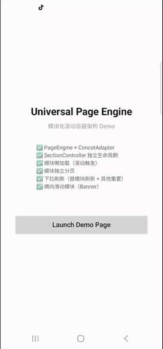

## 问题的起点

电商 App 中，首页、购物车、心愿单这类页面有一个共同特征：它们由多个业务模块纵向拼接而成。运营板块、横向商品推荐、猜你喜欢、动态化容器——每个模块有自己的数据源、分页逻辑和加载状态。

最常见的实现方式是用一个 RecyclerView 搭配多种 ViewType 来承载所有模块。这种方案在模块数量较少时没有明显问题，但随着业务增长，痛点开始浮现：

- 所有模块的状态耦合在同一个 Adapter 中，修改一个模块可能影响其他模块
- 分页逻辑集中处理，难以区分"哪个模块需要加载更多"
- 模块无法独立测试，也无法在不同页面间复用
- 动态插拔模块（如 A/B 实验）需要大量改动 Adapter 代码

这些问题的根源在于：**把模块抽象成了 ViewType，而不是独立的组件**。ViewType 只是渲染层的概念，它无法承载模块自身的生命周期、数据管理和分页能力。

## 核心原则：单滚动轴 + 多数据源

在深入架构设计之前，有一条铁律需要确立：

**永远只保留一个垂直滚动容器。**

任何业务模块都不允许自己成为纵向滚动容器。它只负责输出"可展示的 Item 列表"，滚动权统一交给最外层的 RecyclerView。

横向滑动模块（如 Banner、横向商品列表）是合法的，因为滚动方向不同，不会与纵向主轴冲突。但横向 RecyclerView 必须通过 `setNestedScrollingEnabled(false)` 禁用嵌套滚动。

这条原则保证了滚动行为的可预测性。一旦出现纵向嵌套滚动，滑动手势冲突、惯性滚动中断、高度计算异常等问题会接踵而至，且极难彻底修复。


## 三层抽象：Section、SectionManager、PageContainer

将 UI 实现层的抽象提升到页面结构层，需要引入三个核心概念。

### Section：模块的最小单元

Section 是页面的基本组成单位。一个运营板块是一个 Section，猜你喜欢是一个 Section，购物车中的动态化容器也是一个 Section。

每个 Section 负责：
- 管理自己的数据源
- 控制自己的分页逻辑
- 维护自己的加载状态（Idle → Loading → Loaded → Error）
- 向外输出 `List<SectionItem>`

它不关心 RecyclerView，不操作 Adapter，不知道自己在页面中的位置。它只回答一个问题："我现在应该给页面输出多少条内容。"

```kotlin
abstract class Section {
    abstract val items: List<SectionItem>
    abstract val state: SectionState
    abstract fun loadInitial()
    abstract fun loadMore()
    abstract fun reset()
    abstract val hasMore: Boolean
}
```

### SectionItem：统一的展示协议

所有模块输出的数据都被包装为 `SectionItem`，它携带一个字符串类型标识和唯一 ID：

```kotlin
data class SectionItem(
    val type: String,
    val id: String,
    val data: Any
)
```

使用字符串 `type` 而非整型 `viewType`，是为后续的渲染注册中心和 SDK 化做准备。唯一 ID 的推荐格式为 `{sectionId}_{itemIndex}`，这能保证跨模块的 DiffUtil 计算不会产生冲突。

### SectionManager：数据拼接引擎

SectionManager 持有一个有序的 Section 列表，负责将所有 Section 的 Item 合并（flatten）成一个完整的列表：

```kotlin
class SectionManager {
    private val sections = mutableListOf<Section>()

    fun flattenItems(): List<SectionItem> {
        return sections.flatMap { it.items }
    }

    fun notifyDataChanged() {
        val newList = flattenItems()
        // 通过 DiffUtil 计算差异并更新 Adapter
    }
}
```

当任意一个 Section 的数据发生变化时，SectionManager 重新拼接列表并触发差量更新。Adapter 本身不持有任何业务逻辑，只根据 `SectionItem.type` 查找对应的 ViewHolder 进行渲染。

## 引入 ConcatAdapter：模块级隔离

Google 官方提供的 `ConcatAdapter` 天然支持多 Adapter 线性拼接。每个模块对应一个独立的 Adapter，各自管理自己的 ViewType 和数据集，再由 ConcatAdapter 组合成单个 RecyclerView 的数据源。

相比单 Adapter + 多 ViewType 的方式，ConcatAdapter 的优势在于 ViewType 隔离和 stableId 隔离——模块 A 的 ViewType 0 和模块 B 的 ViewType 0 不会冲突。

配置时需要开启隔离策略：

```kotlin
val config = ConcatAdapter.Config.Builder()
    .setIsolateViewTypes(true)
    .setStableIdMode(ConcatAdapter.Config.StableIdMode.ISOLATED_STABLE_IDS)
    .build()

val concatAdapter = ConcatAdapter(config, sectionAdapterA, sectionAdapterB, sectionAdapterC)
```

但 ConcatAdapter 本身只是一个渲染容器，它不具备分页调度、刷新协调、懒加载等能力。直接让每个 Adapter 自行请求数据、自行处理分页，会导致整页刷新难协调、分页触发混乱、加载状态 UI 不统一等问题。

解决方案是在 ConcatAdapter 之上增加一个调度层——PageEngine。

## PageEngine：页面级调度引擎

PageEngine 是整个架构的中枢，它管理 RecyclerView、SwipeRefreshLayout 以及所有 SectionController 的生命周期。

```kotlin
class PageEngine(
    private val recyclerView: RecyclerView,
    private val swipeRefreshLayout: SwipeRefreshLayout
) {
    private val sections = mutableListOf<SectionController>()
    private val concatAdapter = ConcatAdapter(config)

    fun addSection(section: SectionController) {
        sections.add(section)
        concatAdapter.addAdapter(section.adapter)
    }

    fun removeSection(section: SectionController) {
        sections.remove(section)
        concatAdapter.removeAdapter(section.adapter)
    }
}
```

### SectionController：升级版模块抽象

从简单的 Section 数据源升级为 SectionController，赋予模块完整的生命周期管理能力：

```kotlin
abstract class SectionController {
    abstract val adapter: RecyclerView.Adapter<*>
    var state: SectionState = SectionState.IDLE
        protected set

    abstract fun loadInitial()
    abstract fun loadMore()
    abstract val hasMore: Boolean

    fun resetToIdle() {
        state = SectionState.IDLE
        adapter.submitList(emptyList())
    }
}
```

`SectionController` 不直接依赖 Activity 或 Fragment，所有外部依赖通过 `PageContext` 注入。这样做的好处是模块可以独立测试、跨页面复用，甚至抽成独立 SDK。

```kotlin
class PageContext(
    val lifecycleOwner: LifecycleOwner,
    val coroutineScope: CoroutineScope,
    val tracker: ExposureTracker?
)
```

## 分页控制：模块级粒度

传统的分页逻辑通常监听 RecyclerView 滚动到底部后触发全局 loadMore。在 Section 化架构下，分页粒度细化到模块级别。

PageEngine 的滚动监听逻辑变为：找到当前最后一个已加载（LOADED 状态）且仍有更多数据的 Section，触发它的 `loadMore()`。

```kotlin
recyclerView.addOnScrollListener(object : RecyclerView.OnScrollListener() {
    override fun onScrolled(rv: RecyclerView, dx: Int, dy: Int) {
        val layoutManager = rv.layoutManager as LinearLayoutManager
        val lastVisible = layoutManager.findLastVisibleItemPosition()
        val total = concatAdapter.itemCount

        if (lastVisible >= total - PRELOAD_THRESHOLD) {
            val target = sections.lastOrNull {
                it.state == SectionState.LOADED && it.hasMore
            }
            target?.loadMore()
        }
    }
})
```

这样，运营板块加载完毕后不会触发它的分页，只有猜你喜欢这类带有无限分页的模块才会在用户滚动到底部时持续加载。

## 模块懒加载：按需触发

当页面包含 8 个以上模块时，同时发起所有模块的初始请求会造成不必要的网络开销和首屏延迟。解决方式是引入模块懒加载机制：只有当模块即将进入可视区域时，才触发它的 `loadInitial()`。

每个 SectionController 的初始状态为 `IDLE`，而非立即加载。PageEngine 在滚动监听中计算每个 Section 在列表中的起始位置，当该位置接近可视区域时触发加载：

```kotlin
private fun checkLazyLoad() {
    var offset = 0
    val lastVisible = layoutManager.findLastVisibleItemPosition()

    for (section in sections) {
        val sectionStart = offset
        offset += section.adapter.itemCount

        if (section.state == SectionState.IDLE
            && sectionStart <= lastVisible + PRELOAD_THRESHOLD) {
            section.loadInitial()
        }
    }
}
```

`PRELOAD_THRESHOLD` 建议设置为一屏高度对应的 Item 数量。用户滚动到距离模块还有一屏距离时就开始加载，滚动到达时数据已经就绪，体验更加流畅。

## 整页下拉刷新策略

SwipeRefreshLayout 触发时，PageEngine 并不需要同时刷新所有模块。一种更合理的策略是：

1. 仅对第一个 Section 调用 `loadInitial()` 执行真正的刷新
2. 其余 Section 调用 `resetToIdle()` 清空数据，回到 IDLE 状态
3. 用户向下滚动时，懒加载机制自然重新触发这些模块的加载

```kotlin
fun onRefresh() {
    sections.forEachIndexed { index, section ->
        if (index == 0) {
            section.loadInitial()
        } else {
            section.resetToIdle()
        }
    }
}
```

`resetToIdle()` 只清空 Adapter 数据，不从 ConcatAdapter 中移除模块。移除操作会导致 position 映射错乱，引发不可预期的布局抖动。

当所有 Section 重新加载完成后，PageEngine 通过计数器关闭刷新动画：

```kotlin
private var pendingRefreshCount = AtomicInteger(0)

fun onSectionLoaded(section: SectionController) {
    if (pendingRefreshCount.decrementAndGet() <= 0) {
        swipeRefreshLayout.isRefreshing = false
    }
}
```

## 横向滑动模块的处理

运营模块中经常包含横向 Banner 或横向商品推荐。在 Section 化架构下，横向列表本质上只是某个 SectionItem 的 ViewHolder 内部结构。

该 Section 输出一个类型为 `horizontal_list` 的 SectionItem，对应的 ViewHolder 内部嵌入一个横向 RecyclerView。核心容器不需要知道它是横向的——它在数据层面和其他 Item 没有区别。

需要注意三点：
- 横向 RecyclerView 调用 `setNestedScrollingEnabled(false)`
- 设置固定高度，避免外层 RecyclerView 反复测量
- 横向列表的数据跟随所属 Section 统一管理，不独立请求

## 渲染注册中心：实现真正的组件化

传统 Adapter 在 `onCreateViewHolder` 中通过 `when (viewType)` 分支创建 ViewHolder，每新增一种类型都需要修改 Adapter 代码。渲染注册中心（ItemRegistry）将 ViewHolder 的创建逻辑从 Adapter 中剥离，改为模块自行注册：

```kotlin
object ItemRegistry {
    private val binders = mutableMapOf<String, ItemBinder<*>>()

    fun register(type: String, binder: ItemBinder<*>) {
        binders[type] = binder
    }

    fun getBinder(type: String): ItemBinder<*> {
        return binders[type] ?: throw IllegalStateException("Unregistered type: $type")
    }
}
```

新增一个业务模块只需三步：实现 SectionController、注册对应的 ItemBinder、将 Section 插入页面。无需修改核心容器代码。

## 迈向数据驱动：页面结构配置化

当模块的注册和创建都通过 Registry 管理后，页面结构可以由配置驱动。后端下发一段 JSON，定义页面包含哪些模块、排列顺序、是否启用：

```json
{
  "sections": [
    { "type": "banner", "config": {} },
    { "type": "recommend", "config": { "pageSize": 20 } },
    { "type": "wishlist", "config": {} }
  ]
}
```

客户端通过 SectionFactory 动态创建对应的 SectionController 并注入 PageEngine。这使得首页、心愿单页、购物车页可以复用同一套容器引擎，页面差异完全由配置决定。A/B 实验也变得简单——替换配置中的模块类型即可，无需发版。

## 性能关键点

**stableId 必须开启。** ConcatAdapter 配置 `ISOLATED_STABLE_IDS` 模式后，每个子 Adapter 独立管理 stableId，避免跨模块 ID 冲突。这是 RecyclerView 高效复用的基础。

**Diff 计算在 SectionItem 层面进行。** 每个子 Adapter 使用 `ListAdapter` + `DiffUtil`，只对本模块的 Item 列表做差量比对。全局不需要跨模块排序或插入，ConcatAdapter 的块状拼接特性天然支持这种模式。

**首屏只加载第一个模块。** 通过懒加载机制，进入页面时只有首屏可见的模块发起网络请求，后续模块按需加载。这显著降低了首屏延迟和服务端压力。

## 常见陷阱

1. **Section 内部嵌套纵向 RecyclerView。** 这违反了单滚动轴原则。即使 `NestedScrollView` 能让它"看起来能滚"，惯性滚动和触摸事件的问题终会暴露。正确做法是让 Section 输出多个 SectionItem，由外层统一渲染。

2. **在 Adapter 中编写业务逻辑。** Adapter 的职责仅限于渲染。数据请求、状态管理、分页控制都应在 SectionController 中完成。

3. **刷新时移除再添加子 Adapter。** ConcatAdapter 的 position 映射依赖子 Adapter 列表的稳定性。刷新应只清空数据，不改变 Adapter 的组合结构。

4. **分页逻辑写在 Activity/Fragment 中。** 分页触发应由 PageEngine 统一调度，各模块通过 SectionController 的 `hasMore` 和 `loadMore()` 暴露分页能力，Activity 不直接参与。

## 架构演进路径

从简单到复杂，这套架构可以分阶段落地：

| 阶段 | 方案 | 适用场景 |
|------|------|----------|
| 初级 | 单 Adapter + 多 ViewType | 模块 ≤ 3 个，逻辑简单 |
| 中级 | ConcatAdapter + SectionController | 模块 3~8 个，需要模块级分页和复用 |
| 高级 | PageEngine + ItemRegistry + 懒加载 | 模块 ≥ 8 个，需要动态插拔和配置化 |
| 企业级 | Flow 状态驱动 + 远程配置 + SDK 化 | 多团队协作，模块需跨 App 复用 |

选择哪个阶段，取决于团队规模和业务复杂度。1~2 人的团队直接上企业级方案，维护成本会远超收益。但架构设计上保留向上演进的扩展点——比如使用字符串 type 而非整型 viewType、SectionController 不依赖 Activity——可以在未来需要时以最小代价升级。

最终效果如下

