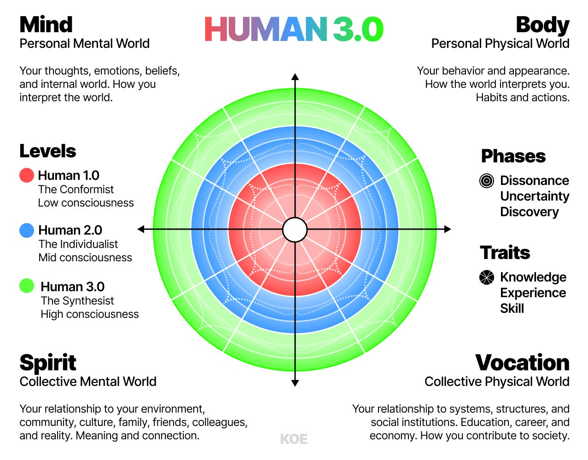
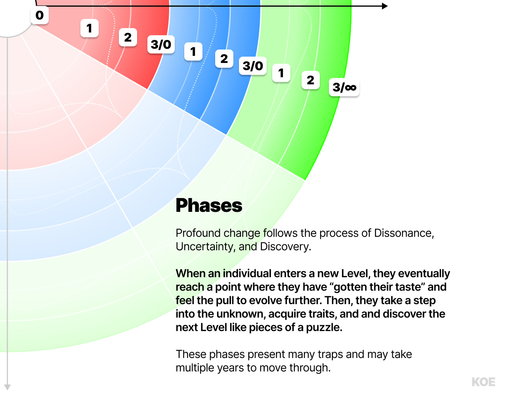
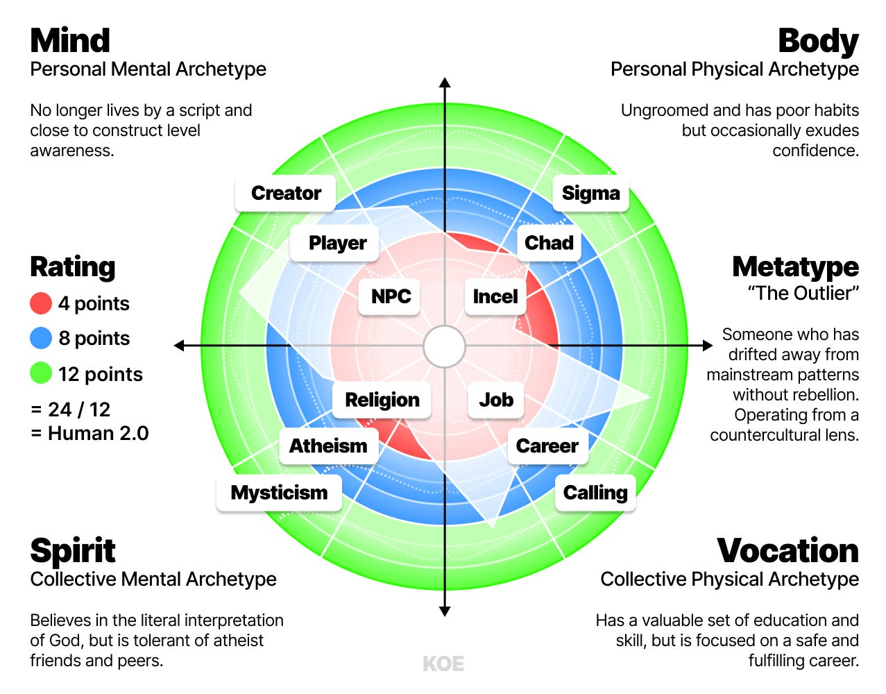

> 这篇文章是DAN KOE的另一篇,出发点是一个“多维度拉满”的渴望：不只健身或赚钱，而是在心智、身体、精神与志业上同时升级。作者用一个统一的模型去解决个人成长碎片化的问题，给出清晰的结构与路径。你将看到一个包含象限、层级、阶段、特质与通道的系统化地图，并学会如何用它定位自己、找到下一个突破口。更重要的是，这不是教条，而是邀请你一起验证、修正与迭代。

### 一套最大化潜能的完整指南（覆盖人生所有领域）

说出来可能有点中二，但我一直想成为一个不可忽视的存在。

一个真正强悍的个体。

不只是拥有好看、强壮的身体，而是在生命的每个领域都被充分开发。

我想成为“多维度拉满”的人。我想把所有属性点都拉满。我不想当 NPC。我想成为 100 级玩家。地图上的每个区域都解锁。体能、智识、职业全部拉满。金库里黄金溢出。我想全部做到：心智、身体、精神、关系、金钱。

这种渴望深刻地影响了我的人生。

青少年时，我痴迷健身。后来，我想尽可能吸收知识。再后来，我想要自由，于是尝试各种商业模式，一路失败，直到最终找到可行的。期间我也经历了各种精神与哲学探索，它们让我用完全不同的眼光看待“表面追求”，比如金钱与健身。

过去 15 年里，我研究了心理学、个人发展、哲学、社会动态、技术、互联网、创业、金钱、宗教与意义等深层领域。

在过去 5 年把研究写出来的过程中，我发现了关键的重叠模式，它们正在形成一套适用于当下的新哲学。

这就是 HUMAN 3.0 的起点。

我想把我学到的一切综合成一张完整地图，用来穿越现代世界。我想给你提供知识、技能与原则，帮助你逃离平庸、实现最高潜能。我会尽量保持非教条、尽可能有科学依据，但我也希望用清晰且有力度的方式讲明白。我会用自然的语言来写，尽量简化复杂概念，让它不会变成一本被遗忘的教科书。为此我会用我自己的说法，而把“细腻与批判性思考”交给你。细节与判断永远在读者身上。

这会是一个持续系列，我们将拆解人的经验，重编现实，去过最好的生活。

很多内容可能会错，我也鼓励你质疑。我甚至希望你能和我一起把它搭建起来。如果你在自己的写作或内容里谈 HUMAN 3.0，我很乐意看到。拿这些想法继续延伸。如果你喜欢 H3.0 模型，就用它。

现在，市面上早已有很多了不起的模型与导师：

- Bruce Lee
- Jordan Peterson
- Wim Hof
- Dr. Joe Dispenza
- Huberman Lab
- David Goggins
- Nikola Tesla
- Jesus
- Buddha
- Neville Goddard
- Andrew Tate
- Michael Jordan
- Paramahansa Yogananda
- Jocko Willink
- Carl Jung
- Nietzsche
- Nathaniel Branden
- Freud
- Steve Jobs
- Elon Musk
- Naval
- Ram Dass
- Ramana Maharshi
- Young Pueblo

这些方法与人物确实都很强。但它们的一个共同问题是：把某个领域讲得很好，却很少把这些领域真正“连接起来”。

知识不是孤岛，而是一张网。你解决了一个问题，会引出另一个问题。这就像给一只青蛙用药治好它的腿，结果它又死在水里，因为你从一开始就忽略了它需要水。

很多精神导师身体很虚弱；很多商业精英在亲密关系里空洞；很多“硬汉”在情绪上极度不对齐。

连接这些领域的尝试并不新鲜。但几乎没人真正触及“工作与金钱”的部分；即使有人谈，也多是孤立领域里的零散建议。

为了解决这个问题，今天我只做一件事：搭建 HUMAN 3.0 的核心模型。接下来的几个月甚至几年里，我会逐步展开细节。

更新：我过去 5 年一直在做这件事。如果你想现在就阅读完整版本，可以在这里查看全量知识库：[A Complete Knowledge Base Of HUMAN 3.0](https://letters.thedankoe.com/p/a-complete-knowledge-base-of-human)

## HUMAN 3.0：最大化潜能的模型

我让 AI 用科学图表风格生成了这个模型。

这张地图可以从多个角度解读。我们会谈 5 个核心维度：象限、层级、阶段、特质与通道。

整张图包含 4 个象限 × 3 个层级 × 3 个阶段 × 3 个特质。也就是 4×3×3×3 = 108 个数据点。

所谓 Metatype（元型），就是一个人在这 108 个点上的总体得分与画像。

> 地图不是领土。Metatype 不是给你贴标签的，而是基于你的行为与认知对“当前状态”的描述。它会变化，你也应该让它变化。

## 1）象限（Quadrants）

- 心智（Mind）：思维、认知、学习、世界观。
- 身体（Body）：健康、体能、外貌、能量。
- 精神（Spirit）：意义、信念、内在与更高维度的连接。
- 志业（Vocation）：工作、职业、影响力、财富与价值创造。

这个结构受到 Ken Wilber 的整合理论（Integral Theory）启发。

> 地图可以防止你在任何一个象限里过度用力而造成“局部正确、整体偏差”。

你需要金钱，也需要意义。你需要力量，也需要智慧。

人生的大部分问题，都是“需要通过知识与技能的获取来解决”的。这不仅局限于心智或身体，而是每一个象限。

每当你解决一个问题，另一个问题就会浮现。就像一颗种子发芽、生长、结果，再掉下新的种子。生命就是一连串问题解决的循环。

这就自然引向下一层：层级（Levels）。

## 2）层级（Levels）

- **1.0：顺从者（Conformist）**：遵循规则，依赖传统与权威，追求稳定。
- **2.0：个体主义者（Individualist）**：质疑规则，追求自我表达与独立。
- **3.0：整合者（Synthesist）**：综合多维视角，超越对立，回到更高层的整体。

这与 Spiral Dynamics（螺旋动力学）的框架相似。

你可以在某个象限处于 1.0，在另一个象限处于 2.0 或 3.0。比如：

- 心智可能还停留在 1.0，但志业已到 2.0。
- 精神可能是 3.0，但身体可能是 1.0。

> 层级反映的是认知复杂度。层级越高，越能同时理解并容纳更多相互冲突的信息。

你可以把它想象成电子游戏：每一层都有新的能力、地图与玩法。

注意：没有“坏的层级”。1.0 不是错误，2.0 不是背叛，3.0 也不是万能。真正的成长是“超越并包含（transcend and include）”。

## 3）阶段（Phases）

每个象限、每个层级里，都有 3 个阶段：

- **Dissonance（不协调）**：旧系统失效，你开始感到不适。
- **Uncertainty（不确定）**：你在探索，但还没建立新稳定性。
- **Discovery（发现）**：你找到路径，开始稳定产出与成长。

想象图上有一个点在移动。如果你在 **Vocation 2.1**，说明你在“志业象限的 2.0 层级、1 号阶段”。

> 你以为自己在 Discovery，但其实还在 Uncertainty；你以为自己进入了 2.0，但从未经历 1.0 的 Dissonance —— 这就是“虚假转化（False Transformation）”。

我在与心理学家合作的研究中发现：人无法跳过阶段，也无法跳过层级。

在 3.0 的世界里，成长变成一种“游戏掌控”。你玩的是无限游戏，而不是一次性的胜负。

## 4）特质（Traits）

每个层级、每个象限里，都有 3 个特质。特质像一道道门槛，只有通过才会进入下一个阶段。

举个例子：一个身材走样的私人教练，很难赢得尊重。即便他知识丰富，别人也会质疑他。于是他必须先解决“身体特质”的问题，才能被看作真正可信。

很多人卡在“焦虑与无聊之间摇摆”的陷阱里，因为他们一直没有解决关键特质问题。

特质与阶段是紧密捆绑的。如果你想进入下一阶段，特质是你必须先完成的“前置任务”。

这就自然引出下一层：通道（Channels）。

## 5）通道（Channels）

通道是一个“任务链”。它把问题拆成一系列可以训练的知识与技能。

比如你在志业象限的 **Vocation 2.1（不协调）**：

你可能需要一个“营销通道”，学习如何让人购买你的产品；你可能需要一个“心智通道”，学会如何表达观点与建立认同。

当你进入一个通道，本质上是在用学习与实践来解决一个核心问题。完成这个通道，你就会进入下一个阶段。

一个非常有效的方法：

- 告诉一个也在同一通道里的人。
- 如果对方走得更远，问他们要建议。

**关于 Glitches（捷径）**

> “Glitch” 是一种跳跃式方法，可以让你短时间内跨越通道或阶段。
>
> 比如：迷幻药、类固醇、换一个国家、突然暴富。
>
> 我认为 AI 是互联网之后最大的 glitch。它能极大提升你的心智，但也可能带来 AI psychosis（AI 精神错乱）或 ADHD 式的注意力瓦解。
>
> 类固醇也是一个 glitch。它们能快速改变你的身体，但没有免费的午餐。你在重写激素系统，不慎就可能让未来更糟。
>
> 这些东西可以用，但必须谨慎。不要在你还没把自然潜能拉满前就跳进捷径。

如果你感到迷茫、停滞，通常说明你还处在 Dissonance 阶段。你的任务很简单：找到你的下一个通道。

## Archetypes（原型）与 Metatypes（元型）

通过这张图，你可以理解一个人的发展结构。甚至可以尝试判断自己与他人所处的位置。

**Archetype（原型）** 是你在某个象限与层级里的典型模式；**Metatype（元型）** 是你在 108 个点上的总体组合。

我创建了一个 prompt 来帮助你识别你的 Metatype、绘制你在各象限的发展状态，并在这里找到你人生的核心问题：[Prompt: HUMAN 3.0 Self-Discovery & Metatype Test](https://letters.thedankoe.com/p/prompt-human-30-self-discovery-and)

上图里我每个象限只展示了 3 个原型，实际数量远不止此。这些只是为了说明结构。

你会发现，随着意识水平提升，原型会呈现明显的进阶路径：

- **NPC → Player → Creator**（心智象限）：停止活在被安排的脚本里，开始玩自己的游戏，最终创造新的游戏。
- **Incel → Chad → Sigma** 或 **Beta Male → Alpha Male → Sigma Male**（身体象限）：这些是当代常见的身体相关原型，既体现行为也体现外观。它们往往还与饮食、环境、社会结构等因素有关，比如高雌激素水平、加工食品与微塑料。
- **Job → Career → Calling**（志业象限）：从打工到职业，再到使命。
- **Religion → Atheism → Mysticism**（精神象限）：从传统宗教，到反叛式无神论，再回到更高维度的神秘主义。

> Ken Wilber 的 “pre-trans fallacy（前-超谬误）” 指的是：人们容易把前理性（Conformist）与超理性（Synthesist）混淆，因为它们都在“非理性”的外观下。有人把 1.0 的原始状态误判为 3.0，也有人把真正的 3.0 降格为原始思维。
>
> 类比可以看看 “IQ bell curve meme”。

这只是精神象限的一个例子。实际上，亲密关系、运动、家庭、科学或形而上信仰等方面，也都存在类似的演化模式。

*每个象限可能有几十到上百个原型，而不止三个。*

当我们把一个人所有象限、层级、阶段、特质的点位都画出来，就能得到他们的总体画像（图里白色区域）。

上面的例子对应的是 **Human 2.0**。

如何计算？

- 层级 1 的每个点记 1 分。
- 层级 2 的每个点记 2 分。
- 层级 3 的每个点记 3 分。

总分除以 12（总切片数），得出平均值。

在这个例子里，可以得到这样的描述：

- **Mind**：不再按脚本生活，接近“构念级意识”。
- **Body**：不修边幅，习惯较差，但偶尔流露自信。
- **Spirit**：相信上帝的字面解释，但对无神论朋友很宽容。
- **Vocation**：有有价值的教育与技能，但偏向稳定而体面的职业。

把这些描述合并起来，就是这个人的 Metatype。

作者把这个例子称为 **The Outlier（异类）**：一个不叛逆但与主流渐行渐远的人，从反主流的视角看世界。他不在意外表，但也可能属于“虚假转化”，因为他在身体象限缺乏真实经验。

## 3.0 的生活方式

“如何在四个象限都能平衡发展？尤其当某个象限消耗大量时间、精力时？”

终极目标，是创造一种**生活方式**，让四个象限都通过“问题解决”被纳入系统。

如果你的志业占据了你所有时间，让心智焦虑、身体耗竭、精神被忽略，这是一个明显的问题。你需要通过知识与技能去解决它，建立一个通道。

比如你每天学习 1 小时商业相关技能并做实践。可能比别人慢，但当你进入“阶段流动”后，你会越来越有把握去减少甚至彻底移除消耗你时间的工作。

但当你解决这个问题，又会出现新问题：低能量、客户不尊重、甚至意义感缺失。下一阶段可能不再需要“更多商业知识”，而是需要在身体、心智或精神上解决关键问题。

即便你赚到世界上所有钱，志业缺乏意义仍会让你“胸口中间有个洞”。

通过持续的问题解决（并且警惕那些阻止你发现问题的干扰），你会创造一种生活：工作变成游戏，健康成为默认状态，意义源源不断，心智站在你这一边。

## 更多资源、细节与扩展

如果你想看完整版模型（包含文明影响、历史脉络、深层细节、科学基础等），请阅读这里的完整知识库：[A Complete Knowledge Base Of HUMAN 3.0](https://letters.thedankoe.com/p/a-complete-knowledge-base-of-human)

你也可以把它丢进 AI 对话，探索更多主题与问题。

如果你想发现自己的 Metatype，并找到生命的核心问题，可以用这个 prompt：[Prompt: HUMAN 3.0 Self-Discovery & Metatype Test](https://letters.thedankoe.com/p/prompt-human-30-self-discovery-and)

---

> 本文翻译自：[HUMAN 3.0 – A Map To Reach The Top 1%](https://letters.thedankoe.com/p/human-30-a-map-to-reach-the-top-1)
