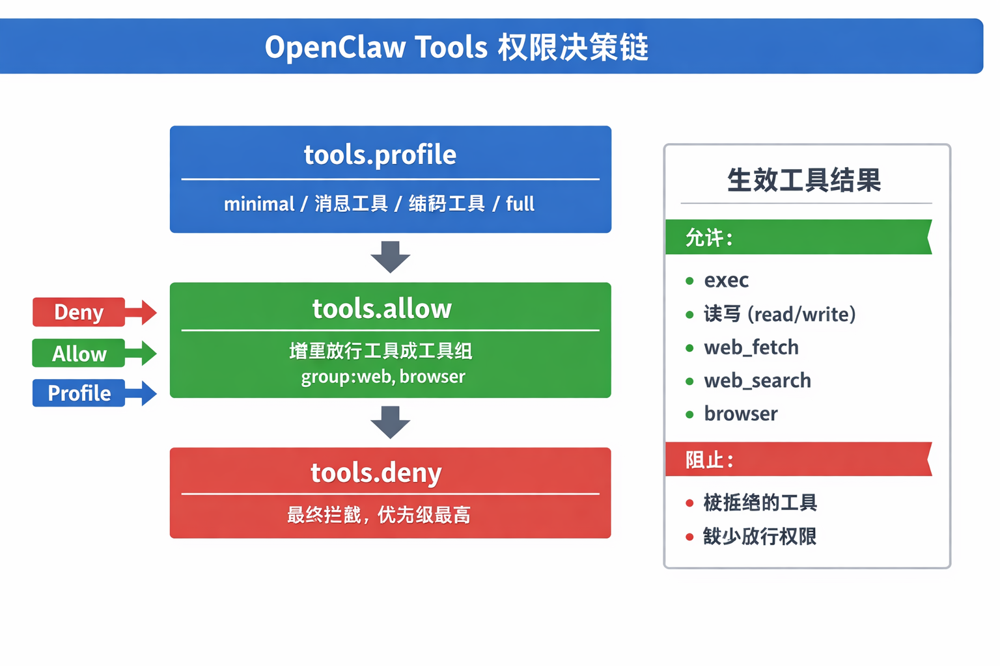
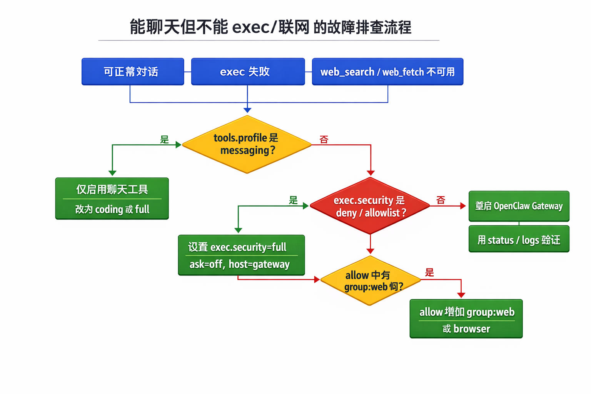
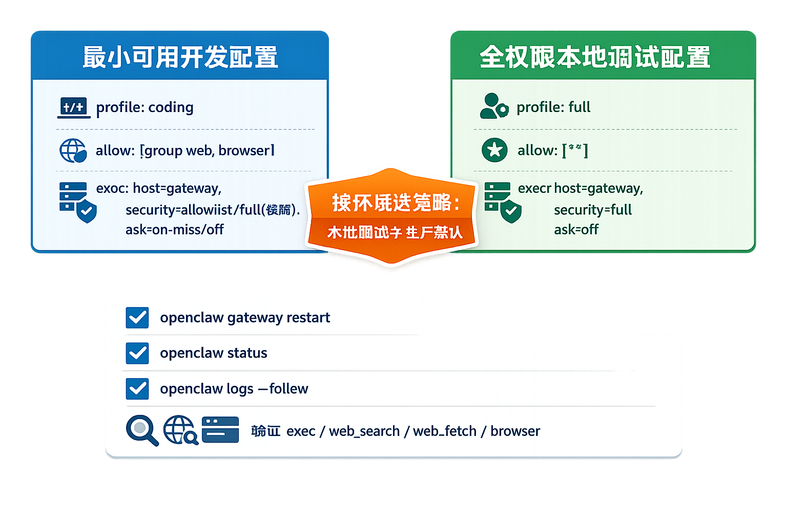

昨天我新升级 OpenClaw 后，出现一个奇怪的现象：channel对话正常，但 `exec` 不执行、`web_search` 和 `web_fetch` 不可用。仔细研究发现这个问题通常不是安装损坏，而是 Tools 权限模型与安全策略生效后的结果。

## 先给结论

“把 `tools.profile` 改成 `full`”在很多场景能快速恢复能力，但它只是一个粗粒度开关。真正决定行为的是三层规则叠加：`tools.profile`、`tools.allow`、`tools.deny`，再叠加 `tools.exec` 的细粒度策略。



如果只改了 profile，却忽略 `deny` 或 `exec.security`，工具依然可能被拦截。

## Tools 权限模型怎么工作

OpenClaw 的 Agent 通过 Tools 调用能力，而不是直接“裸跑 shell”。常见映射关系如下：

- 执行命令：`exec`
- 文件读写：`read` / `write`
- 补丁修改：`apply_patch`
- 联网抓取：`web_fetch`
- 联网搜索：`web_search`
- 浏览器控制：`browser`

权限决策顺序是：

`deny > allow > profile`

这意味着：

1. `profile` 给出基础能力集。
2. `allow` 在基础集之上增量放行。
3. `deny` 最终兜底拦截，优先级最高。

## 为什么会出现“能聊但什么都做不了”

新版本默认或升级后是 `tools.profile = "messaging"`。这个配置只保留会话相关工具，所以能聊天，但没有执行、文件、Web 等能力。

第二类高频原因是 `exec` 自身策略过严：

- `security=deny`：直接禁用执行。
- `security=allowlist` 但命令不在白名单：拒绝。
- `ask=on-miss` 或 `ask=always`：等待审批，UI 未正确弹出时看起来像“卡住”。

第三类原因是运行环境差异。`host=gateway` 下 PATH 可能更精简，命令找不到时表面上像“执行失败”，本质是进程环境缺命令。



## 两套可用配置

### 方案 A：最小可用开发配置（推荐先用）

适合需要写代码、执行命令、联网检索，但不希望完全放开权限的场景。

```json
{
  "tools": {
    "profile": "coding",
    "allow": ["group:web", "browser"],
    "exec": {
      "host": "gateway",
      "security": "allowlist",
      "ask": "on-miss"
    }
  }
}
```

如果临时要快速排查，也可将 `exec.security` 先切到 `full`，定位完成再收紧。

### 方案 B：本地全权限调试配置

适合单机调试、快速验证问题，不建议直接作为生产默认。

```json
{
  "tools": {
    "profile": "full",
    "allow": ["*"],
    "exec": {
      "host": "gateway",
      "security": "full",
      "ask": "off"
    }
  }
}
```

改完后必须重启：

```bash
openclaw gateway restart
```



## 4 步自检清单

1. 查看配置是否仍是 `messaging` profile。
2. 确认是否放行了 `group:web`，否则不会联网搜索。
3. 检查 `exec.security` 和 `ask`，避免隐式审批阻塞。
4. 重启后用日志和状态验证加载结果：

```bash
openclaw status
openclaw logs --follow
```

至少要确认 `exec`、`web_search`、`web_fetch`、`browser` 已按预期可用。

## 实践建议

把 Tools 配置分成“开发模板”和“生产模板”两个版本，避免在紧急排障时临时手改。团队可以把允许的工具组、审批策略、重启与验证命令固化为脚本，这样每次升级后都能快速回归，不再靠人工记忆权限细节。
