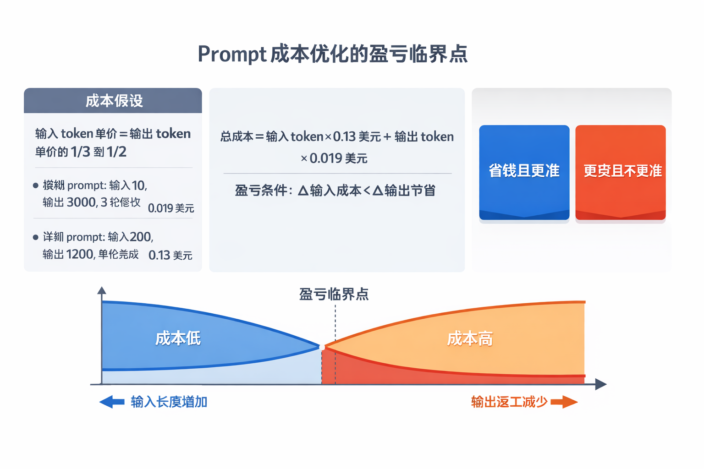
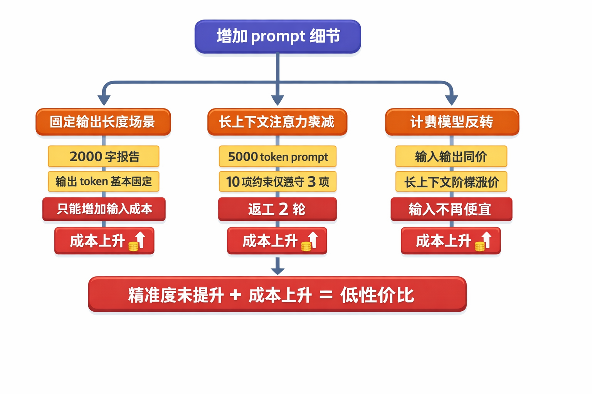
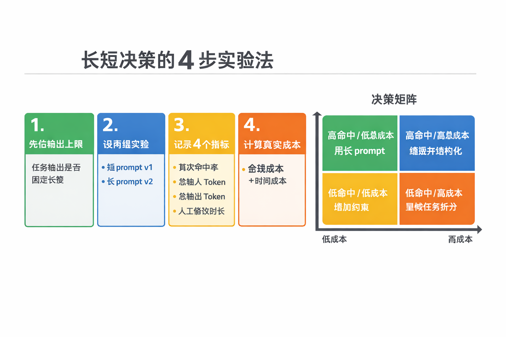

很多团队在做 LLM 应用时，会把「写更详细的 prompt」当成默认策略。这个策略在不少场景确实有效，但它不是无条件成立。真正决定成本的，不是 prompt 看起来有多完整，而是输入成本增加和输出返工减少之间的差值。

## 问题定义：我们到底在优化什么

如果把一次调用拆开看，总成本可以写成一个简单表达式：

`总成本 = 输入 token × 输入单价 + 输出 token × 输出单价`

在主流商用模型里，输入单价通常低于输出单价，这也是「用更多输入换更少输出」能成立的基础。豆包原始讨论里给了一个典型对比：模糊 prompt 在多轮修改后累积到 0.13 美元，而结构化 prompt 一次命中约 0.019 美元，成本降到原来的约 1/7。

这个例子说明，长 prompt 的价值不是「更长」，而是「减少高价输出和返工轮次」。

## 长 prompt 真正赚钱的 3 类场景

### 开放任务且容错成本高

活动方案、技术方案、合规文案这类任务，输出空间大，模型容易跑偏。你在输入端补齐边界、格式、禁用项，能显著减少错误输出。只要返工减少的输出 token 大于新增输入 token，成本就会下降。

### 多轮对话本来就很重

如果任务天然要带历史上下文，多轮改写会反复把上下文送进模型。提前把关键约束写全，常常能把 3 轮压到 1 轮。这里节省的不仅是输出 token，还有上下文重复输入。

### 批量生成且框架稳定

批量话术、批量摘要、批量报告模板最适合「输入固化，输出变量化」。把固定框架写进 prompt，让模型只产出可变部分，输出 token 会明显下降，标准化程度也更高。

## 长 prompt 失效的 4 个边界条件

### 边界一：输出长度固定

当任务天然要求固定字数，例如 2000 字报告，输出 token 基本锁死。此时你增加输入，大概率只会抬高总成本。

### 边界二：长上下文注意力衰减

超长 prompt 会让模型忽略中段约束。原始讨论中提到 5000 token、10 条约束仅执行 3 条的情况，本质是有效信息密度下降，随后触发返工。

### 边界三：定价机制不再「输入便宜」

并非所有模型都按输入低价、输出高价收费。有些场景输入输出同价，或者长上下文触发阶梯涨价。前提变化后，长 prompt 的成本优势会迅速消失。

### 边界四：忽略了人的时间成本

写一份高质量 prompt 需要拆需求、列约束、做示例。若任务价值不高，人工时间成本可能超过 token 节省。

## 工程化落地：用实验而不是感觉决策

建议把 prompt 长短选择做成一个小实验，而不是靠经验拍板。

1. 先定义输出上限：确认任务是否固定长度。
2. 建立 A/B 两组 prompt：短版 `v1` 与长版 `v2`。
3. 记录 4 个指标：首次命中率、总输入 token、总输出 token、人工修改时长。
4. 用统一口径计算真实成本：`API 金额 + 人工时长折算金额`。

只要 `v2` 的命中率提升无法覆盖输入增长和人工投入，就不要继续拉长 prompt。更好的做法是缩短文本，并把信息改写成更强约束的结构化字段。

## 结论

「详细 prompt 更省钱」不是结论，只是条件命题。它成立需要 3 个前提同时满足：输入相对便宜、返工明显减少、人工投入可控。对团队来说，最稳妥的策略是先测量，再标准化，把有效的 prompt 形态固化成模板，把无效冗长部分持续删掉。
