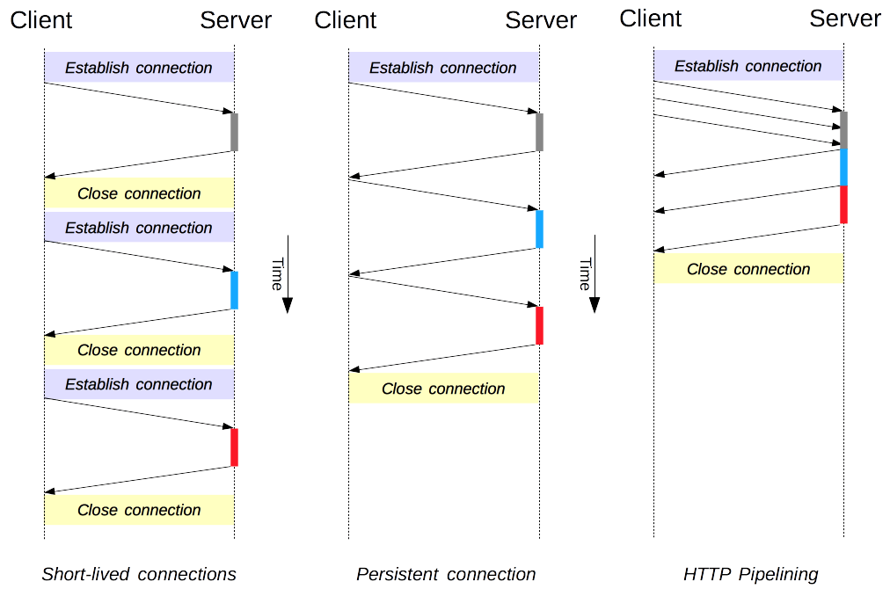
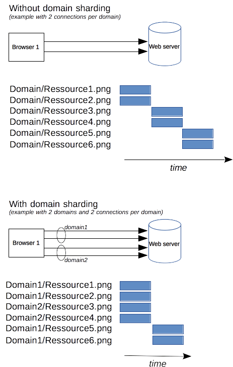
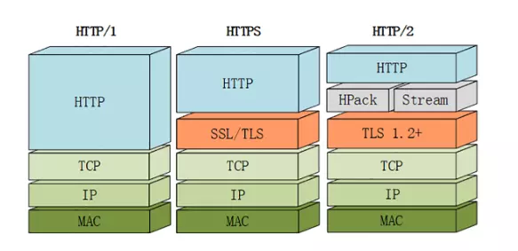
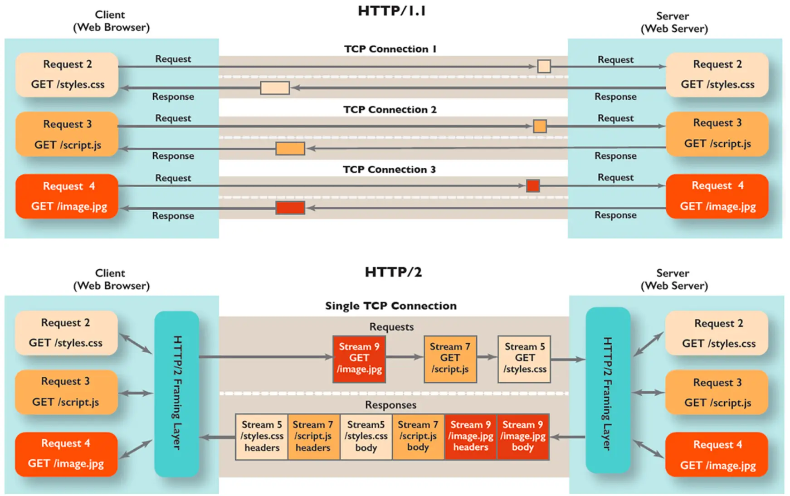
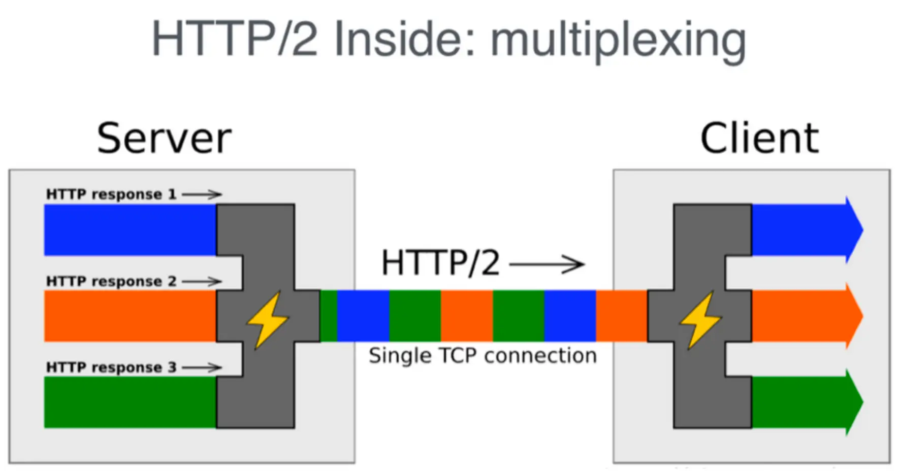
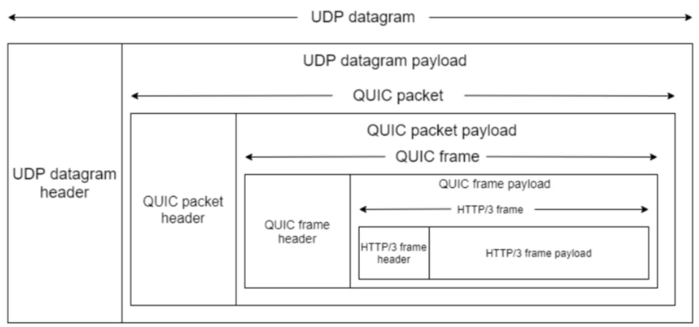
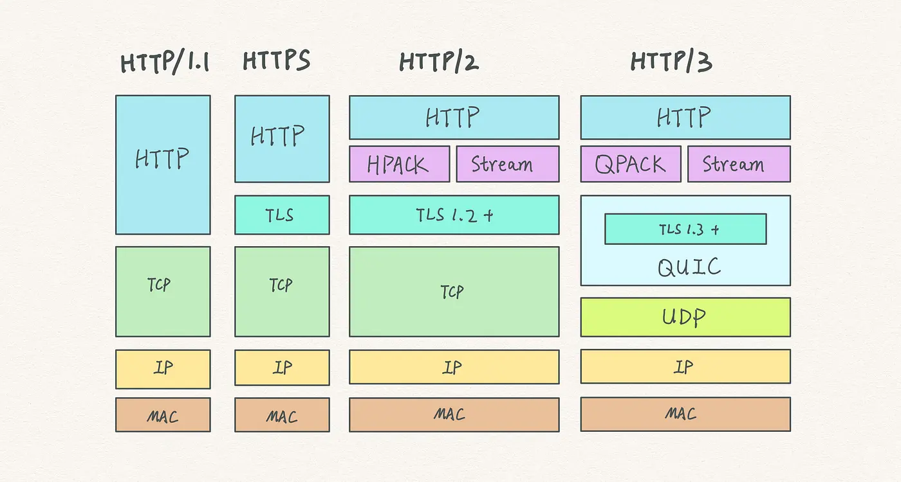

## HTTP 是什么

HTTP（HyperText Transfer Protocol，超文本传输协议）是一种基于**请求-响应**模型的应用层协议，用于在 Web 浏览器与 Web 服务器之间传输超文本（如 HTML）。作为互联网的基础协议之一，它定义了客户端与服务器之间的通信规则，使用户能够访问和浏览网页、图片、视频等各类网络资源。

```plain
GET /zh-CN/docs/Glossary/CORS-safelisted_request_header HTTP/1.1
Host: developer.mozilla.org
User-Agent: Mozilla/5.0 (Macintosh; Intel Mac OS X 10.9; rv:50.0) Gecko/20100101 Firefox/50.0
Accept: text/html,application/xhtml+xml,application/xml;q=0.9,*/*;q=0.8
Accept-Language: zh-CN,zh;q=0.9
Accept-Encoding: gzip, deflate, br
Referer: https://developer.mozilla.org/zh-CN/docs/Glossary/CORS-safelisted_request_header

HTTP/1.1 200 OK
Connection: Keep-Alive
Content-Encoding: gzip
Content-Type: text/html; charset=utf-8
Date: Wed, 20 Jul 2016 10:55:30 GMT
Etag: "547fa7e369ef56031dd3bff2ace9fc0832eb251a"
Keep-Alive: timeout=5, max=1000
Last-Modified: Tue, 19 Jul 2016 00:59:33 GMT
Server: Apache
Transfer-Encoding: chunked
Vary: Cookie, Accept-Encoding

(content)
```

## HTTP 的发展历程

1. HTTP/0.9：1991 年
2. HTTP/1.0：1996 年
3. HTTP/1.1：1997 年
4. HTTP/2：2015 年
5. HTTP/3：2022 年

## HTTP/1

HTTP 协议基于 TCP 协议。在早期版本中，每次请求都需要建立新的 TCP 连接，开销较大。为提升性能，HTTP/1.1 引入了以下机制：

1. **Keep-Alive**：持久连接，复用同一 TCP 连接处理多个请求
2. **Pipeline**：管道化，允许在收到响应前发送多个请求
3. **Chunked**：分块传输编码，支持流式传输响应体



### 域名分片

为提升 Web 页面加载性能，浏览器通常允许为每个域名建立最多 6 个 TCP 连接。为突破这一限制，开发人员会将页面中的资源分散到多个域名下，从而获得更多并发连接。



### 缓存

HTTP 缓存控制是 Web 性能优化的重要环节。通过合理的缓存策略，可以显著减少网络请求次数、降低服务器负载、提高页面加载速度。缓存行为主要由 HTTP 头部字段控制，用于定义缓存的有效期和验证机制。

常见的缓存相关 HTTP 头部字段包括：

1. **Cache-Control**：定义缓存策略和有效期，提供多种指令以灵活控制缓存行为
2. **Expires**：指定资源的过期时间，已被 `Cache-Control: max-age` 取代
3. **ETag**：唯一标识资源版本，用于验证缓存副本的新鲜度
4. **Last-Modified**：标识资源的最后修改时间，用于验证缓存副本的新鲜度
5. **Pragma**：主要用于向后兼容的缓存控制
6. **Age**：指示响应在缓存中存储的时间，帮助客户端了解响应的新鲜度

#### Cache-Control

`Cache-Control` 是 HTTP/1.1 引入的最重要的缓存控制头部字段，其值为指令集合，用于控制请求和响应的缓存机制。常见指令包括：

- **public**：响应可被任何缓存（包括客户端和代理服务器）缓存
- **private**：响应仅供单个用户使用，不允许共享缓存
- **no-cache**：强制每次请求与服务器验证，即使缓存副本看似最新
- **no-store**：禁止缓存任何响应或请求
- **max-age**=[秒数]：指定响应被认为新鲜的最大时间（秒），在此时间内可直接使用缓存，无需再次验证
- **s-maxage**=[秒数]：与 `max-age` 类似，但仅适用于共享缓存（如 CDN）
- **must-revalidate**：缓存过期后必须与服务器验证新鲜度，不能使用陈旧副本
- **proxy-revalidate**：类似 `must-revalidate`，但仅适用于代理缓存
- **immutable**：表示资源不会变化，缓存可长期使用该响应副本

#### Expires

`Expires` 是 HTTP/1.0 引入的头部字段，用于指定资源的过期时间，其值为 GMT 格式的绝对时间戳。在该时间点之后，缓存副本被视为陈旧。示例：

```plain
Expires: Wed, 21 Oct 2023 07:28:00 GMT
```

在 HTTP/1.1 中，`Expires` 已被 `Cache-Control: max-age` 取代，但仍被许多旧系统使用。

#### ETag

`ETag`（实体标签）是服务器生成并发送给客户端的唯一标识资源版本的字符串。客户端在后续请求中可通过 `If-None-Match` 头部携带该值，服务器据此判断资源是否已修改。示例：

```plain
ETag: "5d8c72a5edda8a:0"
```

服务器响应规则：

- 若资源未修改，返回 `304 Not Modified`，客户端使用缓存副本
- 若资源已修改，返回新资源及新的 `ETag` 值

#### Last-Modified

`Last-Modified` 表示资源的最后修改时间。客户端可在后续请求中通过 `If-Modified-Since` 头部携带该时间，服务器据此判断资源是否已修改。示例：

```plain
Last-Modified: Wed, 21 Oct 2023 07:28:00 GMT
```

服务器响应规则：

- 若资源未修改，返回 `304 Not Modified`，客户端使用缓存副本
- 若资源已修改，返回新资源及新的 `Last-Modified` 时间

#### Pragma

`Pragma` 是 HTTP/1.0 中的缓存控制头部字段，主要用于向后兼容。常见值为 `no-cache`，表示客户端或中间缓存不得缓存响应：

```plain
Pragma: no-cache
```

在 HTTP/1.1 中，`Pragma` 常与 `Cache-Control` 配合使用，以确保兼容性。

#### Age

`Age` 头部由缓存服务器添加，表示响应已在缓存中存储的时长（秒），帮助客户端了解响应的实际新鲜度。示例：

```plain
Age: 60
```

表示该响应已在缓存中存在 60 秒。

### 压缩

减少传输内容体积能有效提升传输性能。压缩机制涉及两个主要头部：

1. **Accept-Encoding**：表示客户端支持的压缩算法
2. **Content-Encoding**：表示响应内容采用的压缩算法

常见压缩算法包括：

1. gzip
2. deflate
3. br（Brotli）
4. zstd

### 其他优化手段

除上述机制外，常见的性能优化手段还包括：

- **资源优化**：雪碧图、小图内联为 Base64、IconFont、资源合并
- **预加载**：`preload`、`preconnect` 等预加载与预连接机制
- **CDN**：通过内容分发网络就近分发静态资源，降低延迟

## HTTP/2

HTTP/1.1 的队头阻塞、冗长的头部信息以及单一连接的限制，已难以满足现代 Web 应用对高性能和低延迟的需求。为此，IETF 于 2015 年正式发布 HTTP/2，旨在解决 HTTP/1.1 的性能瓶颈。



### 主要改进

- **二进制分帧**：HTTP/2 使用二进制分帧层将数据帧化，降低解析开销，提高传输效率
- **多路复用**：允许在单一 TCP 连接上并行发送多个请求和响应，消除应用层队头阻塞
- **头部压缩**：通过 HPACK 算法压缩头部信息，减少传输数据量
- **服务器推送**：~~服务器可主动推送资源到客户端，减少请求延迟~~（该特性在实际应用中较少使用）

HTTP/2 基于二进制分帧，可为每个请求分配独立的流 ID，从而实现请求的乱序发送。因此，网页资源不再需要分散到多个域名，可在同一域名下并发请求获取数据。



### 效果演示


### HTTP/2 未解决的问题

尽管 HTTP/2 显著改善了性能，但其仍基于 TCP 协议，存在 **TCP 队头阻塞问题**：HTTP/2 在单一 TCP 连接上进行多路复用，若底层 TCP 连接出现丢包或延迟，所有并行流都会受到影响。



## HTTP/3

为彻底解决 HTTP/2 的队头阻塞问题，HTTP/3 引入了基于 UDP 的 QUIC 协议。QUIC 在设计之初即着眼于降低延迟、提高传输效率。

### HTTP/3 的主要改进

- **基于 UDP 的 QUIC 协议**：QUIC 使用 UDP 替代 TCP，避免 TCP 队头阻塞。每个 QUIC 流相互独立，某个流丢包或延迟不会影响其他流
- **快速握手**：QUIC 将 TLS 集成进连接建立过程，首次连接仅需一次 RTT（往返时间），后续连接可实现 0-RTT
- **改进的拥塞控制**：QUIC 内置先进的拥塞控制算法，更高效地利用网络资源，提升传输速度与稳定性

HTTP/3 使用 Packet Number 标识数据包编号，使用 Stream ID 标识不同请求的数据流。



## 总结

HTTP 协议的每一次演进都旨在解决前一版本的不足，提升传输效率和用户体验：

1. HTTP/1.1 通过持久连接和管道化提升了性能
2. HTTP/2 通过二进制分帧和多路复用解决了诸多性能瓶颈
3. HTTP/3 通过引入 QUIC 协议进一步解决队头阻塞问题，并显著降低延迟



## 参考

1. [TCP 传输](https://blog.csdn.net/JineD/article/details/113527707)
2. [队头阻塞](https://calendar.perfplanet.com/2020/head-of-line-blocking-in-quic-and-http-3-the-details/)
3. [QUIC RFC 9000](https://www.rfc-editor.org/rfc/rfc9000.html)
