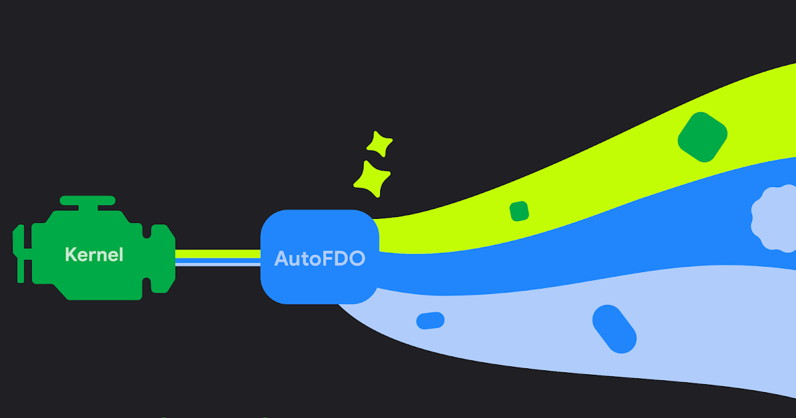
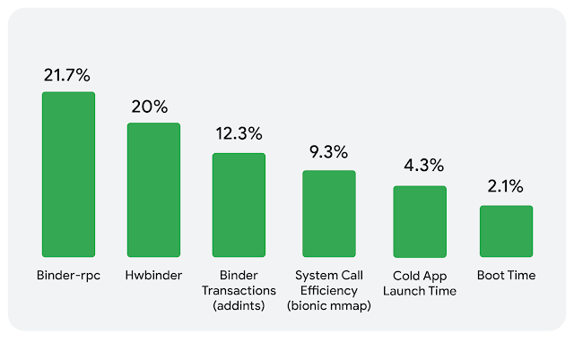
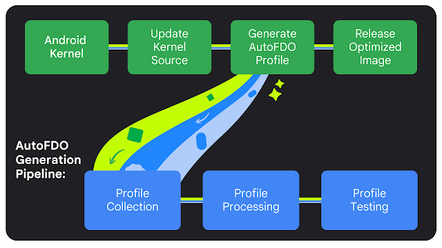

> **总结**：本文介绍了 Android 团队如何把 AutoFDO（Automatic Feedback-Directed Optimization）引入内核构建流程。通过在受控实验室对代表性工作负载（如前 100 大热门应用）采样并生成Profile，编译器可据此优化内核代码布局与内联决策，从而带来更快的应用启动、更顺滑的交互和更低的功耗。文章还阐述了Profile采集、处理、验证与持续更新的管道设计，并讨论了稳定性保障与未来扩展方向。

我们是负责 Android LLVM 工具链的团队。提高 Android 性能是我们的核心目标之一，虽然大量优化发生在用户空间，但内核始终是系统的核心。今天我们介绍如何将 AutoFDO（Automatic Feedback-Directed Optimization）应用到 Android 内核，以为用户带来显著的性能提升。

## 什么是 AutoFDO？

在标准的编译过程中，编译器会基于静态启发式规则（例如是否内联函数、哪条分支更有可能被执行）做出大量小决策。但这些静态启发式并不总能准确反映真实手机使用时的执行路径。

AutoFDO 通过使用真实运行时的执行模式来指导编译器。执行模式以 CPU 的分支历史为代表性数据来源。对于内核，我们在实验室环境中用代表性工作负载（例如启动与运行前 100 名热门应用的脚本）合成这些Profile，而不是直接从野外设备采集。借助采样型 profiler（比如 `simpleperf`）记录分支历史，我们可以识别“热”代码与“冷”代码。

当我们用这些Profile重新构建内核时，编译器就能基于真实工作负载做出更智能的优化决策。

关键事实：

- 在 Android 上，内核大约占用约 40% 的 CPU 时间。 
- 团队已在用户空间的原生可执行文件与库上使用 AutoFDO，观察到冷启动性能约 4% 的提升、引导时间约 1% 的缩短。

### 真实世界的性能收益

通过在受控实验室中使用代表性Profile，我们在若干关键指标上看到了可观的改善（在 Pixel 设备，针对 6.1、6.6 与 6.12 内核版本进行测量）。这些收益体现为更流畅的界面、更快的应用切换、更长的电池续航与整体更好的设备响应性。关于这些内核版本的 AutoFDO Profile详情见内核仓库（android16-6.12 与 android15-6.6 的 afdo 目录）。

这些改进并非理论上的数值，而是对最终用户可感知体验的提升。

## 原理与流水线（Pipeline）

我们的部署策略依赖一套成熟的流水线，以确保Profile持续有效并尽量降低回归风险。主要步骤如下：

### 步骤 1：采集Profile

我们在实验室中对通用内核镜像（Generic Kernel Image, GKI）进行Profile采集，这样可以将采样与设备发布周期解耦。测试设备刷入最新内核镜像，使用 `simpleperf` 等工具捕获指令执行流（包括分支历史），并且利用 ARM 的 ETE/TRBE 等硬件能力获取高精度追踪数据。

工作负载构建以 Android App Compatibility Test Suite（C-Suite）中最流行的 100 款应用为蓝本，采集时重点覆盖：

- 应用启动（App Launching）等用户可感知的延迟场景；
- 基于 AI 的应用爬虫以模拟连续的用户交互；
- 系统级监控以纳入前台与关键后台工作负载以及进程间通信场景。

实验与内部舰队比对显示，该合成工作负载与真实舰队数据在执行模式上有约 85% 的相似度。

### 步骤 2：Profile处理

对原始追踪数据进行后处理，使其适配 AutoFDO 所需的格式：

- 聚合（Aggregation）：将多次运行与多台设备的数据合并为系统视图；
- 转换（Conversion）：将原始 trace 转换为 AutoFDO Profile格式，同时过滤掉不需要的符号；
- Profile裁剪（Trimming）：对“冷”函数的数据进行裁剪，使其保持标准优化策略，防止二进制增长或在罕见路径上引入回归。

### 步骤 3：Profile测试

在将Profile投入生产前，我们会进行严谨的验证：

- Profile与二进制分析：比较Profile的热函数列表、样本计数和Profile大小，确保与历史版本一致并且变化在预期范围内；
- 性能验证：使用目标基准在新构建的内核镜像上运行测试，确认性能提升且没有引入稳定性问题。

### 持续更新

代码随着时间会“漂移”，静态Profile会逐渐失效。为保持最佳性能，我们的流水线会定期刷新Profile，并在内核 LTS 分支的 GKI 发布前更新对应Profile，确保每次构建都包含最新的数据。

当前我们已在 `android16-6.12` 与 `android15-6.6` 分支部署，并计划扩展支持到更新的 GKI（例如 android17-6.18）。

## 保证稳定性

一个常见的疑问是：基于Profile的优化会不会引入稳定性风险？由于 AutoFDO 主要影响编译器的启发式（例如内联、代码布局），而非更改源代码逻辑，因此它本身并不会改变内核的功能行为。AutoFDO 已在大量规模化产品中被验证，包括 Android 平台库、ChromeOS 与 Google 的服务器基础设施。

为进一步保证一致性，我们采取“保守优先”的策略：未被高保真Profile覆盖的函数仍使用标准编译优化，以确保冷路径行为与常规构建一致，避免在边缘情况出现回归。

## 展望

我们正将 AutoFDO 推广到 `android16-6.12` 与 `android15-6.6`。未来的方向包括：

- 扩大覆盖范围：计划将 AutoFDO 支持扩展到更新的 GKI 版本与更多目标架构；
- GKI 模块优化：当前优化聚焦于主内核二进制（`vmlinux`），将来可将此技术拓展到 GKI 模块以覆盖更多内核子系统；
- 厂商模块支持：借助现有构建系统（Kleaf）与简单采样工具（simpleperf），为厂商驱动模块（通过 DDK/Driver Development Kit 构建）提供相同的优化管道；
- 更广的Profile覆盖：收集与更多关键用户旅程（Critical User Journeys）相关的Profile以进一步提升体验。

通过把 AutoFDO 带到内核层，我们正在确保操作系统的基础部分能针对日常设备使用场景获得切实的性能提升。

---

> 本文翻译自：[Boosting Android Performance: Introducing AutoFDO for the Kernel](https://android-developers.googleblog.com/2026/03/BoostingAndroid%20PerformanceIntroducingAutoFDO.html)
