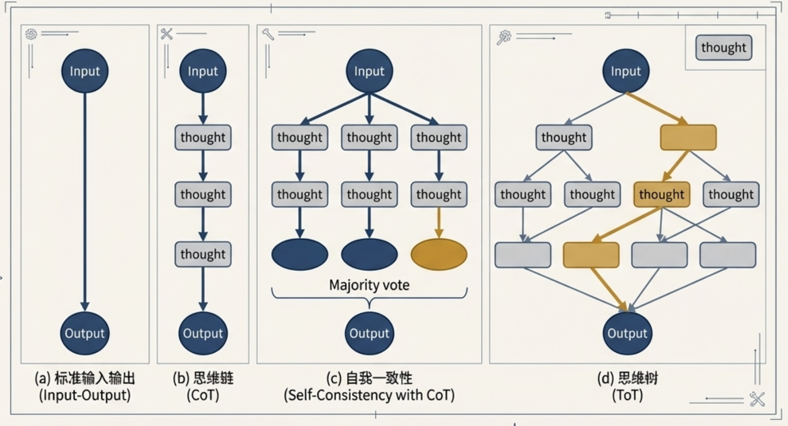

# 提示词工程：从核心原则到前沿实践（1）：引言：为何提示词工程是技术团队的核心能力

> 本文是「提示词工程：从核心原则到前沿实践」系列的第 1 篇，共 4 篇。

GPT-3.5 发布已过去三年多，AI 能力已深入渗透到我们工作与生活的方方面面。值此之际，我们重新审视 LLM 最基础的部分——Prompt，看看是否真正掌握了驾驭 LLM 的要诀。

大家平时使用 AI 时，是否遇到过以下问题？

- **输出不稳定**：同样的提示词，结果时好时坏；
- **效率低下**：反复修改才能获得可用结果，耗费大量时间与 Token；
- **安全风险**：易受提示词注入攻击，导致信息泄露或行为失控。

### 引言：为何提示词工程是技术团队的核心能力
提示词工程（Prompt Engineering）是高效利用大型语言模型（LLMs）的关键技能，它远非简单的“提问技巧”，而是一门融合了技术洞察、逻辑构建与工程实践的系统性学科。在AI驱动的时代，技术团队是否掌握精湛的提示词工程能力，直接决定了其AI应用的准确性、可靠性、成本效益乃至安全性。因此，它已成为团队在激烈技术竞争中保持领先地位的基石。

从宏观视角看，自然语言处理（NLP）领域经历了一次深刻的范式变革。根据学术研究（"A Survey on Prompting Techniques in LLMs"），我们已经从传统的“预训练-微调”（Pre-train and Fine-tune）模式，演进到了以LLMs为核心的“预训练-提示”（Pre-train and Prompt）模式。这一转变意味着，我们不再需要为每个下游任务都对模型进行昂贵的微调，而是通过精心设计的提示词来引导强大的预训练模型完成特定任务，这极大地提升了开发的灵活性和效率。

本文旨在为技术团队提供一份从核心原则到前沿实践的深度解析。我们将从构建高效、可预测提示词的核心设计原则入手，深入探讨一系列旨在解锁模型深度推理能力的高级技术，系统介绍工程化所必需的评估与自动化方法，并最终展望该领域的未来发展方向与尚待解决的挑战。

---

### 核心设计原则：构建高效、可预测的提示词
在深入探讨复杂技术之前，我们必须首先掌握一套与具体模型无关、具有普适性的提示词设计原则。遵循这些原则是提升 AI 交互效率和成果质量的第一步，能够从根本上减少反复试错的成本，为构建稳定、可靠的 AI 应用打下坚实基础。

#### 实践框架：KERNEL 六大原则

社区实践总结的 KERNEL 框架，为我们提供了一套经过大规模验证、行之有效的指导方针。该框架包含六大核心原则，每一个都旨在提升提示词的确定性和效率。

##### 1.1. K - 保持简洁 (Keep it simple)
清晰、单一的目标远胜于冗长、含糊的上下文。一个简洁的提示词能让模型更快地理解核心任务，减少不必要的计算开销。与其提供数百字的背景信息，不如直接阐明一个具体的目标。

**实践数据**：根据社区测试，将冗长的上下文提炼为单一目标的提示词，可带来 **70%的Token使用量下降** 和 **3倍的响应速度提升**。

##### 1.2. E - 易于验证 (Easy to verify)
为提示词设定明确的成功标准至关重要。如果我们自己都无法清晰地判断结果是否成功，模型同样无法精确交付。可验证性将主观的期望转化为客观的指令。

- **模糊指令**："make it engaging"
- **可验证指令**："include 3 code examples"

**实践数据**：在测试中，带有明确成功标准的提示词 **成功率达到85%**，而没有明确标准的提示词成功率仅为 **41%**。

##### 1.3. R - 结果可复现 (Reproducible results)
一个高质量的提示词应该在不同时间、不同会话中产生一致的结果。为此，必须避免使用“当前趋势”、“最新实践”等具有时间依赖性的模糊参考。相反，应使用具体的版本号、精确的要求和确定的数据源。

**实践数据**：遵循此原则的提示词在为期30天的测试中，结果的 **一致性高达94%**。

##### 1.4. N - 范围窄化 (Narrow scope)
我们必须坚持“一个提示词，一个目标”的原则。当面对复杂任务时，应将其拆分为多个独立的、目标单一的子任务，并通过链式调用（Chaining Prompts）将它们串联起来。例如，不要在同一个提示词中同时要求模型编写代码、生成文档和创建测试用例。

**实践数据**：单一目标提示词的用户 **满意度为89%**，而多目标提示词的满意度仅为 **41%**。

##### 1.5. E - 显式约束 (Explicit constraints)
明确“告诉AI不做什么”与“告诉AI做什么”同样重要。通过施加显式约束，可以有效过滤掉不期望的输出，大幅提升结果的可用性。

- **基础指令**："Python code"
- **带约束的指令**："Python code. No external libraries. No functions over 20 lines."

**实践数据**：添加约束条件后，不期望的输出 **减少了91%**。

在此基础上，一个更高级的技巧是 **优先使用“肯定指令”而非“否定限制”**。例如，用“只包含完整列表”来替代“不要包含不完整列表”。这种方法之所以更有效，是因为LLMs被训练来基于其训练数据中的正相关性预测下一个Token。肯定指令为模型提供了通往期望输出的更清晰、更直接的路径；而否定命令则要求模型避开某个概念，这种方式可靠性较低，有时甚至会导致模型无意中聚焦于被禁止的元素。

##### 1.6. L - 逻辑结构 (Logical structure)
结构化的提示词能显著提升模型的理解能力。通过整合KERNEL结构（`Context`, `Task`, `Constraints`, `Format`）与指南中的描述性元素（`主体/角色`, `输入数据`）以及Mistral和Claude的最佳实践（使用`###`等分隔符或XML标签），我们得到一个鲁棒的通用模板。

以下是一个综合性的 **结构化提示词模板** 示例：

```plain
### 角色 ###
你是一位资深的Python技术专家。

### 任务 ###
根据下方提供的CSV数据，编写一个Python脚本，计算每个类别的平均值。

### 约束 ###
- 只能使用Pandas库。
- 脚本代码不能超过50行。
- 忽略任何包含空值的行。

### 输入数据 ###
<data>
category,value
A,10
B,20
A,15
C,30
B,
</data>

### 输出格式 ###
以JSON格式返回结果，键为类别，值为该类别的平均值。
```

掌握了这些基础原则后，我们接下来将深入探讨一系列能处理更复杂任务的高级提示词技术。

---

### 进阶技术工具箱：解锁LLM的深度推理能力
当任务的复杂性超出单一指令所能覆盖的范围时，我们需要引入一系列更高级的提示词技术。这些由学术界和工业界共同验证的技术，能够引导模型进行多步推理、生成中间过程，从而有效解决标准提示词难以应对的挑战。

#### 2.1 基础模式：Few-Shot 与 Zero-Shot 提示
这是两种最基础的提示模式，其核心区别在于是否向模型提供示例。

- **Zero-Shot Prompting（零样本提示）**：仅向模型提供任务描述，不附带任何示例。这种方法简单直接，适用于模型已经具备足够预训练知识的任务。
- **Few-Shot Prompting（少样本提示）**：在任务描述之后，提供少量（通常是1到5个）高质量的输入-输出示例。这种“在上下文中学习”（In-context Learning）的方式能显著提升模型在特定任务上的表现，帮助其更好地理解任务要求和输出格式。

| **特性** | **Zero-Shot Prompting** | **Few-Shot Prompting** |
| --- | --- | --- |
| **易用性** | 非常高，无需准备示例 | 较高，需要精心设计少量示例 |
| **性能表现** | 依赖模型的泛化能力，对复杂任务可能不足 | 通常优于 Zero-Shot，尤其在特定格式或风格要求下 |
| **成本** | Token 消耗少 | Token 消耗相对较多 |
| **适用场景** | 简单、通用的任务，如文本分类、简单问答 | 需要精确格式、特定风格或复杂逻辑的任务 |


#### 2.2 思维链（Chain-of-Thought, CoT）与其演进
思维链（CoT）技术的出现是 LLM 推理能力的一大飞跃。其核心原理是 **通过引导模型生成一系列中间推理步骤，最终得出答案**。相比于直接输出结果（Standard Prompting），CoT 模拟了人类解决复杂问题的思考过程，这使得模型能够分解问题、逐步求解，从而在算术、常识和符号推理等任务上取得显著的性能提升。

例如，在一个多步算术问题中，标准提示词可能会直接输出错误答案，而 CoT 提示词则会引导模型先阐明中间计算过程（如“Roger started with 5 balls... 5 + 6 = 11”），从而推导出正确的最终结果，正如开创性研究中图示所展示的那样。

- **Zero-shot CoT**：这是CoT最简单的应用形式，无需提供复杂的推理示例。只需在问题末尾添加一句触发语，如 **“Let’s think step by step” (让我们一步一步地思考)**，即可激发大型语言模型的内在推理能力，使其自动生成思考过程。
- **自洽性（Self-Consistency）**：这是一种先进的解码策略，旨在提高CoT结果的鲁棒性。它通过多次采样，生成多个不同的推理路径（思维链），然后对这些路径得出的最终答案进行“投票”，选择最一致的答案作为最终输出。这种方法有效减少了因单一推理路径错误而导致最终结果失败的风险。
- **思维树（Tree-of-Thoughts, ToT）**：ToT将CoT的线性路径和自洽性的多路径投票推广为一种更灵活的树状结构。在每个思考步骤，模型不再只探索一条路径，而是生成多个可能的“想法”或分支。接着，模型会对这些分支进行自我评估，并利用搜索算法（如广度优先或深度优先搜索）来系统性地探索这棵思维树，甚至可以在发现错误时进行回溯。这种方法使得模型能够处理需要广泛探索和战略规划的更复杂问题。
- **由简及繁（Least-to-Most Prompting）**：专门用于解决标准 CoT 也难以泛化的复杂问题。将大问题分解为一系列更简单的子问题，按顺序逐一解决；前一个子问题的答案会被用作解决下一个子问题的上下文，从而循序渐进地构建出最终答案。



#### 2.3 外部知识与工具增强（Resource/Tools Augmented）
此类技术的核心思想是弥补 LLM 在实时信息、精确计算和特定领域知识上的不足。通过在提示词中设计特定的指令，我们可以让 LLM 调用外部工具（如代码解释器、搜索引擎、数据库API等）来获取必要的信息或执行计算，从而增强其解决问题的能力。

- **RAG**：在向 LLM 提问前，先从外部知识库（如文档、数据库）中检索相关信息，并将其作为上文注入提示词。优势：有效缓解模型幻觉，提供基于实时、私有数据的准确回答。
- **程序辅助语言模型（Program-aided Language models, PAL）**：这种技术引导LLM不直接计算答案，而是生成一段可执行的代码（如Python代码）。然后，将这段代码交由外部的代码解释器运行，以获得精确、可靠的结果。这在数学和逻辑推理任务中尤为有效。
- **ReAct（Reasoning and Acting）**：ReAct框架巧妙地将 **推理 (Thought)** 和 **行动 (Act)** 交错进行。模型首先生成一个“思考”来分析当前情况并决定下一步该做什么，然后生成一个“行动”来调用外部工具。获取工具返回的“观察 (Observation)”结果后，模型再进行下一轮的“思考-行动”循环，直至问题解决。这种动态交互使其能够处理需要与外部环境持续互动的复杂任务。

掌握了如何构建和运用这些强大的提示词技术后，如何系统性地评估其效果并实现工程化管理，便成为下一个关键议题。

---

---

> 下一篇我们将探讨「promptfoo」，敬请关注本系列。

**「提示词工程：从核心原则到前沿实践」系列目录**

1. **引言：为何提示词工程是技术团队的核心能力**（本文）
2. promptfoo
3. 评估原则
4. 安全性专题：提示词注入攻击与防御实践
