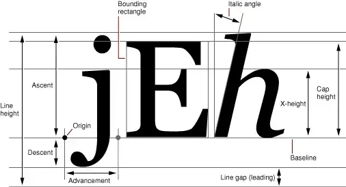

> 本文是「深入浅出 Android TextView：揭秘文本测量与布局的艺术」系列的第 3 篇，共 4 篇。在上一篇中，我们探讨了「三大 Layout 实现详解」的相关内容。

## 5. 精雕细琢：换行、断字与对齐

StaticLayout 和 DynamicLayout 的核心能力之一就是处理文本换行。

### 换行算法简介

最简单的换行算法是**贪心算法（Greedy Algorithm）**：

1. 从当前行首开始，尽可能多地放入单词（以空格或标点分隔）；
2. 直到下一个单词放不下（超出可用宽度）为止；
3. 将当前行确定下来，然后从下一个单词开始处理下一行。

贪心算法简单快速，是很多文本布局系统的基础。但它不一定能产生最优的排版效果（例如，可能导致某一行特别空，或者最后一行只有一个很短的单词）。更高级的算法（如 TeX 使用的 Knuth-Plass 算法）会考虑整个段落的断行，以达到更均衡、美观的效果，但计算复杂度也更高。Android 的 StaticLayout 主要基于贪心策略，但提供了一些可配置的选项来优化效果。

### Android 的换行策略（android:breakStrategy）

Android 提供了 `android:breakStrategy` 属性（API 23+），允许开发者调整换行行为，以在排版质量和性能之间取得平衡。

- **simple**：默认值（API 23–27）。非常基础的策略，速度快，但可能在 CJK（中日韩）文本或标点附近断行不够理想；
- **high_quality**：默认值（API 28+）。提供更高质量的换行，尤其改善了标点悬挂、CJK 字符处理等，推荐使用。它会进行更多的计算来寻找更好的断点；
- **balanced**：尝试让每行的长度尽可能接近，以获得更均衡的视觉效果。这通常需要更多的计算，可能影响性能，适用于标题或短文本块。

```xml
<TextView
    android:layout_width="200dp"
    android:layout_height="wrap_content"
    android:text="This text demonstrates different break strategies. High quality is often preferred."
    android:breakStrategy="high_quality" />
```

### 断字（android:hyphenationFrequency）

对于西文，当一个较长的单词在一行末尾放不下时，可以使用连字符（-）将其分割到下一行，这就是断字（Hyphenation）。Android 提供了 `android:hyphenationFrequency` 属性（API 23+）来控制断字行为。

- **none**：不使用断字。如果单词放不下，整个单词会被移到下一行；
- **normal**：默认值。进行适度的断字，平衡可读性和空间利用率；
- **full**：进行更积极的断字，以最大限度地利用空间，使文本边缘更整齐。

```xml
<TextView
    android:layout_width="150dp"
    android:layout_height="wrap_content"
    android:text="Demonstrating hyphenation for long words like 'internationalization'."
    android:breakStrategy="high_quality"
    android:hyphenationFrequency="normal" />
```

启用 normal 或 full 断字通常能改善窄宽度下西文的排版效果，但可能会稍微增加布局计算时间，因为它需要查询断字词典。

**注意**：断字需要设备支持相应语言的断字规则。

### 对齐（android:gravity 或 Layout.Alignment）

文本在 TextView 的布局区域内如何对齐，由 `gravity` 属性控制（水平方向），或在创建 Layout 时通过 `Layout.Alignment` 指定。

- `Gravity.LEFT` / `Alignment.ALIGN_NORMAL`：左对齐（LTR 默认）；
- `Gravity.RIGHT` / `Alignment.ALIGN_OPPOSITE`：右对齐（RTL 默认）；
- `Gravity.CENTER_HORIZONTAL` / `Alignment.ALIGN_CENTER`：居中对齐。

TextView 会将 gravity 转换成对应的 `Layout.Alignment` 传递给 Layout 对象。

## 6. 字体之韵：Font Metrics 与垂直间距

文本不仅仅是水平排列，垂直方向的间距同样重要。理解字体度量（Font Metrics）是掌握行高和垂直对齐的关键。

### 理解 Paint.FontMetrics

`android.graphics.Paint.FontMetrics` 类提供了关于特定字体和字号的垂直度量信息。可以通过 `paint.getFontMetrics()` 获取。

- **baseline**：这不是 FontMetrics 的字段，而是绘制文本的基准线。其他度量都是相对于基线的。想象一下英语字母 'x' 坐落的那条线；
- **ascent**：基线（baseline）到西文字符最高处的建议距离（通常为**负值**）。它考虑了大部分字符（如 'h'、'l'）的高度，但不一定包含所有重音符号或特殊字符的最高点；
- **descent**：基线（baseline）到西文字符最低处的建议距离（通常为**正值**）。它考虑了像 'g'、'p'、'y' 这样低于基线的字符部分；
- **top**：基线（baseline）到字体所能绘制的**最高**可能像素的距离（为**负值**，且 top ≤ ascent）。它包含了所有可能的标记或字形（包括罕见的、非常高的）；
- **bottom**：基线（baseline）到字体所能绘制的**最低**可能像素的距离（为**正值**，且 bottom ≥ descent）。它包含了所有可能低于基线的标记或字形；
- **leading**：行间距，即上一行的 descent 和下一行的 ascent 之间的建议额外空间。这个值很多时候是 0。



*图示说明*：一条水平线表示 baseline。从 baseline 向上标记 ascent 和 top（负值），向下标记 descent 和 bottom（正值）。用字母 'jEh' 演示：'h' 的顶部接近 ascent，'j' 的底部接近 descent。可能有一个带很高重音符号的字母触及 top，一个带很低标记的字母触及 bottom。leading 显示在两行文本之间。

### 行高的计算：默认行为

默认情况下（`includeFontPadding=true`、`elegantTextHeight=false`），TextView 中一行的基本高度大致由 `descent - ascent` 决定。但是，为了容纳所有可能的字形（包括 top 和 bottom 覆盖的范围），并且为了在多行之间提供一致的间距，实际的行高计算会更复杂一些。

### includeFontPadding 的作用与影响（android:includeFontPadding）

这个属性（**默认为 true**）控制是否在 ascent 之上和 descent 之下额外包含由 top 和 bottom 定义的空间。

- **includeFontPadding="true"（默认）**：
  - 第一行的顶部会包含 top - ascent 的额外空间；
  - 最后一行的底部会包含 bottom - descent 的额外空间；
  - 行与行之间的间距会考虑 bottom 和 top，确保即使有非常高或低的字符，也不会发生重叠；
  - **优点**：能容纳所有字形，避免极端情况下的裁剪；
  - **缺点**：可能会导致文本看起来上下 padding 过大，尤其是在顶部和底部，使得文本与其他 UI 元素在视觉上精确对齐变得困难；
- **includeFontPadding="false"**：
  - 行高主要基于 ascent 和 descent；
  - 第一行的顶部紧贴 ascent，最后一行的底部紧贴 descent；
  - 行间距也主要基于 ascent 和 descent；
  - **优点**：文本的实际边界更贴近可见字符，更容易与其他元素进行像素级对齐；
  - **缺点**：如果字体包含非常高或低的字形（超出 ascent 或 descent 范围），这些部分**可能被裁剪**。

**建议**：如果你需要精确控制文本的垂直对齐，或者觉得默认的上下边距过大，可以尝试设置 `android:includeFontPadding="false"`。但一定要在多种设备和字体上测试，确保没有重要的字形被裁剪。

```xml
<LinearLayout
    android:layout_width="match_parent"
    android:layout_height="wrap_content"
    android:orientation="horizontal"
    android:background="#DDDDDD">

    <ImageView
        android:layout_width="48dp"
        android:layout_height="48dp"
        android:src="@drawable/ic_launcher_foreground"
        android:background="#AAAAAA"/>

    <TextView
        android:layout_width="wrap_content"
        android:layout_height="48dp"
        android:text="Align Me (Padding True)"
        android:textSize="20sp"
        android:gravity="center_vertical"
        android:includeFontPadding="true"
        android:background="#EEEEEE"/>

    <TextView
        android:layout_width="wrap_content"
        android:layout_height="48dp"
        android:text="Align Me (Padding False)"
        android:textSize="20sp"
        android:gravity="center_vertical"
        android:includeFontPadding="false"
        android:background="#DDDDDD"/>

</LinearLayout>
```

运行上面的例子，你会发现在设置了相同高度和 `center_vertical` 的情况下，`includeFontPadding="false"` 的 TextView 中的文本，其基线位置看起来会与 `includeFontPadding="true"` 的有所不同，后者通常因为额外的字体 padding 显得「偏下」一点。

### elegantTextHeight：追求极致的排版美学（android:elegantTextHeight）

这个属性（API 21+，**默认为 false**）提供了另一种计算行高的方式，旨在实现更一致和「优雅」的垂直韵律，尤其是在处理包含多种脚本（如拉丁文、梵文、泰文等混合）或带有复杂附加符号的文本时。

- **elegantTextHeight="false"（默认）**：主要使用 ascent/descent 作为基准，并通过 includeFontPadding（如果为 true）来增加额外的空间；
- **elegantTextHeight="true"**：
  - 它倾向于使用字体文件中定义的**特定于「优雅」排版的度量标准**（如果字体支持的话），或者回退到使用 top/bottom 作为主要的行高计算依据；
  - 目标是为不同语言和脚本提供更一致的行高和基线，即使它们的 ascent/descent 值差异很大；
  - 通常会导致**行高增加**，因为它需要容纳各种语言的最大高度范围；
  - 它隐含了 `includeFontPadding="true"` 的行为，即总是考虑 top 和 bottom。

**何时使用：**

- 当你混合显示多种脚本，并且希望它们的行高和基线对齐更和谐时；
- 当你使用的字体明确支持「优雅高度」特性时；
- 当默认的行高在某些语言或特殊字符下显得不一致时。

**注意**：启用 elegantTextHeight 可能会改变文本的整体垂直尺寸，需要仔细测试布局影响。它并不总是「更好」，取决于具体的设计需求和字体。

```xml
<TextView
    android:layout_width="match_parent"
    android:layout_height="wrap_content"
    android:text="Text with default height.\nअगला पाठ (Hindi)"
    android:textSize="24sp" />

<TextView
    android:layout_width="match_parent"
    android:layout_height="wrap_content"
    android:text="Text with elegant height.\nअगला पाठ (Hindi)"
    android:textSize="24sp"
    android:elegantTextHeight="true"
    android:layout_marginTop="16dp"/>
```

比较上面两个 TextView 的渲染效果，你可能会观察到启用 elegantTextHeight 后，两行文本（英文和印地语）之间的垂直间距和整体高度有所变化，通常是为了更好地适应印地语字符的高度。

---

> 下一篇我们将探讨「复杂场景处理」，敬请关注本系列。

**「深入浅出 Android TextView：揭秘文本测量与布局的艺术」系列目录**

1. 开篇：文字的旅程 —— 从字符到像素
2. 三大 Layout 实现详解
3. **精雕细琢：换行、断字与对齐**（本文）
4. 复杂场景处理
