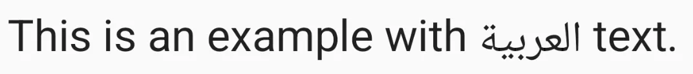

# 深入浅出 Android TextView：揭秘文本测量与布局的艺术（4）：复杂场景处理

> 本文是「深入浅出 Android TextView：揭秘文本测量与布局的艺术」系列的第 4 篇，共 4 篇。在上一篇中，我们探讨了「精雕细琢：换行、断字与对齐」的相关内容。

## 7. 复杂场景处理

现代应用常常需要处理比简单 LTR 文本更复杂的情况。

### RTL（从右到左）文本布局

Android 对 RTL 语言（如阿拉伯语、希伯来语）提供了完善的支持。

- **自动检测**：TextView 和 Layout 类能自动检测文本中是否存在 RTL 字符；
- **BiDi 算法**：当文本混合了 LTR 和 RTL 字符时（例如，英文中嵌入阿拉伯语），系统会应用 Unicode 双向算法（BiDi Algorithm）来确定每个字符片段的正确显示顺序和方向。StaticLayout 和 DynamicLayout 内部实现了 BiDi 处理；
- **android:textDirection**：你可以显式控制 TextView 的基础文本方向（通常设为 locale、ltr、rtl、inherit 等）。对于 Layout，这会影响 `Alignment.ALIGN_NORMAL` 和 `Alignment.ALIGN_OPPOSITE` 的具体行为（例如，ALIGN_NORMAL 在 RTL 上下文中是右对齐）。



*图示说明*：显示一个 TextView，包含英文和阿拉伯文混合的文本，例如 "This is an example with العربية text."。图中文字应按正确的 BiDi 规则显示：英文从左到右，阿拉伯文从右到左，但整体语序符合逻辑。

系统处理 BiDi 的过程对开发者通常是透明的，Layout 类会负责计算正确的字形顺序和位置。

### Emoji 与特殊字符

- **Emoji**：本质上是 Unicode 字符。现代 Android 系统和字体通常内置了对 Emoji 的支持。
  - **测量**：Emoji 表情通常比普通字符宽（有时是普通字符的两倍宽度），Layout 在测量和换行时会正确处理它们的宽度；
  - **渲染**：系统使用彩色字体（如 Noto Color Emoji）来渲染表情符号；
  - **换行**：表情符号通常被视为一个整体，不会在中间断开；
- **复杂脚本**：对于需要字形组合（Glyph Composition/Shaping）的语言（如阿拉伯语的字母连接、印地语的元音组合），Android 使用 **HarfBuzz** 引擎进行处理。这个过程发生在 Layout 计算之前：文本先经过 HarfBuzz 转换成正确的字形序列和位置，然后 Layout 再基于这些字形信息进行断行和定位。

开发者通常不需要直接干预 Emoji 和复杂脚本的处理，系统底层会自动完成。确保使用支持这些特性的较新 Android 版本和字体即可。

### 富文本（Spanned String）

TextView 支持通过 Spanned 接口显示富文本（不同样式、颜色、可点击链接等）。Layout 类在计算布局时会识别并处理 Spanned 中的各种 Span 对象：

- **MetricAffectingSpan**：如 StyleSpan（粗体/斜体）、RelativeSizeSpan（相对字号）、TextAppearanceSpan。这些 Span 会改变文本的度量（宽度、高度），Layout 在测量和换行时必须考虑它们。BoringLayout 不支持这类 Span；
- **CharacterStyle（非度量）**：如 ForegroundColorSpan、BackgroundColorSpan、UnderlineSpan。这些 Span 只影响绘制效果，不改变文本度量，Layout 主要在绘制阶段应用它们的效果；
- **ParagraphStyle**：如 AlignmentSpan（影响段落对齐）、LineBackgroundSpan（行背景）、BulletSpan（项目符号）。这些 Span 影响整行或整个段落的布局或绘制。

StaticLayout 和 DynamicLayout 能够正确处理所有类型的 Span。

```java
SpannableString spannable = new SpannableString("This text has bold, colored, and clickable parts.");

// Bold
spannable.setSpan(new StyleSpan(Typeface.BOLD), 15, 19, Spanned.SPAN_EXCLUSIVE_EXCLUSIVE);
// Color
spannable.setSpan(new ForegroundColorSpan(Color.RED), 21, 28, Spanned.SPAN_EXCLUSIVE_EXCLUSIVE);
// Clickable
ClickableSpan clickableSpan = new ClickableSpan() {
    @Override
    public void onClick(@NonNull View widget) {
        Toast.makeText(widget.getContext(), "Clicked!", Toast.LENGTH_SHORT).show();
    }
    @Override
    public void updateDrawState(@NonNull TextPaint ds) {
        super.updateDrawState(ds);
        ds.setUnderlineText(true); // Make clickable part underlined
        ds.setColor(Color.BLUE); // Make clickable part blue
    }
};
spannable.setSpan(clickableSpan, 34, 43, Spanned.SPAN_EXCLUSIVE_EXCLUSIVE);

TextView textView = findViewById(R.id.myTextView);
textView.setText(spannable);
// !!! 重要：必须设置 MovementMethod 才能使 ClickableSpan 响应点击
textView.setMovementMethod(LinkMovementMethod.getInstance());
```

Layout 类会解析这些 Span，确保加粗的文字占用正确的宽度，着色的文字在绘制时使用正确的颜色，并为 ClickableSpan 提供位置信息以便响应触摸事件。

## 8. 性能考量与优化建议

虽然 TextView 功能强大，但在处理大量文本或频繁更新时，性能可能成为瓶颈。

- **避免在 onDraw 中创建 Layout 或 Paint 对象**：这些对象的创建有一定开销，应在初始化或文本/属性变化时创建/更新，然后在 onDraw 中复用。TextView 内部已经遵循了这个原则；
- **StaticLayout vs DynamicLayout**：
  - 对于不经常变化的文本，StaticLayout 渲染更快；
  - 对于需要编辑的文本（EditText），必须使用 DynamicLayout；
  - 如果你的 TextView 内容需要频繁更新（但不可编辑），每次更新都会触发 StaticLayout 的重新创建，开销较大。考虑是否有其他方式（例如，使用 RecyclerView 分割长文本，或只更新变化部分，但这通常很难实现）；
- **缓存 Layout 对象**：如果你在自定义 View 中手动创建 Layout，并且文本和约束条件不变，可以缓存 Layout 对象避免重复计算；
- **TextView 优化**：
  - **减少不必要的 setText() 调用**：只有在文本确实改变时才调用；
  - **避免在列表中过度使用复杂 Span**：大量复杂的 Span 会增加布局和绘制的负担；
  - **考虑 PrecomputedText（API 28+）**：对于可能在后台线程加载的长文本，可以使用 PrecomputedText 在后台线程完成大部分文本布局计算，然后在主线程将结果设置给 TextView，减少主线程卡顿。

```java
// 在后台线程
TextView textView = findViewById(R.id.myTextView);
CharSequence longText = ... ;
PrecomputedText.Params params = textView.getTextMetricsParams();
Spannable newText = PrecomputedText.create(longText, params);

// 回到主线程
textView.setText(newText);
```

- **简化布局**：过于复杂的 ConstraintLayout 或嵌套布局会增加整体测量/布局时间，间接影响 TextView 的显示性能。

## 9. 调试技巧

当 TextView 的显示效果不符合预期时，可以尝试以下调试方法：

- **Layout Inspector（布局检查器）**：Android Studio 自带的工具，可以查看 TextView 的边界、内边距、测量的宽高以及文本内容；
- **检查属性**：仔细核对 XML 属性或代码中设置的 textSize、textColor、lineSpacingExtra、includeFontPadding、breakStrategy、maxLines、ellipsize 等是否正确；
- **打印 FontMetrics**：获取 TextView 的 TextPaint 对象，打印 FontMetrics 信息，帮助理解当前的字体度量和基线位置。

```java
TextPaint paint = textView.getPaint();
Paint.FontMetrics fm = paint.getFontMetrics();
Log.d("FontMetrics", "top: " + fm.top + ", ascent: " + fm.ascent +
                   ", descent: " + fm.descent + ", bottom: " + fm.bottom +
                   ", leading: " + fm.leading);
```

- **简化场景**：尝试使用更简单的文本、移除 Span、使用标准字体、移除 lineSpacing 等，逐步排查是哪个因素导致了问题；
- **边界可视化**：临时给 TextView 设置一个明显的背景色，或者在开发者选项中打开「显示布局边界」，查看 TextView 的实际占用区域。

## 10. 总结：掌握 TextView 布局的精髓

TextView 的文本测量与布局是一个涉及多方面因素的精密过程。理解其背后的机制，特别是 Layout 类（BoringLayout、StaticLayout、DynamicLayout）的角色和差异，以及 Font Metrics 对垂直间距的影响，对于我们构建高质量、高性能的 Android 应用至关重要。

**核心要点回顾：**

- TextView 的 onMeasure 依赖 Layout 对象计算尺寸；
- BoringLayout 用于优化简单的单行 LTR 文本；
- StaticLayout 是处理复杂、静态多行文本的主力，功能全面但创建有开销；
- DynamicLayout 用于 EditText，支持高效的增量更新；
- 换行策略（breakStrategy）和断字（hyphenationFrequency）影响文本流的外观；
- Font Metrics（top、ascent、descent、bottom）决定了垂直空间；
- includeFontPadding 和 elegantTextHeight 控制如何使用 Font Metrics 来计算行高和行距，影响垂直对齐；
- 系统能自动处理 RTL/BiDi、Emoji 和复杂脚本；
- Spanned 文本允许富文本展示，由 Layout 负责处理；
- 性能优化需要关注 Layout 的选择、缓存和避免不必要的计算。

希望通过本文的深入探讨，你对 Android TextView 的文本测量和布局有了更清晰、更全面的认识。下次当你调整 lineSpacingMultiplier、处理多语言对齐或者优化列表滚动性能时，能够更加胸有成竹。

---

**「深入浅出 Android TextView：揭秘文本测量与布局的艺术」系列目录**

1. 开篇：文字的旅程 —— 从字符到像素
2. 三大 Layout 实现详解
3. 精雕细琢：换行、断字与对齐
4. **复杂场景处理**（本文）
