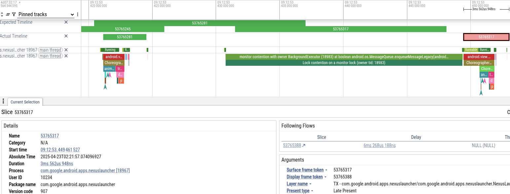
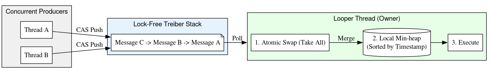
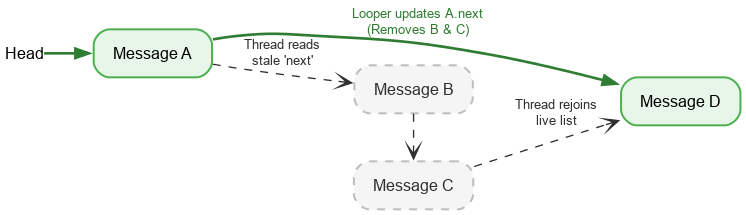
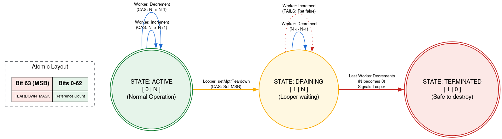
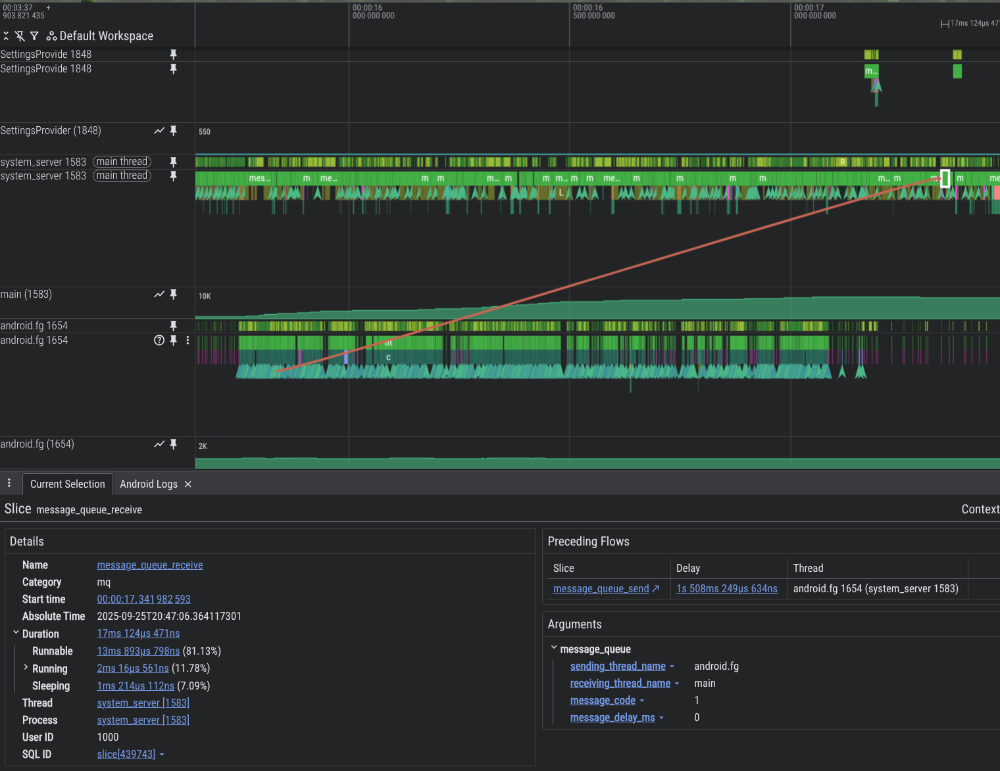

# 深入解析 Android 17 的无锁 MessageQueue

> **总结**：Android 的 MessageQueue 十多年来一直使用单一监视器锁保护状态，导致后台线程与 UI 线程之间频繁发生锁竞争和优先级反转，成为 UI 卡顿的重要根源。Android 17 引入了名为 DeliQueue 的全新无锁数据结构，结合 Treiber 栈实现 O(1) 无锁入队，配合最小堆实现高效出队，从根本上解决了这一系统级性能问题。本文深入剖析了 DeliQueue 的架构设计、原子操作原语、墓碑删除机制、无分支优化等核心技术，并展示了如何使用 Perfetto 分析锁竞争。对于关注 Android 系统底层性能优化的开发者而言，这篇文章极具参考价值。

*作者：Shai Barack（Android 平台性能负责人）和 Charles Munger（首席软件工程师）*


在 Android 17 中，以 SDK 37 及以上为目标平台的应用将使用全新的无锁 MessageQueue 实现。新实现提升了性能并减少了掉帧，但可能会影响那些通过反射访问 MessageQueue 私有字段和方法的客户端。要了解更多关于此行为变更及缓解方案的信息，请查阅 [MessageQueue 行为变更文档](https://developer.android.com/)。本文将概述 MessageQueue 的架构重构，以及如何使用 Perfetto 分析锁竞争问题。

Looper 驱动着每个 Android 应用的 UI 线程。它从 MessageQueue 中拉取工作，将其分发到 Handler，然后循环往复。过去二十年间，MessageQueue 使用一把监视器锁（即 `synchronized` 代码块）来保护其内部状态。

Android 17 对这一核心组件进行了重大更新：引入了一个名为 DeliQueue 的无锁（Lock-Free）实现。

本文将解释锁如何影响 UI 性能、如何使用 Perfetto 分析这些问题，以及用于改进 Android 主线程的具体算法和优化手段。

## 问题：锁竞争与优先级反转

传统的 MessageQueue 本质上是一个由单一锁保护的优先队列。当后台线程在主线程执行队列维护时投递消息，后台线程会阻塞主线程。

当两个或多个线程竞争同一锁的独占使用权时，称之为**锁竞争**（Lock Contention）。锁竞争可以导致**优先级反转**（Priority Inversion），进而引发 UI 卡顿等性能问题。

优先级反转发生在高优先级线程（如 UI 线程）被迫等待低优先级线程时。考虑以下场景：

1. 低优先级后台线程获取 MessageQueue 锁，以投递其计算结果。
2. 中优先级线程变为可运行状态，内核调度器为其分配 CPU 时间片，**抢占了低优先级线程**。
3. 高优先级 UI 线程完成当前任务并尝试从队列中读取，但因低优先级线程持有锁而被阻塞。

低优先级线程阻塞了 UI 线程，而中优先级线程又进一步加剧了延迟。


## 使用 Perfetto 分析锁竞争

可以使用 Perfetto 诊断这些问题。在标准 trace 中，被监视器锁阻塞的线程会进入 sleeping 状态，Perfetto 会显示一个切片（slice），标注锁的持有者。

查询 trace 数据时，应关注名为 "monitor contention with …" 的切片，其后跟随持有锁的线程名称和锁获取位置。

### 案例研究：Launcher 卡顿

为了说明问题，让我们分析一个用户在拍照后导航回主屏幕时遭遇卡顿的 trace。下图展示了 Perfetto 中导致掉帧的事件序列：



- **现象**：Launcher 主线程错过了帧截止时间。阻塞了 18ms，超过了 60Hz 渲染所需的 16ms 截止时间。
- **诊断**：Perfetto 显示主线程被 MessageQueue 锁阻塞。"BackgroundExecutor" 线程持有该锁。
- **根因**：BackgroundExecutor 运行在 `Process.THREAD_PRIORITY_BACKGROUND`（极低优先级）。它正在执行一个非紧急任务（检查应用使用限制）。与此同时，中优先级线程正在使用 CPU 处理来自相机的数据。OS 调度器抢占了 BackgroundExecutor 线程来运行相机线程。

这一序列导致 Launcher 的 UI 线程（高优先级）被相机工作线程（中优先级）间接阻塞——因为后者阻止了 Launcher 的后台线程（低优先级）释放锁。

### 使用 PerfettoSQL 查询 trace

可以使用 PerfettoSQL 查询 trace 数据中的特定模式。如果你拥有大量来自用户设备或测试的 trace 数据，这对于查找特定问题的 trace 非常有用。

例如，以下查询可查找与掉帧（jank）同时发生的 MessageQueue 锁竞争：

```sql
INCLUDE PERFETTO MODULE android.monitor_contention;
INCLUDE PERFETTO MODULE android.frames.jank_type;

SELECT
  process_name,
  -- 将持续时间从纳秒转换为毫秒
  SUM(dur) / 1000000 AS sum_dur_ms,
  COUNT(*) AS count_contention
FROM android_monitor_contention
WHERE is_blocked_thread_main
AND short_blocked_method LIKE "%MessageQueue%"

-- 仅查看发生过 jank 的应用进程
AND upid IN (
  SELECT DISTINCT(upid)
  FROM actual_frame_timeline_slice
  WHERE android_is_app_jank_type(jank_type) = TRUE
)
GROUP BY process_name
ORDER BY SUM(dur) DESC;
```

在这个更复杂的示例中，通过跨多个表关联 trace 数据来识别应用启动期间的 MessageQueue 锁竞争：

```sql
INCLUDE PERFETTO MODULE android.monitor_contention;
INCLUDE PERFETTO MODULE android.startup.startups;

-- 关联启动事件的包信息和进程信息
DROP VIEW IF EXISTS startups;
CREATE VIEW startups AS
SELECT startup_id, ts, dur, upid
FROM android_startups
JOIN android_startup_processes USING(startup_id);

-- 将监视器锁竞争事件与同一进程中的启动事件做交集
DROP TABLE IF EXISTS monitor_contention_during_startup;
CREATE VIRTUAL TABLE monitor_contention_during_startup
USING SPAN_JOIN(android_monitor_contention PARTITIONED upid, startups PARTITIONED upid);

SELECT
  process_name,
  SUM(dur) / 1000000 AS sum_dur_ms,
  COUNT(*) AS count_contention
FROM monitor_contention_during_startup
WHERE is_blocked_thread_main
AND short_blocked_method LIKE "%MessageQueue%"
GROUP BY process_name
ORDER BY SUM(dur) DESC;
```

你可以使用 LLM 来编写 PerfettoSQL 查询，以发现更多模式。

在 Google 内部，我们使用 BigTrace 在数百万条 trace 上运行 PerfettoSQL 查询。结果证实，我们在个案中观察到的现象实际上是一个**系统性问题**。数据表明，MessageQueue 锁竞争影响着整个生态系统的用户，充分说明了进行根本性架构变更的必要性。

## 解决方案：无锁并发

我们通过实现无锁数据结构来解决 MessageQueue 的锁竞争问题——使用原子内存操作而非排他锁来同步对共享状态的访问。如果一个数据结构或算法是无锁的，那么无论其他线程的调度行为如何，至少有一个线程始终能够取得进展。这个特性通常很难实现，对于大多数代码来说也不值得追求。

### 原子操作原语

无锁软件通常依赖硬件提供的原子**读取-修改-写入**（Read-Modify-Write）原语。

在较老一代的 ARM64 CPU 上，原子操作使用 **LL/SC 循环**（Load-Link/Store-Conditional）。CPU 加载一个值并标记该地址。如果另一个线程写入了该地址，存储操作会失败，循环会重试。因为线程可以不断尝试并在不等待其他线程的情况下成功，所以这一操作是无锁的。

```asm
retry:
    ldxr    x0, [x1]        // 从地址 x1 独占加载到 x0
    add     x0, x0, #1      // 值加 1
    stxr    w2, x0, [x1]    // 独占存储
                            // w2 为 0 表示成功，1 表示失败
    cbnz    w2, retry       // 如果 w2 非零（失败），跳转到 retry
```

（[在 Compiler Explorer 中查看](https://godbolt.org/)）

更新的 ARM 架构（ARMv8.1）支持**大型系统扩展**（Large System Extensions, LSE），包括 CAS（Compare-And-Swap）和 Load-And-Add 等指令。在 Android 17 中，我们为 ART 编译器添加了 LSE 检测支持，能够在支持 LSE 的设备上生成优化指令：

```asm
// ARMv8.1 LSE 原子操作示例
ldadd   x0, x1, [x2]    // 原子 load-add
                        // 更快，无需循环
```

在我们的基准测试中，使用 CAS 的高竞争代码比 LL/SC 变体实现了约 **3 倍加速**。

Java 语言通过 `java.util.concurrent.atomic` 提供原子操作原语，底层依赖这些特殊的 CPU 指令。

### 数据结构：DeliQueue

为了消除 MessageQueue 中的锁竞争，我们的工程师设计了一种新型数据结构，称为 **DeliQueue**。DeliQueue 将 Message 的插入与处理分离：

1. **Message 链表（Treiber 栈）**：一个无锁栈。任何线程都可以在无竞争的情况下向其中推入新的 Message。
2. **优先队列（最小堆）**：一个 Message 堆，由 Looper 线程独占（因此访问时无需同步或加锁）。

### 入队：推入 Treiber 栈

Message 链表保存在一个 **Treiber 栈** [1] 中——这是一种使用 CAS 循环更新头指针的无锁栈。

```java
public class TreiberStack <E> {
    AtomicReference<Node<E>> top =
            new AtomicReference<Node<E>>();
    public void push(E item) {
        Node<E> newHead = new Node<E>(item);
        Node<E> oldHead;
        do {
            oldHead = top.get();
            newHead.next = oldHead;
        } while (!top.compareAndSet(oldHead, newHead));
    }

    public E pop() {
        Node<E> oldHead;
        Node<E> newHead;
        do {
            oldHead = top.get();
            if (oldHead == null) return null;
            newHead = oldHead.next;
        } while (!top.compareAndSet(oldHead, newHead));
        return oldHead.item;
    }
}
```

*源码基于 Java Concurrency in Practice [2]，在线提供并已发布为公共领域*

任何生产者都可以随时向栈中推入新的 Message。这就像在熟食柜台（deli counter）取号——你的号码取决于到达时间，但上菜的顺序不必与此一致。由于它是一个链式栈，每个 Message 本身就是一个子栈——通过追踪栈顶并向下迭代，你可以看到任意时刻的 Message 队列快照，即使有新的 Message 正被压入栈顶也不会被看到。

### 出队：批量转移到最小堆

为了找到下一个待处理的 Message，Looper 从 Treiber 栈的栈顶开始遍历，直到找到上次处理过的最后一个 Message。在遍历过程中，Looper 将 Message 插入按截止时间排序的最小堆。由于 Looper 独占拥有该堆，它可以在不使用锁或原子操作的情况下对 Message 进行排序和处理。



在向下遍历栈的过程中，Looper 还会创建从栈中 Message 到其前驱的反向链接，从而形成一个双向链表。创建链表是安全的，因为指向栈下方的链接通过 Treiber 栈算法使用 CAS 添加，而指向栈上方的链接仅由 Looper 线程读取和修改。这些反向链接随后用于以 O(1) 时间从栈的任意位置删除 Message。

这一设计为生产者（向队列投递工作的线程）提供了 *O*(1) 的插入复杂度，为消费者（Looper）提供了均摊 *O*(log N) 的处理复杂度。

使用最小堆来排序 Message 还解决了传统 MessageQueue 中的一个根本缺陷——传统实现使用单链表（以头部为根）保存 Message。在传统实现中，从头部移除是 *O*(1)，但插入的最坏情况是 *O(N)*——在队列过载时性能急剧下降！相反，最小堆的插入和移除都是对数级别的，在平均性能上与传统实现相当，但在尾部延迟（tail latency）上表现更为出色。

|  | 传统（加锁）MessageQueue | DeliQueue |
| --- | --- | --- |
| 插入 | *O(N)* | 调用线程 *O*(1)，Looper 线程 *O(logN)* |
| 从头部移除 | *O*(1) | *O(logN)* |

在传统队列实现中，生产者和消费者使用锁来协调对底层单链表的独占访问。而在 DeliQueue 中，Treiber 栈处理并发访问，单一消费者负责排序其工作队列。

### 删除：通过墓碑实现一致性

DeliQueue 是一种混合数据结构，将无锁 Treiber 栈与单线程最小堆结合在一起。在没有全局锁的情况下保持这两个结构的同步是一个独特的挑战：一个消息可能在物理上存在于栈中，但在逻辑上已从队列中移除。

为解决这个问题，DeliQueue 使用了**墓碑**（Tombstoning）技术。每个 Message 通过前向和反向指针追踪其在栈中的位置、通过堆数组中的索引追踪其在堆中的位置，并有一个布尔标志表示是否已被删除。当一个 Message 准备运行时，Looper 线程会对其删除标志执行 CAS 操作，然后将其从堆和栈中移除。

当其他线程需要删除一个 Message 时，它不会立即从数据结构中提取该 Message，而是执行以下步骤：

1. **逻辑删除**：线程使用 CAS 将 Message 的删除标志从 false 原子地设置为 true。该 Message 作为待删除的证据保留在数据结构中，即所谓的"墓碑"。一旦 Message 被标记为删除，DeliQueue 在后续遇到它时会将其视为不存在。
2. **延迟清理**：实际从数据结构中移除的责任归 Looper 线程，且被推迟到稍后执行。删除方线程不修改栈或堆，而是将 Message 添加到另一个无锁空闲链表（freelist）栈中。
3. **结构删除**：只有 Looper 才能操作堆或从栈中移除元素。当它唤醒时，会清空空闲链表并处理其中的 Message。每个 Message 随后被从栈中解除链接并从堆中移除。

这种方法使所有堆管理保持在单线程内。它最大限度地减少了所需的并发操作和内存屏障数量，使关键路径更快、更简洁。

### 遍历：良性 Java 内存模型数据竞争

大多数并发 API，如 Java 标准库中的 `Future`、Kotlin 的 `Job` 和 `Deferred`，都包含在工作完成前取消的机制。这些类的一个实例与一个底层工作单元一一对应，对对象调用 cancel 即可取消与之关联的特定操作。

如今的 Android 设备拥有多核 CPU 和并发分代垃圾收集器。但在 Android 最初开发时，为每个工作单元分配一个对象的开销太大。因此，Android 的 Handler 通过多个 `removeMessages` 重载来支持取消——它不是移除特定的 Message，而是移除所有匹配指定条件的 Message。实际上，这需要遍历在 `removeMessages` 调用之前插入的所有 Message，并移除匹配的那些。

在向前遍历时，线程只需要一次有序原子操作来读取当前栈顶。之后，使用普通的字段读取来查找下一个 Message。如果 Looper 线程在删除 Message 时修改了 next 字段，Looper 的写操作和另一个线程的读操作是不同步的——这是一个**数据竞争**（data race）。通常，数据竞争是一个严重的 bug，可能导致泄漏、无限循环、崩溃、冻结等严重问题。但在某些特定条件下，数据竞争在 Java 内存模型中是**良性的**（benign）。假设初始栈状态为：


我们对栈顶执行原子读取，看到 A。A 的 next 指针指向 B。在我们处理 B 的同时，Looper 可能删除了 B 和 C，将 A 更新为指向 C 然后指向 D。



尽管 B 和 C 在逻辑上已被删除，但 B 仍保留着指向 C 的 next 指针，C 仍保留着指向 D 的指针。读取线程继续遍历这些已分离的被删除节点，最终在 D 处重新汇入活跃栈。

通过将 DeliQueue 设计为能够处理遍历与删除之间的竞争，我们实现了安全的无锁遍历。

### 退出：Native 引用计数

Looper 由一个 native 分配支撑，该分配必须在 Looper 退出后手动释放。如果其他线程正在添加 Message 而 Looper 正在退出，可能会在 native 分配被释放后继续使用它——这是一个**内存安全违规**。我们使用**带标记的引用计数**（Tagged Refcount）来防止这种情况，其中原子值的一个 bit 用于表示 Looper 是否正在退出。

在使用 native 分配之前，线程读取引用计数原子值。如果退出位已设置，则返回 Looper 正在退出的状态，不得使用 native 分配。如果未设置，则尝试 CAS 操作来增加使用 native 分配的活跃线程计数。使用完毕后，递减计数。如果在增加之后但递减之前退出位被设置，且计数此时变为零，则唤醒 Looper 线程。

当 Looper 线程准备退出时，它使用 CAS 设置原子值中的退出位。如果引用计数为 0，则可以继续释放 native 分配。否则，它会挂起自身，等待 native 分配的最后一个使用者递减引用计数后将其唤醒。这种方法确实意味着 Looper 线程在退出时需要等待其他线程的进展，但这只在退出时发生一次且不涉及性能敏感路径，同时保持了其他使用 native 分配的代码完全无锁。



实现中还有很多其他技巧和复杂之处。你可以通过[阅读源码](https://cs.android.com/)来深入了解 DeliQueue。

## 优化：无分支编程

在开发和测试 DeliQueue 期间，团队运行了大量基准测试，并仔细分析了新代码的性能。使用 simpleperf 工具发现了一个问题：Message 比较器代码引起的流水线刷新。

标准比较器使用条件跳转，Message 优先级判断的条件简化如下：

```java
static int compareMessages(@NonNull Message m1, @NonNull Message m2) {
    if (m1 == m2) {
        return 0;
    }

    // 主排序键是 when 字段
    // when 值更小的 Message 应排在队列前面
    final long whenDiff = m1.when - m2.when;
    if (whenDiff > 0) return 1;
    if (whenDiff < 0) return -1;

    // 次排序键是插入顺序
    // 如果两个 Message 的 when 值相同，先插入的排在前面
    final long insertSeqDiff = m1.insertSeq - m2.insertSeq;
    if (insertSeqDiff > 0) return 1;
    if (insertSeqDiff < 0) return -1;

    return 0;
}
```

这段代码编译为条件跳转（`b.le` 和 `cbnz` 指令）。当 CPU 遇到条件分支时，在条件计算完成之前无法确定下一条指令的位置，因此必须进行猜测——这种技术称为**分支预测**（Branch Prediction）。在二分搜索等场景中，分支方向在每一步都不可预测，因此大约一半的预测会出错。分支预测在搜索和排序算法（如最小堆中使用的算法）中通常效果不佳，因为猜错的代价大于猜对的收益。当分支预测器猜错时，必须丢弃基于预测值所做的工作，从实际执行的路径重新开始——这称为**流水线刷新**（Pipeline Flush）。

为了发现这个问题，我们使用 `branch-misses` 性能计数器对基准测试进行了 profiling，该计数器记录分支预测失败的调用栈。然后使用 Google pprof 将结果可视化，如下所示：


回顾一下，原始 MessageQueue 使用单链表作为有序队列。插入时按排序顺序遍历链表，执行线性搜索，在第一个超过插入点的元素前停止并链入新的 Message。从头部移除只需解除头部链接。而 DeliQueue 使用最小堆，变更操作需要在平衡数据结构中重新排列一些元素（上浮或下沉），复杂度为对数级别，任何一次比较都有相等的概率将遍历引向左子节点或右子节点。新算法渐进地更快，但暴露了一个新的瓶颈——搜索代码有一半时间因分支预测失败而停滞。

意识到分支预测失败拖慢了堆代码后，我们使用**无分支编程**（Branch-Free Programming）进行优化：

```java
// 无分支逻辑
static int compareMessages(@NonNull Message m1, @NonNull Message m2) {
    final long when1 = m1.when;
    final long when2 = m2.when;
    final long insertSeq1 = m1.insertSeq;
    final long insertSeq2 = m2.insertSeq;

    // signum 返回参数的符号（-1、0、1），
    // 通过纯算术实现：
    // ((num >> 63) | (-num >>> 63))
    final int whenSign = Long.signum(when1 - when2);
    final int insertSeqSign = Long.signum(insertSeq1 - insertSeq2);

    // whenSign 优先于 insertSeqSign，
    // 因此下面的公式确保 insertSeqSign 仅在
    // whenSign 为 0 时作为平局决胜
    return whenSign * 2 + insertSeqSign;
}
```

要理解这一优化，可以在 Compiler Explorer 中反汇编这两个版本，并使用 LLVM-MCA（CPU 模拟器）生成 CPU 周期的估算时间线。

原始代码：

```
Index     01234567890123
[0,0]     DeER .    .  .   sub  x0, x2, x3
[0,1]     D=eER.    .  .   cmp  x0, #0
[0,2]     D==eER    .  .   cset w0, ne
[0,3]     .D==eER   .  .   cneg w0, w0, lt
[0,4]     .D===eER  .  .   cmp  w0, #0
[0,5]     .D====eER .  .   b.le #12
[0,6]     . DeE---R .  .   mov  w1, #1
[0,7]     . DeE---R .  .   b    #48
[0,8]     . D==eE-R .  .   tbz  w0, #31, #12
[0,9]     .  DeE--R .  .   mov  w1, #-1
[0,10]    .  DeE--R .  .   b    #36
[0,11]    .  D=eE-R .  .   sub  x0, x4, x5
[0,12]    .   D=eER .  .   cmp  x0, #0
[0,13]    .   D==eER.  .   cset w0, ne
[0,14]    .   D===eER  .   cneg w0, w0, lt
[0,15]    .    D===eER .   cmp  w0, #0
[0,16]    .    D====eER.   csetm        w1, lt
[0,17]    .    D===eE-R.   cmp  w0, #0
[0,18]    .    .D===eER.   csinc        w1, w1, wzr, le
[0,19]    .    .D====eER   mov  x0, x1
[0,20]    .    .DeE----R   ret
```

注意其中有一个条件分支 `b.le`，当 `when` 字段的比较结果已知时跳过 `insertSeq` 字段的比较。

无分支代码：

```
Index     012345678
[0,0]     DeER .  .   sub       x0, x2, x3
[0,1]     DeER .  .   sub       x1, x4, x5
[0,2]     D=eER.  .   cmp       x0, #0
[0,3]     .D=eER  .   cset      w0, ne
[0,4]     .D==eER .   cneg      w0, w0, lt
[0,5]     .DeE--R .   cmp       x1, #0
[0,6]     . DeE-R .   cset      w1, ne
[0,7]     . D=eER .   cneg      w1, w1, lt
[0,8]     . D==eeER   add       w0, w1, w0, lsl #1
[0,9]     .  DeE--R   ret
```

无分支实现的周期数和指令数甚至少于有分支代码的最短路径——在所有情况下都更快。更快的实现加上消除错误预测的分支，在我们的一些基准测试中实现了 **5 倍性能提升**！

然而，这种技术并非总是适用。无分支方法通常需要执行一些最终会被丢弃的工作，如果分支在大多数情况下是可预测的，这些浪费的工作反而可能拖慢代码。此外，消除分支通常会引入数据依赖。现代 CPU 每个周期执行多个操作，但在前一条指令的输入就绪之前无法执行依赖它的指令。相比之下，CPU 可以对分支中的数据进行推测执行，如果分支预测正确就能提前完成工作。

## 测试与验证

验证无锁算法的正确性是出了名的困难！

除了在开发期间用于持续验证的标准单元测试外，我们还编写了严格的压力测试来验证队列不变量，并尝试在数据竞争存在的情况下诱发它们。在我们的测试实验室中，可以在模拟设备和真实硬件上运行数百万个测试实例。

通过 Java ThreadSanitizer（JTSan）插桩，我们可以使用相同的测试来检测代码中的数据竞争。JTSan 在 DeliQueue 中没有发现任何有问题的数据竞争，但——令人意外的是——实际上检测到了 Robolectric 框架中的两个并发 bug，我们已经及时修复了它们。

为了提升调试能力，我们构建了新的分析工具。下图展示了 Android 平台代码中的一个问题示例——一个线程向另一个线程过载投递 Message，导致大量积压。借助我们新增的 MessageQueue 插桩功能，该问题在 Perfetto 中清晰可见。



要在 system_server 进程中启用 MessageQueue 追踪，在 Perfetto 配置中添加以下内容：

```
data_sources {
  config {
    name: "track_event"
    target_buffer: 0  # 根据你的缓冲区配置修改
    track_event_config {
      enabled_categories: "mq"
    }
  }
}
```

## 成效

DeliQueue 通过消除 MessageQueue 中的锁来提升系统和应用性能。

- **合成基准测试**：在繁忙队列上的多线程插入比传统 MessageQueue 快最高 **5,000 倍**，得益于更好的并发性（Treiber 栈）和更快的插入（最小堆）。
- 在内部测试用户获取的 Perfetto trace 中，应用主线程花在锁竞争上的时间**减少了 15%**。
- 在相同的测试设备上，锁竞争的减少带来了显著的用户体验改善：
  - 应用掉帧率 **-4%**
  - System UI 和 Launcher 交互掉帧率 **-7.7%**
  - 从应用启动到首帧绘制的时间，在 P95 分位上 **-9.1%**

## 后续计划

DeliQueue 正在 Android 17 中向应用推出。应用开发者应查阅 Android Developers 博客上的[为新的无锁 MessageQueue 准备你的应用](https://android-developers.googleblog.com/)，了解如何测试自己的应用。

## 参考文献

[1] Treiber, R.K., 1986. Systems programming: Coping with parallelism. International Business Machines Incorporated, Thomas J. Watson Research Center.

[2] Goetz, B., Peierls, T., Bloch, J., Bowbeer, J., Holmes, D., & Lea, D. (2006). Java Concurrency in Practice. Addison-Wesley Professional.

---

> 本文翻译自：[Under the hood: Android 17's lock-free MessageQueue](https://android-developers.googleblog.com/2026/02/under-hood-android-17s-lock-free.html)
