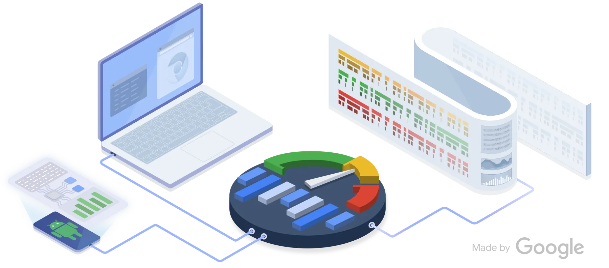
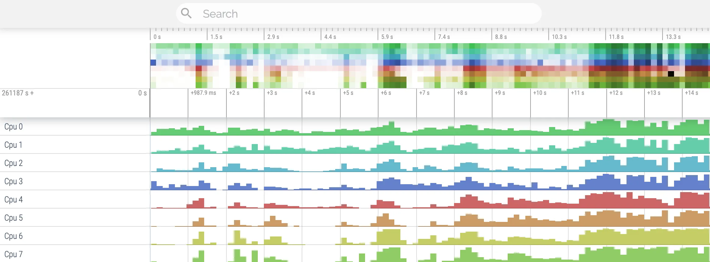

## 引言：超越应用边界，洞察系统全局

当 Android 应用出现性能问题时——例如 UI 卡顿（Jank）、启动缓慢、功耗过高或整体响应迟钝——仅依赖应用级性能分析工具（如 Android Studio 的 CPU 或 Memory Profiler）往往难以定位根因。这些工具虽能帮助发现应用内部的代码瓶颈或内存泄漏，但许多复杂的性能问题源于应用与 Android 系统服务、Linux 内核、硬件之间的交互，或是多进程、多线程间的资源争抢。要诊断这类问题，我们需要能够**跨越应用边界、提供系统全局视角**的工具。

**Systrace**（较旧，但概念仍有参考价值）和 **Perfetto**（现代 Android 系统内置、功能更强大的标准）正是为此而生。它们是系统级追踪（Tracing）工具，能够记录短时间内系统各层面——如 CPU 调度、I/O、Binder 通信、图形渲染管线、内存事件、电源状态等——发生的详细事件和状态，并将它们可视化地呈现在时间轴上。

对于 Android 开发者而言，**精通 Perfetto（或 Systrace）的使用与分析，是诊断疑难性能问题、理解系统在负载下的真实行为、驱动深度性能优化的关键能力**。这不仅在于会使用工具，更在于能够读懂 Trace 数据背后隐藏的系统运行逻辑。

本文将重点介绍现代化的 Perfetto 工具（同时借鉴 Systrace 的核心分析思路），涵盖以下内容：

- **Perfetto 框架简介**：了解其架构与数据来源
- **Trace 数据采集**：多种采集方式及其配置
- **Perfetto UI 核心概念**：时间轴、轨道、切片、计数器等
- **关键轨道深度解读**：CPU 调度与状态、Binder 事务、图形渲染管线、内存事件、电源管理
- **典型问题分析方法**：系统性地诊断 Jank、慢启动、高功耗
- **自定义追踪**：利用 Atrace 为应用添加分析锚点
- **Perfetto 高级特性**：SQL 查询、Trace Processor 等

---

## 一、Perfetto：现代 Android 追踪框架



Perfetto 是 Google 开发的新一代、高性能、低开销的系统追踪与分析框架，已成为 Android 平台性能分析的标准工具。

### 核心架构

**数据源/探针（Probes）**：负责收集数据，包括：

- 内核的 ftrace（用于捕获调度、系统调用、磁盘/网络 I/O 等事件）
- 用户空间的 atrace（用于 Framework 和应用的自定义 Trace 点）
- heapprofd（Native 内存分析）
- 进程状态/计数器等

**追踪守护进程（traced）**：在设备上运行，负责根据配置启动/停止探针，管理追踪缓冲区。

**追踪处理器（Trace Processor）**：独立的库或命令行工具，负责解析二进制 Trace 文件，将其转换为结构化数据，并提供查询接口（如 SQL）。

**UI 界面**：基于 Web 技术（ui.perfetto.dev）的可视化分析器，可加载 Trace 文件进行交互式分析。

### 丰富的数据来源

Perfetto 可整合来自系统各层面的数据：

- **内核（Kernel）**：CPU 调度（sched_switch、sched_wakeup）、系统调用（syscalls）、磁盘 I/O（diskio）、网络（net）、中断（irq）等
- **Android Framework 与系统服务**：通过 ATRACE 记录的关键事件类别，如视图系统（view）、窗口管理（wm）、活动管理（am）、图形（gfx）、输入（input）、Binder 驱动（binder_driver）、HAL 层（hal）等
- **应用程序**：应用自身添加的 ATRACE 埋点（Trace.beginSection）、ART 运行时信息（GC 事件、JIT 编译）
- **Native 进程**：Native 堆内存分配（heapprofd）、内存错误检测（HWASan/ASan，需特定构建）
- **硬件**：CPU 频率（cpufreq）、CPU 空闲状态（cpuidle）、GPU 活动（部分设备）、内存带宽、功耗相关计数器（部分设备）

### Trace 数据采集方法

**Android Studio Profiler**：在 CPU Profiler 中选择「System Trace」录制模式。简单易用，适合调试应用本身的行为，但配置选项有限。

**设备端「系统跟踪」应用（开发者选项）**：提供图形化界面，可选择常用 Atrace 类别、设置缓冲区大小、持续时间等。适合录制系统范围的行为或复现特定问题。录制后生成 `.perfetto-trace` 或 `.trace` 文件。

**Perfetto Web UI 录制页面（ui.perfetto.dev -> Record new trace）**：通过 ADB 连接设备，提供详细的配置选项，可精确选择 ftrace 事件、atrace 类别及各类数据源探针。适合高级用户进行精细化数据采集。

**adb shell perfetto 命令行**：最灵活、最强大的方式。使用文本格式的配置文件（TextProto 格式）精确定义要采集的数据源、缓冲区模式（环形缓冲区 ring-buffer 或持续写入 long-trace）、持续时间、触发器等。非常适合自动化测试或需要复杂配置的场景。

**关键配置参数示例（TextProto）**：

```plain
buffers { /* ... size, fill_policy ... */ }
data_sources {
    config {
        name: "linux.ftrace"
        ftrace_config {
            ftrace_events: "sched/sched_switch"
            ftrace_events: "sched/sched_wakeup"
            atrace_categories: "view"
            atrace_categories: "wm"
            // ... other ftrace events or atrace categories
        }
    }
}
data_sources {
    config {
        name: "linux.process_stats"
        process_stats_config { /* ... options ... */ }
    }
}
duration_ms: 10000 // Record for 10 seconds
```

---

## 二、玩转 Perfetto UI：核心概念解读

加载 Trace 文件后，理解 Perfetto UI 的基本元素是进行分析的前提。



### 时间轴（Timeline）

顶部显示时间刻度，可缩放和平移，用于选择分析的时间范围。

### 轨道/轨迹（Tracks）

水平的行，代表不同的数据来源或维度，例如：

- 每个 CPU 核心一个 Track
- 每个进程一个 Track Group，其下包含该进程所有线程的 Track
- 特定系统事件的 Track（如 VSYNC 信号）
- 计数器 Track（如 CPU 频率、内存使用量）

### 切片（Slices）

轨道上彩色的矩形块，表示有开始和结束时间的事件或状态：

- **CPU Track Slices**：表示某线程在该 CPU 上运行的时间段
- **Thread State Slices**：表示线程处于特定状态（Running、Runnable、Sleeping 等）的时间段
- **Atrace Section Slices**：表示 Trace.beginSection/endSection 包裹的代码段执行时间
- **Binder Transaction Slices**：表示 Binder 调用的时间

点击 Slice 后，会在下方信息面板显示其详细信息（名称、开始时间、持续时间、关联的线程/进程、参数等）。

### 计数器（Counters）

以图形方式展示数值随时间变化的轨道，例如 CPU 频率、内存 PSS、电池电量。

### 瞬时事件（Events）

在时间轴上标记为菱形或竖线，表示瞬间发生的事件，如 sched_wakeup（线程被唤醒）。

### 钉住与过滤（Pinning & Filtering）

可将关心的轨道或线程「钉」在顶部，或使用搜索框过滤只显示包含特定名称的轨道或切片，便于聚焦分析。

### 流事件（Flow Events）

以**箭头**形式连接相关的切片，展示事件的因果或流程关系。例如，连接 Binder 调用的发起、执行和回复；连接 sched_wakeup 到线程实际开始 Running。对于理解跨线程、跨进程的交互非常有帮助。

### 信息与标签面板（Info & Tabs Panel）

底部面板显示选中项（切片、时间范围）的详细信息，包含多个标签页：

- **Current selection**：当前选中项详情
- **Thread States**：当前时间范围内的线程状态分布统计
- **Logcat**：（若包含在 Trace 中）显示对应时间的 Logcat
- **Android Logs**：（同上）系统事件日志
- **SQL Query**：**强大功能**——在此执行 SQL 查询分析 Trace 数据
- **Critical Path**：分析导致某切片延迟的关键路径
- **Slice Details**：当前选中切片的详细属性

---

## 三、核心轨道分析：从数据中挖掘真相

理解关键轨道承载的信息是分析性能问题的核心。

### CPU 调度与状态（Scheduling & States）

**CPU 核轨道（CPU 0、CPU 1、...）**

关注点：哪个线程在哪个核上运行？CPU 是否忙碌？是否存在长时间空闲？高负载时，任务是否均匀分布在大小核上？切片代表线程在该核上的执行片段。

**线程状态轨道（ThreadState，在进程/线程下方展开）——极其重要**

- **Running（绿色）**：线程正在 CPU 上执行指令
- **Runnable（浅绿/白色）**：线程已准备就绪，可运行，但**没有**可用的 CPU 核（正在等待调度）。**长时间处于 Runnable 状态（尤其对 UI/RenderThread）是 CPU 争抢的明确信号，直接导致延迟和 Jank**
- **Sleeping（灰色/深灰，可中断睡眠）**：线程主动放弃 CPU，等待某事件发生。常见等待包括：
  - 等待内核定时器（hrtimer_expire_entry）
  - 等待锁（mutex_lock、futex_wait）
  - 等待 I/O 完成（如 binder_thread_read 等待 Binder 回复，vfs_read 等待磁盘数据）
  - 等待 Object.wait() 或 Condition.await()
- **Uninterruptible Sleep（红/橙色）**：线程在内核态等待某些无法被中断的操作完成，通常为等待磁盘 I/O 或某些内核锁。**长时间处于此状态通常表示严重的 I/O 瓶颈或内核问题**
- **Blocked（等待 I/O）**：特指等待磁盘 I/O 完成的状态

**sched ftrace 事件**

- **sched_switch**：记录每次 CPU 上下文切换。信息面板显示切换出去（prev_comm、prev_tid、prev_state）和切换进来（next_comm、next_tid）的线程信息及优先级，有助于分析抢占和调度延迟
- **sched_wakeup**：记录线程被唤醒。信息面板显示被唤醒线程（comm、tid）和唤醒它的线程（wake_comm、wake_tid）。结合 Flow 箭头，可清晰看到从唤醒到实际运行（Running 状态）之间的调度延迟

**分析要点**

- 找出关键线程（UI、RenderThread、Binder 线程、后台工作线程）长时间处于 Runnable 状态的原因（CPU 不足？被高优先级线程抢占？）
- 找出关键线程长时间处于 Sleeping 状态的原因（等待哪个锁？等待哪个 Binder 调用返回？等待哪个 I/O？）。通过 Flow 箭头或 sched_wakeup 信息追溯唤醒源
- 识别不合理的 Uninterruptible Sleep
- 分析调度延迟（Wakeup -> Running）是否过长

### Binder 事务

- **binder_transaction 切片**：代表一次同步 Binder 调用，连接调用线程和目标线程。切片长度代表**总往返时间（RTT）**
- **binder_transaction_async 切片**：代表 oneway 调用
- **binder_lock 切片**：代表获取 Binder 驱动全局锁的耗时。通常应很短且不频繁。频繁或长时间的 binder_lock 争用表示 Binder 驱动层存在瓶颈

**分析要点**

- **定位长事务**：找到耗时过长的 binder_transaction，这是 ANR 或主线程阻塞的常见原因
- **分解耗时**：长事务的耗时可能来自：(1) 客户端准备数据；(2) Binder 驱动传输/调度；(3) 服务端 onTransact 执行；(4) Binder 驱动返回。结合服务端线程的 CPU 和状态分析，判断瓶颈主要在哪一方
- **队列与延迟**：若目标服务的 Binder 线程池长时间处于 Runnable 或 Running 状态，且新的 binder_transaction 切片在该线程的 Sleeping 状态之后有明显延迟才开始，可能表示 Binder 请求正在排队或线程池已满
- **关联线程状态**：观察发起调用的线程在 Binder 调用期间是否处于 Sleeping 状态

### 图形渲染管线（Jank 分析核心）

**应用 UI 线程（.../UI Thread）**

- **Choreographer#doFrame 切片**：核心！代表 UI 线程为渲染一帧所做的工作。**其时长必须小于 VSYNC 间隔（如 16.6ms）**。内部通常包含：
  - performTraversals：测量、布局、绘制（记录 RenderNode）的总耗时
  - onMeasure、onLayout、onDraw（若添加了 Atrace 标记或结合 CPU 采样）：具体 View 方法的耗时
  - draw / syncAndDrawFrame：绘制记录和与 RenderThread 同步的耗时

**应用 RenderThread（.../RenderThread）**

- **DrawFrame 切片**：核心！代表 RenderThread 为渲染一帧所做的工作（处理 RenderNode，通过 HWUI 向 GPU 发指令）。**其时长也应尽量小于 VSYNC 间隔**，且需与 UI 线程工作并行执行
- **内部细节**：可能看到 syncFrameState、nSyncAndDrawFrame、render、upload 等切片

**SurfaceFlinger 进程（surfaceflinger）**

- **onMessageReceived / handleMessageInvalidate / handleMessageRefresh**：SF 响应 VSYNC 信号，准备合成新一帧
- **latchBuffer**：SF 从应用 BufferQueue 获取新渲染好的 Buffer。若应用未能按时提供 Buffer，此处会看到延迟或使用旧 Buffer
- **performComposition**：SF 执行合成操作（调用 HWC 或 GPU）。耗时不应过长
- **BufferQueue 相关事件**：在应用进程或 SF 进程下可能看到 queueBuffer、acquireBuffer、releaseBuffer 等事件，反映 Buffer 流转状态

**VSYNC 信号轨道（VSYNC-app、VSYNC-sf）**：提供帧时间基准线。

**关键路径分析（Critical Path）**：Perfetto UI（选中某长帧的 DrawFrame 或 doFrame 切片后，在下方 Tab）可自动分析并高亮显示导致该帧延迟的关键事件链条，跨越 UI 线程、RenderThread 和 SurfaceFlinger。

**分析要点**

- 找到 Jank 帧（通过 FrameTimeline 或手动观察超长的 doFrame/DrawFrame）
- 分析是 UI 线程慢（哪个阶段慢？Measure/Layout/Draw/Sync？具体哪个方法？）、RenderThread 慢（GPU 任务重？上传慢？），还是 SurfaceFlinger 慢（合成耗时？等待 Buffer？）
- 结合 CPU 状态分析瓶颈原因（CPU 争抢？锁等待？I/O？）

### 内存事件

- **GC 暂停**：在 UI 线程轨道上，可能看到由 GC 引起的短暂 Sleeping 或 monitor contention（若 GC 需要获取锁）。ART Trace 事件（gc_pause_start/end）或 Logcat 信息可确认。长时间或频繁的 GC 暂停会直接导致 Jank
- **内存计数器（mem.* tracks）**：观察 Java Heap、Native Heap、PSS 等内存使用趋势。与 GC 事件关联，看 GC 是否有效回收内存；与应用操作关联，看哪些操作导致内存飙升。虽然 Perfetto 本身不直接定位泄漏，但内存趋势可为 Heap Dump 分析提供上下文
- **oom_score_adj 变化**：监控进程优先级变化，理解 LMK 行为

### 电源与频率

- **CPU 频率（cpufreq）**：查看 CPU 是否运行在较低频率，可能由系统电源策略或**热节流（Thermal Throttling）**引起。低频运行会直接影响所有计算任务的速度
- **CPU 空闲（cpuidle）**：分析设备能否进入深度睡眠状态以省电。频繁被唤醒会增加功耗
- **电池（batt）**：（若设备支持）直接观察耗电速率、温度变化。将耗电高峰与 Trace 中的高 CPU 活动、Wakelock、网络活动等关联
- **Wakelocks**：Wakelock 轨道显示哪些组件持有了唤醒锁，阻止设备进入睡眠。检查是否存在不必要的、长时间持有的 Wakelock

---

## 四、典型性能问题分析方法论

### 诊断 UI Jank（卡顿）

**目标**：找到导致 Choreographer#doFrame 或 RenderThread#DrawFrame 超时的原因。

**流程**：

1. 抓取包含 Jank 场景的 Perfetto Trace（开启 sched、gfx、view、wm、am、binder_driver、freq、dalvik 类别）
2. 在 Perfetto UI 中找到明显掉帧的地方（如 FrameTimeline 中的长条）
3. 选中问题帧对应的 UI 线程 doFrame 切片
4. 分析该切片的**内部结构**和**自身状态**：
   - **内部耗时**：是 Measure/Layout 长？还是 Draw(Record) 长？还是 Sync 长？通过 Atrace 或 CPU 采样定位到具体慢的 View 或方法
   - **线程状态**：在该切片执行期间，UI 线程是长时间 Running（代码本身慢）？还是长时间 Runnable（CPU 被抢占）？还是长时间 Sleeping（等锁、等 Binder、等 I/O）？
5. 若为 Runnable，查看哪个其他线程/进程占用了 CPU
6. 若为 Sleeping，查看等待依赖（锁持有者、Binder 对端、I/O 操作）
7. 查看 RenderThread 的 DrawFrame 是否也超时，分析其原因（GPU 负载？同步等待？）
8. 查看 SurfaceFlinger 是否按时接收到 Buffer
9. 利用 **Critical Path** 分析功能
10. 检查是否有并发的 GC 暂停

### 诊断应用启动慢

**目标**：找出从进程创建到首帧绘制完成过程中耗时最长的阶段。

**流程**：

1. 抓取覆盖应用冷启动过程的 Perfetto Trace（开启 sched、activity、view、binder_driver、dalvik、diskio、package_manager 类别，可能需要命令行 perfetto 配合 am start 触发）
2. 在 Trace 中定位关键时间点：进程启动 -> bindApplication -> Application.onCreate -> ActivityThreadMain -> Activity.onCreate -> Activity.onResume -> 首个 Choreographer#doFrame -> 首个 RenderThread#DrawFrame -> SurfaceFlinger 合成显示
3. 测量各阶段耗时
4. 重点分析耗时最长阶段的主线程行为：
   - **Application.onCreate**：是否有同步 I/O、复杂初始化、锁等待？
   - **Activity.onCreate/onResume**：是否有复杂布局加载、同步数据加载（网络/DB）、耗时计算？
   - **首次绘制**：Measure/Layout/Draw 是否慢？Shader 编译？
5. 检查主线程状态：是否存在大量 Runnable（启动初期系统繁忙，CPU 争抢）或 Sleeping（I/O 瓶颈是常见原因）？
6. 检查 Binder 调用：启动过程是否依赖某些系统服务，而这些服务响应慢？
7. 检查磁盘 I/O（diskio track）：是否有大量、耗时的读写操作？
8. 检查 GC 活动：启动过程是否 GC 频繁？

### 诊断功耗过高

**目标**：找到导致设备无法休眠或 CPU/硬件持续高负载的原因。

**流程**：

1. 在问题场景（如后台待机）下抓取较长时间的 Perfetto Trace（开启 power、cpufreq、cpuidle、sched、wakelock、net、disk、sync、battery 类别）
2. **Wakelock 分析**：检查 Wakelock 轨道，看是否存在长时间持有的 PARTIAL_WAKE_LOCK（阻止 CPU 休眠）。找出持有 Wakelock 的来源（哪个应用/服务）
3. **CPU 状态分析**：查看 CPU 是否能进入较深的 Idle 状态（cpuidle track）。若 CPU 持续处于 Running 或浅层 Idle 状态，找出哪个线程/进程是「罪魁祸首」（CPU Scheduling track）
4. **CPU 频率分析（cpufreq）**：CPU 是否长时间运行在高频？是什么任务导致的？
5. **后台活动分析**：检查是否有不必要的网络轮询（net track）、磁盘读写（diskio track）、后台同步（sync track）、后台任务（检查相关进程/线程活动）在运行
6. **关联电池数据**：将电池耗电速率（batt track）的高峰与上述活动高峰进行关联

---

## 五、自定义追踪

为了更精确地定位应用内部逻辑的耗时，需要添加自定义追踪点。

**目的**：在系统 Trace 中标注出应用代码中特定逻辑块（如数据加载、图片处理、复杂计算）的开始和结束，以便在 Perfetto 中看到对应的 Slice 及其耗时。

**方法**：使用 `android.os.Trace` 类。

```java
import android.os.Trace;

// 方法1：包裹代码块（推荐）
Trace.beginSection("DataParsing"); // Section 名称应具有描述性
try {
    // ... 执行数据解析逻辑 ...
    parseData(rawData);
} finally {
    Trace.endSection(); // 必须在 finally 块中调用，确保配对！
}

// 方法2：异步 Trace（用于跨线程/回调的异步操作）
// String cookie = "MyAsyncTaskCookie:" + System.nanoTime();
// Trace.beginAsyncSection("LoadResource", cookie.hashCode());
// // ... 启动异步任务 ...
// // 在异步任务完成的回调中:
// Trace.endAsyncSection("LoadResource", cookie.hashCode());
```

**查看**：自定义的 Section 会以彩色 Slice 的形式出现在对应线程的轨道上。

**实践建议**：在关键业务逻辑路径、耗时预估较长的函数、核心算法、UI 渲染准备阶段（如数据转换）**策略性地**添加 Trace 埋点。**避免过度添加**，以免干扰 Trace 分析并产生性能开销。使用有意义且唯一的 Section 名称。

---

## 六、Perfetto 高级特性：释放全部潜力

### SQL 查询引擎

**能力**：使用类 SQL 语法直接查询 Trace 文件中的底层数据（存储在虚拟表中）。

**用途**：

- **聚合计算**：计算特定事件的总次数、总耗时、平均/最大/P90 耗时（如计算所有 binder_transaction 的平均 RTT，计算 UI 线程总的 Runnable 时间）
- **模式匹配**：查找符合特定条件的复杂事件序列（如查找所有后面紧跟着长时间 Runnable 状态的 sched_wakeup 事件）
- **自定义指标**：基于原始数据计算应用或系统特有的性能指标
- **数据导出**：将查询结果导出进行进一步分析或可视化
- **学习**：需了解 Perfetto Trace 的数据模型和可用的虚拟表（Perfetto 文档中有详细介绍）。UI 界面的「Query (SQL)」标签页是练习和执行查询的地方

### Trace Processor

**命令行工具**：可在无 UI 的情况下解析 Trace 文件、执行 SQL 查询、计算预定义的性能指标（Metrics）。

**用途**：集成到自动化性能测试框架中，进行性能回归检测；进行大规模 Trace 文件的离线分析。

---

## 七、结论：Trace 在手，性能无忧

Systrace/Perfetto 是 Android 平台上进行系统级性能分析与调优无可替代的强大工具。它们提供的全局视野和详尽数据，让我们能够深入到应用、Framework、内核甚至硬件层面，揭示那些隐藏在表象之下的性能瓶颈根源。

精通 Perfetto 不仅在于学会操作 UI，更在于深刻理解各核心轨道（CPU 调度、Binder、图形、内存、电源）数据的含义，掌握针对不同性能问题（Jank、慢启动、高功耗）的系统性分析方法论，并能够巧妙运用自定义追踪和高级 SQL 查询等功能进行深度挖掘。

熟练驾驭系统级追踪分析的能力，是衡量一位顶尖 Android 工程师性能优化水平的重要标志。掌握它，你将有信心面对最复杂的性能挑战，将应用的性能和用户体验推向新的高度。
