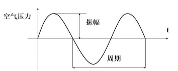
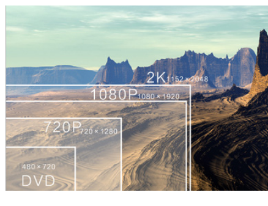
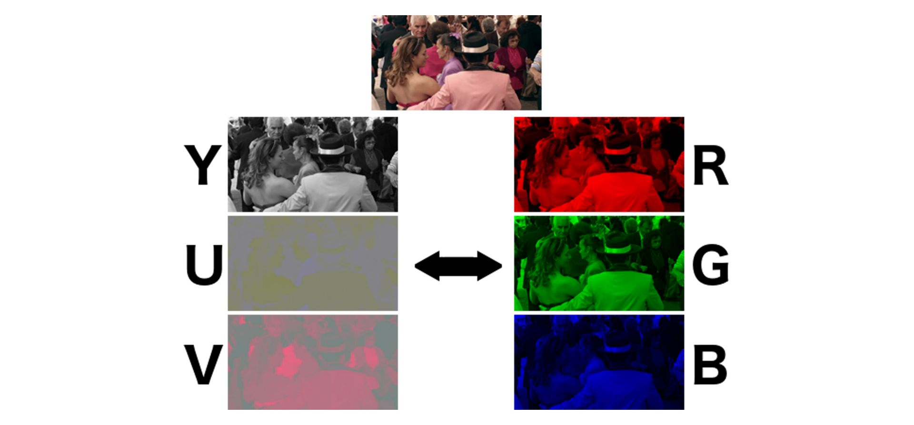
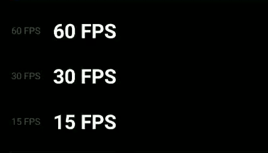
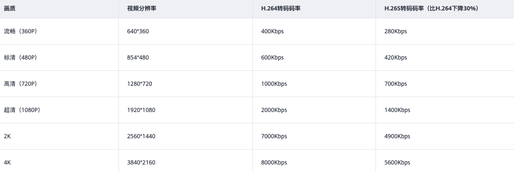
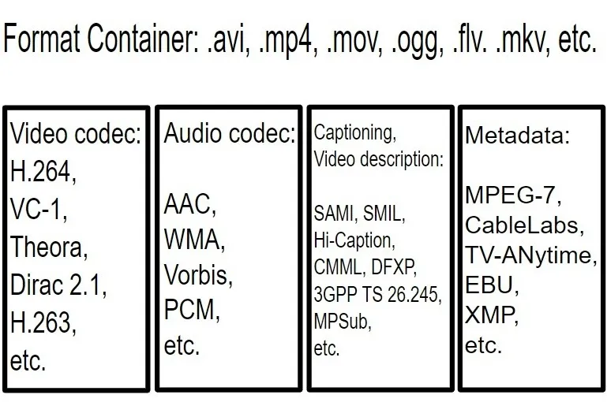
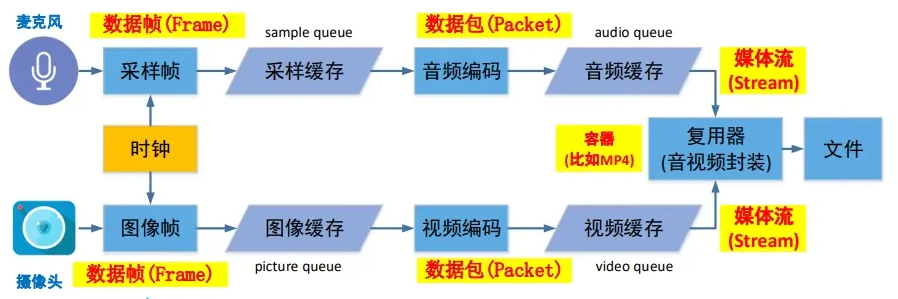
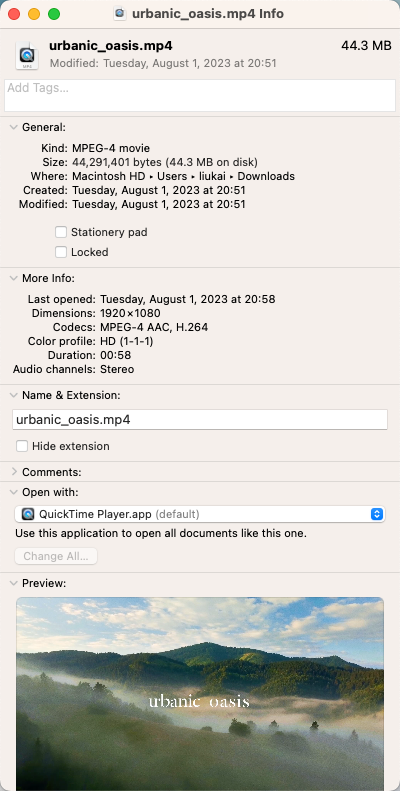
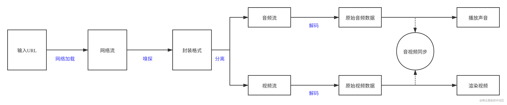
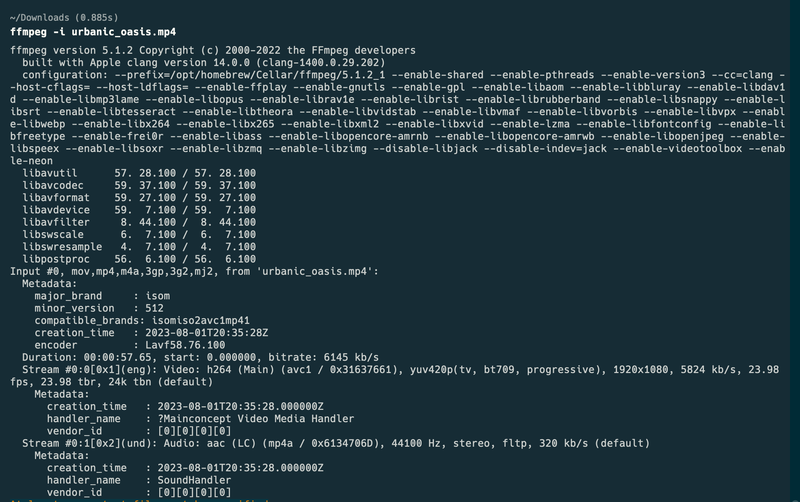

# 音视频入门基础

通常，视频由一系列连续播放的图片和声音组成。要理解视频的构成，首先需要了解声音和图像两方面的基础知识。

## 声音

声音的本质是波。通过波的振幅、频率、波长等参数，即可准确描绘出波形。

要对声音进行数字化，主要有三个关键参数：

1. **采样率**：每秒采样的次数，一般为 44100 Hz；
2. **位宽**：一次采样值的表示范围，一般为 16 位，可表示 65536 个等级；
3. **声道**：如单声道、双声道等。

由此可得，1 秒音频的数据量约为 44100×16×2≈1411200 bit≈172 KB。一首常见的 3 分 20 秒歌曲，原始大小可达约 33 MB。

## 图像

在计算机中，一张完整的图像由特定数量的点来数字化表示。例如，720p 的图像由 720×1280 个点组成，这些点就是我们常说的像素点，每个像素点对应一种颜色。

计算机表达颜色主要有两种方式：

1. **RGB**：由红、绿、蓝三原色组成，常见形式有：
   - RGB888：每个通道占 8 位，共 24 位（3 字节）；
   - ARGB8888：增加透明度通道，共 32 位（4 字节）；
   - RGB565：R 占 5 位，G 占 6 位，B 占 5 位，共 16 位（2 字节）。
2. **YUV**：由亮度（Y）和色度（UV）组成。人眼对亮度更敏感，对色度相对不敏感，因此可以对 UV 进行适当降采样，对观感影响很小：
   - YUV444：每个像素点都包含完整的 Y、U、V 信息，4 个点包含 4 个 Y、4 个 U、4 个 V；
   - YUV422：每 2 个像素点共享 1 组 UV，4 个点包含 4 个 Y、2 个 U、2 个 V；
   - YUV420：每 4 个像素点共享 1 组 UV，4 个点包含 4 个 Y、1 个 U、1 个 V。

下面计算同一张 720p 图片在不同格式下的大小：

- **RGB888**：720×1280×24≈22118400 bit≈2.63 MB；
- **YUV420**：(720×1280/4)×(4×8+8+8)≈11059200 bit≈1.32 MB。

市面上的显示屏（手机、电脑等）通过 RGB 三色光叠加来显示色彩。但 YUV 比 RGB 更易于压缩和传输，且 YUV 兼容黑白图像，因此视频编码主要采用 YUV 格式。RGB 与 YUV 可以相互转换。

## 视频

根据人眼视觉暂留原理，一般每秒播放 20 张以上图片即可被视为连续画面。视频就是通过高频连续播放图片而产生的动态效果。

由此引出视频的一个重要属性：**帧率**，即每秒播放的图片帧数。下面 GIF 展示了不同帧率下的表现效果，视频通常采用 24 fps 或 30 fps。

据此可计算，1 分钟 YUV420 格式视频的原始大小约为 `1.32 MB×30×60≈2376 MB`，占用存储空间非常大，通过互联网传输和播放更是难以接受。因此，需要对视频（以及音频）进行编码压缩。

**视频压缩的基础原理**包括：空间冗余、时间冗余、编码冗余、视觉冗余、知识冗余。

**视频编码帧类型**包括：I 帧、P 帧、B 帧。

下面是一些常见的编码格式，主要差异体现在压缩率、兼容性、编解码性能等方面，具体区别可自行查阅资料：

- **音频**：WAV、AAC、MP3；
- **视频**：H.264、HEVC（H.265）、VP9、AV1。

其中涉及一个非常重要的概念：**码率**。码率是指单位时间内的数据量，单位为 bps（bit per second），常用 kbps 表示。视频总大小约等于码率×时长。可以说，**码率是影响视频播放流畅度的最重要因素**。

前述原始视频的码率约为 39600 kbps，原始音频码率约为 1411.2 kbps。编码时可针对音、视频分别设置码率，理论上可任意设定。但码率越小，视频清晰度越低、还原度越差；码率高到一定程度后，也无法继续提升清晰度。下面是常见画质在保证流畅和清晰的前提下，建议的码率参考。

有了视频流之后是否就可以直接播放？答案是否定的。与其他文件一样，除了原始视频流之外，还需要头信息（如视频长度、分辨率、编码格式、作者等），以及如何将视频流、音频流、字幕等组合在一起。这部分内容属于**视频封装格式**，常见的有 MP4、FLV、MKV 等，一般通过文件后缀名体现。

最后总结视频的常见属性：**分辨率、帧率、码率、编码格式、封装格式**。下面左图为视频生产的完整流程，右图为一个线上 ESG 视频的示例。

综上，压缩视频文件的常见方法包括（直观对比可参考 [Video Compare](https://mayfairtech.feishu.cn/wiki/MuPcwL1WNiZrtZkLmkpckOyBnDg)）：

1. 降低分辨率；
2. 降低帧率；
3. 降低码率；
4. 使用更先进的编码格式。

视频播放流程与上述生产过程基本相反：

除文件下载播放外，还有 HLS、RTMP、DASH 等流媒体方案，感兴趣可继续查阅相关资料。

## 常用工具

1. **FFmpeg**：强大的音视频处理工具，支持编解码、格式转换、流处理等。

2. **VLC**：开源、跨平台的多媒体播放器，支持广泛的音视频格式和网络协议流。
